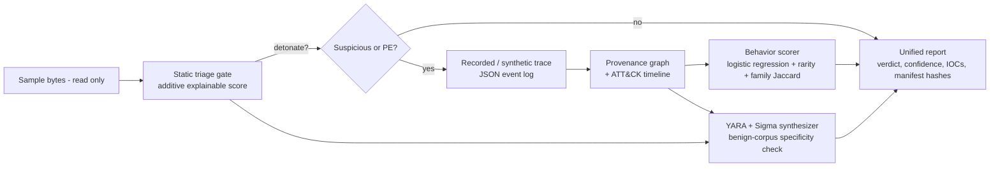

# SPECIMEN

SPECIMEN is a malware analysis pipeline that takes one sample and produces one report. The report covers what the sample is, what it did on the host, how to detect it next time, and the evidence behind each conclusion.

It chains five stages: an explainable static triage gate, replay of a behavior trace, reconstruction of a provenance graph with an ATT&CK-mapped timeline, ML behavior scoring with family matching, and generation of YARA and Sigma rules that are checked against benign data before they are kept. The output is a JSON and Markdown report with a hash manifest.

> **This MVP never executes anything.** Samples are only read as bytes. "Detonation" means replaying a behavior trace that was recorded or synthesized elsewhere. All bundled fixtures are inert byte blobs and synthetic traces, not real malware.

## Architecture



| Module | File |
| --- | --- |
| Typed models | `specimen/models.py` |
| Static gate | `specimen/static_triage.py` |
| Trace ingestion (validated) | `specimen/trace.py` |
| Provenance + timeline | `specimen/provenance.py` |
| ML scoring / anomaly / clustering | `specimen/scoring.py`, `specimen/corpus.py` |
| Detection synthesis | `specimen/synth.py` |
| Report + manifest | `specimen/report.py` |
| Orchestration / CLI | `specimen/pipeline.py`, `specimen/cli.py` |

The runtime uses only the Python standard library. `pytest` is needed only for the tests.

## Quickstart

```bash
pip install -r requirements.txt
make test      # or: python -m pytest -q
make demo      # or: python -m specimen demo --out out
python -m specimen triage path/to/file
python -m specimen analyze path/to/file --trace run.trace.json --out out/
```

`make demo` writes inert fixtures and runs these scenarios:

| Fixture | Scenario |
| --- | --- |
| `benign_notes.txt` | The gate skips it, so no detonation happens (the gate saves work) |
| `sim_injector.bin` | Full end-to-end run: injection, C2, YARA and Sigma rules, family match |
| `sim_bland.bin` | The static score is benign, but the replayed behavior is malicious, so Sigma rules are generated |
| `sim_ransom.bin` | The sample matches the `sim-ransom` family |
| every run | The manifest records the sample hash, trace hash and a reproducible report-content hash |

### Trace format

```json
{"run_id": "lab-1", "sandbox": "cape-export", "sample_sha256": "<sha256>",
 "events": [{"ts": 1.2, "type": "process_create", "pid": 200, "image": "sample.exe",
             "target": "powershell.exe", "cmdline": "powershell -enc ...", "child_pid": 202}]}
```

The supported event types are `process_create`, `process_inject`, `file_write`, `file_read`, `file_delete`, `registry_set`, `net_connect`, `dns_query`, `service_create` and `scheduled_task`. SPECIMEN rejects a trace whose `sample_sha256` does not match the sample (evidence mismatch).

## Prior art and how SPECIMEN differs

| Existing tool | What SPECIMEN adds |
| --- | --- |
| Cuckoo / CAPEv2 | CAPE produces the behavior log. SPECIMEN consumes that kind of log and adds a provenance graph, a static gate that decides whether to detonate, and rules that are checked for specificity |
| Any.run / Joe Sandbox | SPECIMEN is open, runs offline and can be extended; every score has visible feature contributions |
| VirusTotal / Intezer | SPECIMEN reconstructs what happened on the host, not only a verdict and relationships |

Dynamic sandboxes are already mature. SPECIMEN contributes the integration: one explainable report that fuses the static verdict, host provenance, ML confidence and synthesized detections.

## Safety: lab-only sample handling

- Real samples (for example from MalwareBazaar) must only be handled inside a disposable VM that has no network egress and is reverted after each run. The repo's `.gitignore` blocks `samples/`, `*.exe`, `*.dll` and `*.zip`.
- For development, use the bundled inert fixtures, EICAR, or benign binaries.
- SPECIMEN itself only reads bytes (capped at 50 MB) and parses JSON. It never runs, loads or unpacks a sample.
- Generated YARA and Sigma rules are marked `experimental` and must be reviewed before deployment.

See [THREAT_MODEL.md](THREAT_MODEL.md) and [SECURITY.md](SECURITY.md).

## TODO: roadmap items not built (Grade C/D/E)

- [ ] Detonation controller: QEMU/KVM disposable VM, snapshot and revert, egress verification (Grade C/D)
- [ ] eBPF / Sysmon live capture, and adapters for CAPE and Sysmon EVTX into the trace format (Grade C/D)
- [ ] Handling live samples from MalwareBazaar or VirusShare, which requires isolation to be proven first (Grade D)
- [ ] A real PE parser (`pefile`), plus XGBoost and SHAP trained on EMBER instead of hand-set static weights (Grade C)
- [ ] Behavior model trained on real sandbox corpora; the current model is trained on synthetic data only (Grade C)
- [ ] Job queue (Redis/RQ) for batches of samples (Grade B)
- [ ] Validating rules with real `yara-python` and `sigma-cli` compilers; the current matchers are built-in approximations (Grade B/C)
- [ ] Evaluating Sigma generalization to sibling samples (the research question in the spec) (Grade D)
