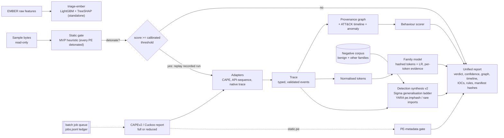
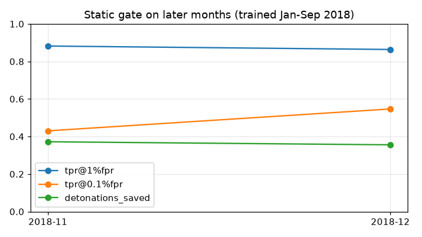

# SPECIMEN

[](https://github.com/rakshit-737/specimen/actions/workflows/ci.yml)
[](https://rakshit-737.github.io/specimen/)

[](LICENSE)


**Docs:** <https://rakshit-737.github.io/specimen/> (architecture, benchmarks with confidence intervals, API reference, [demo reports](https://rakshit-737.github.io/specimen/demo/)) · **Image:** `ghcr.io/rakshit-737/specimen`

**Contribution, in one sentence:** SPECIMEN measures, on a temporal split of 48,976 CAPEv2 reports, how often Sigma rules synthesised from one sandbox run and filtered against a real negative corpus catch later siblings (mean recall 0.30, median family 0.06), inside one explainable sample-to-report pipeline. Generalising beyond exact values adds only about 0.6 recall points; the negative corpus does most of the work.

[](https://rakshit-737.github.io/specimen/demo/avast_njrat_1/)

**One sample (or one sandbox report) in, one defensible story out:** what the sample is, what it did on the host, how to detect it next time, and the evidence behind each conclusion.

SPECIMEN is a sample-to-story malware analysis pipeline. It runs an explainable static gate that decides whether a sample is worth detonating, then replays sandbox behaviour (CAPEv2/Cuckoo reports or its own trace format) into a process/file/registry/network provenance graph with an ATT&CK timeline. After that it attributes the run to a family, synthesizes YARA and Sigma rules that are checked for specificity before they are kept, and writes a JSON + Markdown report with a hash manifest.

> **Lab-only, and it never executes anything.** SPECIMEN reads sample bytes and parses sandbox reports. Nothing in this repository runs, loads or unpacks a sample. All real-data work uses public sandbox reports and pre-extracted features: no binaries are ever downloaded. See [Safety](#safety).

---

## Headline results (real public data)

| Question | Dataset | SPECIMEN | Baseline (MVP) | Published reference |
|---|---|---|---|---|
| Can a static gate skip detonations safely? | EMBER 2018, **temporal** (train Jan-Sep, test Nov-Dec), 5 subsample seeds | Skips **72 %** of benign and misses **0.6 %** of malware at a 99 %-recall threshold calibrated on October (36 % of all test detonations at EMBER's malware share); ROC AUC **0.989**, TPR **0.49** at 0.1 % FPR. A random split of the same data gives 0.997 / 0.85, so drift costs a lot | Detonate every PE (0 % saved); heuristic AUC 0.560 | Upstream EMBER-2018 LightGBM, 600k rows: AUC 0.9964, TPR 0.868 at 0.1 % FPR |
| Which family is it? | Avast-CTU CAPEv2, 48,976 reports, temporal split | **95.0 %** [94.6, 95.4] accuracy for the shipped behaviour+static model, chosen on a validation slice (behaviour-only scores 95.9 % on test, McNemar p ≈ 1.3e-12); 92.5 % on test reports whose behaviour was never seen in training | Jaccard over ATT&CK sets: 87.8 % | HMIL (behaviour+static): 94.5 % |
| Do auto-Sigma rules from **one** run catch later siblings? | Avast-CTU, 9 families x 10 runs x 5 seeds (HarHar has no host actions) | Mean sibling recall **0.30** [0.08, 0.57] at **0.020 %** [0.002, 0.043] cross-family FPR (ladder + real negatives; 0.004 % if the true family is excluded from the negatives, an oracle setting); the **median family is only 0.06**: Swisyn and Qakbot carry the mean | MVP: 0.17 at 1.8 % FPR | none found for single-run sandbox-to-Sigma |
| Is the behaviour malicious? | MalbehavD-V1, 2,570 Cuckoo API traces | **96.3 ± 1.1 %** accuracy over 5 random 70/30 splits (paper protocol; 42 % of test rows have an exact duplicate in train). **93.4 ± 2.6 %** on a duplicate-free split. Through the shipped pipeline routing: 96.0 ± 1.3 % | MVP synthetic-trained scorer: 50 % (AUC 0.23) | MalDetConv 96.1 %, MalDy 95.6 % (both random split, duplicates included) |

All numbers come from `benchmarks/*.py` runs, and the raw outputs are committed in [`results/`](results/). The [evaluation section](#evaluation) gives the protocol, the caveats and what did *not* work.

## Architecture



| Stage | Module | Notes |
|---|---|---|
| Adapters | `specimen/adapters/cape.py`, `api_seq.py`, `sysmon.py` | Full CAPE/Cuckoo call logs, Avast-CTU reduced reports, API sequences and Sysmon XML / JSON-lines exports, all mapped to one `Trace`. Hostile input is coerced and capped; XML with DTDs is refused. |
| Behaviour scorer | `specimen/api_behaviour.py`, `specimen/scoring.py` | MalbehavD-V1 API uni+bigram TF-IDF + LR, exported to JSON and run in pure Python when a trace has >= 20 real API calls; otherwise the MVP ATT&CK-feature scorer. The report names the scorer used. |
| Static gate | `specimen/static_triage.py`, `specimen/ml/ember.py` | `analyze` uses the additive heuristic and still detonates every PE. The EMBER LightGBM gate (TreeSHAP, 99 %-recall threshold) runs only through `triage-ember` on EMBER raw-feature JSON: SPECIMEN has no PE-to-EMBER feature extractor, so the integrated pipeline saves 0 % of PE detonations today |
| Provenance | `specimen/provenance.py` | Process tree, file/registry/network/mutex/service edges; about 50 ATT&CK mapping rules (34 API-level, 17 artefact-level) |
| Tokens | `specimen/tokens.py` | Removes user names, GUIDs, SIDs, hex blobs and numbers so runs of one family share tokens |
| Family | `specimen/ml/family.py` | 2^18 hashed tokens with multinomial LR. Weights are stored as `.npz` (no pickle), and every prediction is explained by its top tokens |
| Detection synthesis | `specimen/detect.py` (v2), `specimen/synth.py` (MVP) | See [ADR 0002](docs/adr/0002-specificity-constrained-rule-generalisation.md) |
| Report | `specimen/report.py` | JSON + Markdown, Mermaid graph, manifest with sample, trace, report and content SHA-256 |
| Queue | `specimen/jobqueue.py` | Resumable append-only ledger with per-job failure isolation |

## Try it in 60 seconds

Core install is stdlib-only, so this needs nothing but Python 3.10+:

<!-- quickstart:start -->
```bash
git clone https://github.com/rakshit-737/specimen && cd specimen
pip install -e .
python -m specimen demo --out out
python -m specimen report tests/fixtures/cape/avast_njrat_1.json --out out/reports
python -m specimen batch tests/fixtures/cape --out out/batch --workers 2
python -m specimen analyze tests/fixtures/sysmon/lab_sample.bin --trace tests/fixtures/sysmon/lab_run.xml --force-detonate --out out/sysmon
```
<!-- quickstart:end -->

CI runs this block exactly as written on every push. `lab_sample.bin` is an inert dummy file whose hash the Sysmon fixture is bound to.

## Usage

```bash
pip install -e ".[dev,ml]"       # [ml] adds numpy/scikit-learn/lightgbm for the trained models
python -m pytest -q

# trained family model and EMBER gate (too large for git): fetch the release assets
gh release download v1.0.0 -R rakshit-737/specimen -p 'family_*' -p 'static_*' -D models
# the round-3 family model used for the committed demo pages is, until the next release, only in the
# bench run artefact (expires with the artefact retention period):
# gh run download 37004185054 -R rakshit-737/specimen -n bench-avast -D bench-avast && find bench-avast -name 'family_*' -exec cp {} models/ \;

python -m specimen analyze <your-sample> --trace <recorded-run.json|sysmon.xml> --out out/
python -m specimen batch <your-report-dir> --out out/batch --workers 4
python -m specimen triage-ember <ember-raw-features.jsonl>
```

Without the family model, `family` is `null`; the API behaviour model ships inside the package. In Docker: `docker run --rm --network none -v "$PWD/tests/fixtures:/fx:ro" ghcr.io/rakshit-737/specimen:latest report /fx/cape/avast_njrat_1.json` (the image has no family or EMBER model; mount them with `-v ./models:/opt/specimen/models:ro`).

Example (`specimen report` on the bundled njRAT report, with the trained family model in `models/`; actual output):

```json
{"verdict": {"label": "malicious", "score": 0.9133, "confidence": "medium (behavior-driven)"},
 "static_score": 0.2315,
 "behaviour_scorer": "mvp-synthetic-logreg (ATT&CK features)",
 "family": "njRAT", "family_confidence": 0.821,
 "techniques": ["T1105", "T1547.001"],
 "sigma_rules": 9, "yara": true}
```

The bundled fixtures are trimmed to about 8 KB, so they carry fewer behaviour tokens than the full reports the model was evaluated on. With the round-3 model (behaviour+static, abstain below 0.6) the trimmed Lokibot fixture comes out as `unknown (closest: Lokibot)`; the round-2 model misattributed it as njRAT. The njRAT and Emotet fixtures are attributed correctly. The round-3 family model comes from the `bench` workflow artefact (run 37004185054) and is attached to the next release; the v1.0.0 assets are the older behaviour-only model.

Each report contains the static contributions, the timeline with ATT&CK tags and anomaly scores, the provenance graph as Mermaid, IOCs, the family evidence tokens, ready-to-review Sigma and YARA rules, and the evidence manifest.

## Data

Nothing is committed. Benign behaviour corpora that were searched for Sigma false-positive measurement, and why none was adopted yet, are listed in [docs/datasets.md](docs/datasets.md#benign-behaviour-corpora-searched-round-3). `scripts/download_data.py` fetches the data into `$SPECIMEN_DATA` (outside the repo) with resumable parallel range requests and records SHA-256 hashes in `SHA256SUMS` (`--verify` re-checks them).

| Dataset | What is used | Size | Licence | Citation |
|---|---|---|---|---|
| [Avast-CTU Public CAPEv2 Dataset](https://github.com/avast/avast-ctu-cape-dataset) | Reduced reports (`behavior.summary` + `static.pe`) for 48,976 samples in 10 families, labels and dates | 593 MB zip | MIT (per `Licences.txt`) | Bošanský et al., *Avast-CTU Public CAPE Dataset*, arXiv:2209.03188 (2022) |
| [EMBER 2018 v2](https://github.com/elastic/ember) | Raw feature JSON lines. Locally a 120 MB prefix (56,893 rows, 2018-01); the full 1.7 GB archive (pinned SHA-256 `b6052eb8...7812`) is downloaded only inside the GitHub Actions `bench` workflow for the temporal evaluation | 1.7 GB | data: MIT | Anderson & Roth, *EMBER*, arXiv:1804.04637 (2018) |
| [Mal-API-2019](https://github.com/ocatak/malware_api_class) | 7,107 Cuckoo API-call sequences in 8 malware families (2.17 GB text, streamed line by line from the zip) | 12 MB zip | MIT | Catak et al., *PeerJ CS* 2020 |
| Oliveira API-call sequences (re-host of the 2019 Kaggle/IEEE DataPort release) | 42,797 malware + 1,079 goodware, first 100 calls, integer-coded | 15 MB | not stated by the re-host; used for within-dataset evaluation only | Oliveira, *Malware Analysis Datasets: API Call Sequences*, 2019 |
| [MalbehavD-V1](https://github.com/mpasco/MalbehavD-V1) | Cuckoo API-call sequences, 1,285 benign + 1,285 malicious | 2.3 MB | MIT | Maniriho et al., *MalDetConv*, arXiv:2209.03547 (2022); *API-MalDetect*, JNCA 2023 |

```bash
export SPECIMEN_DATA=/data/specimen           # anywhere outside the repo
python scripts/download_data.py --dest "$SPECIMEN_DATA"
python scripts/download_data.py --dest "$SPECIMEN_DATA" --verify
```

The test fixtures in `tests/fixtures/cape/` are four real Avast-CTU reduced reports trimmed to about 8 KB each (reports only), plus one clearly synthetic full-format CAPE report.

## Evaluation

Exact commands, runtimes and expected numbers are on the [Reproduce](https://rakshit-737.github.io/specimen/reproduce/) page. Full-data runs (rules, family, temporal EMBER) go through the manual `bench` GitHub Actions workflow; MalbehavD, Mal-API and the paper reproductions are light enough for a laptop.

### 1. Static gate on EMBER

The gate evaluated here is the standalone `triage-ember` model on EMBER raw features; `analyze` does not call it (see Architecture).

**Temporal (round 3, `results/static_ember_temporal.json`, `docs/figures/static_temporal.png`).** Full EMBER-2018 archive downloaded in a GitHub Actions job (pinned SHA-256), vectorised with SPECIMEN's own featuriser, month-stratified subsample; train Jan-Sep, threshold calibrated for 99 % recall on October, test Nov-Dec; 5 subsample seeds (min-max shown).

| protocol | ROC AUC | TPR @ 0.1 % FPR | TPR @ 1 % FPR | detonations saved | malware missed | benign skipped |
|---|---|---|---|---|---|---|
| **temporal (SPECIMEN)** | **0.9892** (0.9889-0.9894) | **0.488** (0.466-0.538) | **0.873** (0.869-0.879) | 36.4 % | 0.63 % | 72.2 % |
| random split, same months and volume | 0.9965 | 0.852 | 0.949 | | | |
| *upstream EMBER-2018 LightGBM (600k train rows)* | *0.99643* | *0.868* | *0.965* | | | |



Under drift the gate is clearly worse than on a random split, mostly in the low-FPR region. "Detonations saved" depends on the malware share of the submissions: it is benign share x 72 % + malware share x 0.6 %, so about 8 % at a 90 % malware mix and 58 % at 20 %.

**Earlier one-month random split (`results/static_ember.json`).** A stratified 25 % of a 56,893-row prefix (2018-01 only), kept for comparison; this is optimistic about drift.

| model | ROC AUC | TPR @ 0.1 % FPR | TPR @ 1 % FPR | accuracy | F1 |
|---|---|---|---|---|---|
| MVP heuristic (ported) | 0.560 | 0.007 | 0.017 | 0.523 | 0.488 |
| logistic regression | 0.968 | 0.010 | 0.574 | 0.926 | 0.930 |
| LightGBM (SPECIMEN) | 0.994 | 0.839 (about 7 of 6,756 benign rows define this FPR) | 0.924 | 0.965 | 0.967 |


Every gate decision carries TreeSHAP contributions over named features, for example `section.n_rx`, `datadir[2].size` or `imports:CreateToolhelp32Snapshot`. The hand-weighted MVP heuristic is barely better than chance on real PEs.

### 2. Family attribution on Avast-CTU CAPEv2: `results/family_avast.json`

Authors' temporal split: 37,512 training reports before 2019-08-01, 11,464 later test reports. 59 % of test reports have a behaviour-token set never seen in training ("novel"). Wilson 95 % CIs. The shipped variant is now chosen on a validation slice (training runs from 2019-06 on), not on test accuracy.

| model | test accuracy [95 % CI] | novel-behaviour accuracy | macro-F1 |
|---|---|---|---|
| MVP Jaccard over ATT&CK technique sets | 0.878 [0.872, 0.884] | 0.813 | 0.713 |
| static.pe tokens only | 0.700 [0.692, 0.709] | 0.504 | 0.744 |
| **behaviour + static tokens (shipped; best on validation, 0.987)** | **0.950 [0.946, 0.954]** | **0.925** | **0.923** |
| behaviour tokens only | 0.959 [0.955, 0.962] | 0.934 | 0.926 |
| *HMIL behaviour+static (Bošanský et al. 2022)* | *0.945* | | |
| *HMIL static-only* | *~0.63* | | |


The like-for-like comparison with HMIL is behaviour+static: 0.950 against 0.945. On test, behaviour-only is significantly better (McNemar, 159 vs 56 discordant reports, p ≈ 1.3e-12), but picking it would mean selecting on the test set, so the published shipped number is the lower one. Each prediction lists the tokens that drove it.

**Open set.** In a leave-one-family-out run, the top probability for a held-out family's reports has a median of 0.45-0.79. The shipped abstain threshold is 0.6, the largest value that keeps at least 95 % known-family coverage. It was picked on the test split itself (not on the validation slice), so these figures are optimistic: known-family coverage 95.9 % at 98.2 % accuracy, but 30 % of unseen-family reports are still forced into a known family. Below the threshold, reports say `unknown (closest: X)`.

### 3. Do auto-rules from ONE run generalise? `results/rules_avast.json`

For each family and seed (5 seeds), 10 reference runs are drawn from the training split, rules are synthesised from each single run, and they are applied to the later test split. *Sibling recall* is the share of same-family test runs on which any rule fires. *Cross-family FPR* is the same share over other-family test runs. CIs come from a two-level bootstrap over families and units; paired Wilcoxon tests are over the 450 (seed, family, run) units. Per-unit values are in `results/rules_avast_units.csv`.

| synthesizer (ablation) | mean recall [95 % CI] | median family | novel-behaviour recall | cross-family FPR [95 % CI] | rules / run |
|---|---|---|---|---|---|
| Sigma MVP (exact values, synthetic negatives) | 0.174 [0.03, 0.40] | 0.005 | 0.193 | 1.85 % [0.91, 2.89] | 0.6 |
| Sigma MVP + real negatives | 0.000 | 0.000 | 0.000 | 0 % | 0.01 |
| exact values (rung 0) + real negatives | 0.298 [0.07, 0.56] | 0.056 | 0.291 | 0.009 % | 5.7 |
| ladder + synthetic negatives only | 0.372 [0.15, 0.62] | 0.228 | 0.392 | 8.67 % [3.65, 14.8] | 6.2 |
| ladder + real negatives (v2) | 0.304 [0.07, 0.58] | 0.057 | 0.298 | 0.020 % [0.002, 0.043] | 5.7 |
| ladder + real negatives, at most 3 rules | 0.227 [0.04, 0.46] | 0.045 | 0.215 | 0.007 % | 2.6 |
| **shipped (packaged negative corpus, true family excluded)** | **0.303 [0.08, 0.57]** | **0.058** | **0.296** | **0.004 %** [0.001, 0.007] | 5.7 |
| v2, 5 runs pooled | 0.391 [0.16, 0.64] | 0.265 | 0.350 | 0.056 % | 6.0 per 5-run pool |
| YARA `pe.imphash()` | 0.081 | 0.000 | 0.073 | 0.025 % | 1.0 |
| YARA v2 (imphash or rare imports) | 0.104 | 0.018 | 0.097 | 0.071 % | 0.9 |


What the ablation shows, compared with the round-2 claim ("roughly doubles recall, 140x fewer FPs"):

- **The real negative corpus does most of the work on false positives.** With only synthetic negatives the ladder over-generalises (8.7 % FPR). Given the same real negatives, the MVP's exact-value rules almost never survive, so most of the MVP-vs-v2 gap comes from the negatives, not the ladder.
- **The ladder adds little over exact values once real negatives are used**: +0.006 recall (Wilcoxon p = 7e-7) at about twice the FPR. That is a much smaller effect than the round-2 headline implied.
- **The mean hides the spread.** Per family (shipped): Swisyn 0.998, Qakbot 0.93, Lokibot 0.42, njRAT 0.24, Zeus 0.06, Adload 0.04 (n = 5, not estimable), Ursnif 0.02, Trickbot 0.004 and Emotet 0.001. Emotet, Trickbot and Ursnif randomise every artefact that reduced reports record. On Zeus, v2 is worse than the MVP (0.06 vs 0.31).
- The round-2 single-draw numbers (0.327 recall at 0.016 % FPR) were slightly optimistic; the seeded re-run gives 0.304 at 0.020 % for the same configuration.

### 4. Behavioural detection on MalbehavD-V1: `results/behaviour_malbehavd.json`

Every sample goes through `api_sequence_to_trace`. Intervals over repeated splits and folds use the Nadeau-Bengio corrected resampled t (they were naive t-intervals before round 3 and are now about 1.8-2.7x wider).

| model | seed-0 holdout [bootstrap CI] | 5 x 70/30 (paper protocol) | 5x5-fold CV | 5 x 70/30, duplicate-free |
|---|---|---|---|---|
| MVP scorer (synthetic-trained, ATT&CK features) | 0.503 [0.468, 0.537] | 0.502 ± 0.002 | 0.501 ± 0.002 | |
| same 9 ATT&CK features, retrained | 0.754 [0.722, 0.786] | 0.724 ± 0.050 | 0.715 ± 0.020 | 0.723 ± 0.018 |
| **API uni+bigram tokens + LR (shipped scorer)** | **0.968 [0.955, 0.979]** | **0.963 ± 0.011** | **0.962 ± 0.010** | **0.934 ± 0.026** |
| API uni+bigram tokens + LightGBM | 0.966 [0.952, 0.978] | 0.961 ± 0.016 | 0.963 ± 0.008 | 0.939 ± 0.012 |
| *MalDetConv CNN-BiGRU (published, random split)* | *0.961* | | | |
| *MalDy TF-IDF + XGBoost (as reported there)* | *0.956* | | | |

**Duplicate leakage.** The 2,570 rows hold only 1,601 distinct sequences (478 distinct malicious ones); 42 ± 4 % of test rows in a random 70/30 split have an exact copy in train. The LR is 99.5 % accurate on those and 93.9 % on unseen rows. The paper protocol (and the published numbers) therefore include memorised duplicates; the duplicate-free number is the honest one.

**Pipeline path.** The shipped routing now sends traces with at least 5 API calls to the LR (it used to need 20, which sent 24 % of MalbehavD traces to the MVP scorer at 56 % accuracy). End-to-end accuracy through `behaviour_score` is 0.960 ± 0.013. The shipped JSON model deviates from a scikit-learn refit by at most 1.3e-6 (5-decimal rounding).

The MVP's synthetic-trained scorer does not transfer at all: API-only traces trigger almost no ATT&CK-mapped features, so its ranking is inverted.

### 5. Paper reproductions: paper vs reproduction vs SPECIMEN

**MalDetConv (Maniriho et al. 2022) on MalbehavD-V1** (`results/repro_maldetconv.json`, `benchmarks/repro_maldetconv.py`). Re-implemented in PyTorch from the paper's text: embedding, 2x Conv1D+MaxPool, BiGRU, dense ReLU with dropout 0.2, sigmoid output; Keras-style pre-padding and truncation to n calls; random 70/30 split; 10 seeds. The paper gives the layer sizes only as an image, so the sizes used (64 filters, kernel 3, 64 GRU units, lr 1e-3, batch 32, 20 epochs) are guesses and are recorded in the file. SPECIMEN's LR is trained on the same truncated sequences and the same splits.

| n calls | paper (Table 3) | our reproduction | SPECIMEN LR | reproduction, duplicate-free | SPECIMEN LR, duplicate-free |
|---|---|---|---|---|---|
| 20 | 0.938 | 0.915 ± 0.018 | 0.944 ± 0.008 | 0.863 ± 0.017 | 0.919 ± 0.019 |
| 40 | 0.940 | 0.914 ± 0.035 | 0.953 ± 0.010 | 0.869 ± 0.020 | 0.933 ± 0.022 |
| 60 | 0.952 | 0.920 ± 0.021 | 0.958 ± 0.011 | 0.872 ± 0.024 | 0.939 ± 0.016 |
| 80 | 0.955 | 0.925 ± 0.016 | 0.959 ± 0.011 | 0.878 ± 0.038 | 0.940 ± 0.019 |
| 100 | 0.961 | 0.923 ± 0.016 | 0.957 ± 0.009 | 0.877 ± 0.028 | 0.938 ± 0.020 |

Our reproduction falls 2-4 points short of the paper. The likeliest cause is the unstated layer sizes and training schedule. On a duplicate-free split the CNN-BiGRU loses about 5 points while the n-gram LR loses about 2.

**Li et al. 2024 on Mal-API-2019** (`results/api_cross.json`). 8-class family classification, TF-IDF with 5-fold CV (the grid ranges and PCA size are not stated, so defaults are used):

| model | paper (Table I) | reproduction, all rows | reproduction, duplicate-free |
|---|---|---|---|
| Random Forest | 0.68 | 0.637 ± 0.008 | 0.605 ± 0.015 |
| XGBoost | 0.68 | 0.632 ± 0.015 | 0.602 ± 0.017 |
| KNN | 0.54 | 0.569 ± 0.014 | 0.535 ± 0.013 |
| MLP | 0.56 | 0.619 ± 0.015 | 0.590 ± 0.017 |
| **SPECIMEN uni+bigram LR** | - | **0.666 ± 0.010** | **0.639 ± 0.014** |

**Cross-dataset.** The shipped MalbehavD-trained scorer, applied unchanged to Mal-API-2019 (all malware), flags 71.6 % [70.5, 72.6] of sequences at p >= 0.5 but only 40.1 % at the "malicious" cut-off of 0.8, so it transfers only partly. Within Oliveira (integer-coded calls, duplicate-free, 5-fold), the n-gram LR reaches a balanced accuracy of 0.913 ± 0.025 and an AUC of 0.982. Cross-dataset transfer to Oliveira is not possible because the re-host has no API-name table.


## Prior art and how SPECIMEN differs

| Existing | Scope | What SPECIMEN adds |
|---|---|---|
| Cuckoo / CAPEv2 | Mature dynamic sandboxes that produce behaviour reports | SPECIMEN *consumes* those reports. It adds a static detonation gate with a measured cost/miss trade-off, a provenance graph and ATT&CK timeline, family attribution with token evidence, and rules that are checked for specificity before they are kept |
| Any.run / Joe Sandbox | Commercial, closed and cloud-based | Open, offline and extendable; every score is explainable |
| VirusTotal / Intezer | Verdicts, code reuse and relationships | Host-level reconstruction and detection synthesis from one run |
| EMBER / HMIL / MalDetConv / Li et al. 2024 | Single-stage classifiers | Published numbers used as reference points; MalDetConv and Li et al. are re-implemented and reproduced below. SPECIMEN's contribution is the integration and the rule-generalisation measurement |
| LLM CTI-to-Sigma generators | Rules from threat-report *text* | SPECIMEN works from sandbox runs; no published single-run sandbox-to-Sigma benchmark was found to compare against |
| Sigma / YARA rule generators (e.g. yarGen) | String-based rule generation | Behavioural Sigma from sandbox actions, filtered against a real negative corpus, with a measured single-run-to-sibling recall (the generalisation ladder adds only ~0.6 points) |

## Limitations

- **No live detonation.** The detonation controller (QEMU/KVM snapshot and revert, egress verification) and live eBPF capture are not built: they need an isolated lab host and must never run on this development machine. SPECIMEN replays recorded runs instead ([ADR 0001](docs/adr/0001-report-replay-instead-of-live-detonation.md)). Recorded Sysmon exports are supported offline; binary `.evtx` must be exported to XML first.
- **Reduced reports have no timing.** Events from them are ordered deterministically and flagged `synthetic_ts`.
- **Negatives for rule specificity** are other malware families (a packaged sample of Avast-CTU training runs) plus a small synthetic benign set. Benign false-positive rates are unmeasured; the corpora searched and why none was adopted are listed on [Datasets](docs/datasets.md#benign-behaviour-corpora-searched-round-3).
- **The EMBER LightGBM gate is standalone** (`triage-ember` on EMBER raw features). `analyze` has no PE-to-EMBER feature extractor and still detonates every PE.
- **Under temporal drift the gate is weaker**: AUC 0.989 and TPR 0.49 at 0.1 % FPR on Nov-Dec 2018 when trained on Jan-Sep (vs 0.997 / 0.85 on a random split). Detonations saved depend on the malware share of submissions.
- **Family attribution is closed-set over 10 families**; in leave-one-family-out tests, 30 % of unseen-family reports still pass the 0.6 abstain threshold (below it, reports say `unknown (closest: X)`). The threshold was picked on the test split, not on a separate validation slice.
- **MalbehavD-V1 contains exact duplicate sequences** (1,601 distinct of 2,570); random splits, including the published ones, partly measure memorisation. The duplicate-free accuracy is 93.4 %.
- **The API behaviour scorer is trained on MalbehavD-V1** (Cuckoo API names, 2,570 samples). It only runs on traces with a real call sequence; reduced reports (no call logs) still use the MVP scorer, which is known to transfer poorly (see Benchmarks).
- No adversarial robustness evaluation of any model.

## Roadmap

- [x] Static gate wired into reconstruction on pre-captured logs (CAPE adapters, 49k real runs)
- [x] Detection synthesizer with measured generalisation
- [x] Unified report with evidence manifest; batch queue
- [x] Family attribution; job queue
- [x] Real-data behaviour scorer in the pipeline (API n-grams, pure-Python inference)
- [x] Emitted rules validated with pySigma and yara-python in CI
- [x] Sysmon (XML / JSON lines) to trace adapter
- [x] Seeds and confidence intervals for the static and behaviour benchmarks
- [ ] Stage 4: detonation controller with EICAR and benign binaries only, fail-closed without verified egress isolation (needs a lab hypervisor)
- [ ] Live eBPF capture (needs a Linux lab host)
- [x] Temporal EMBER evaluation on the full 2018 set (GitHub Actions)
- [x] Seeded rule benchmark with ablation; family variant chosen on a validation slice
- [x] More API-call datasets (Mal-API-2019, Oliveira) and paper reproductions (MalDetConv, Li et al. 2024)
- [ ] Benign behaviour corpus for Sigma FP measurement (Quo Vadis Speakeasy adapter)
- [ ] PE-to-EMBER feature extraction so `analyze` uses the trained gate
- [ ] Adversarial robustness checks

## Safety

- SPECIMEN only reads bytes (capped at 50 MB) and parses JSON. There is no code path that executes, imports, unpacks or decompresses a sample.
- No binaries are downloaded: only sandbox reports, pre-extracted features and labels. `.gitignore` blocks `samples/`, `*.exe`, `*.dll`, `*.zip`, `data/` and `models/`.
- Model artefacts are stored as LightGBM text and `.npz` files. Loading a model never unpickles anything.
- Auto-generated rules are `status: experimental`. They record their generalisation rung and must be reviewed before deployment.
- Any future detonation work must run in a disposable VM with no egress and be reverted after each run. See [THREAT_MODEL.md](THREAT_MODEL.md) and [SECURITY.md](SECURITY.md).

## Project docs

[Docs site](https://rakshit-737.github.io/specimen/) · [CHANGELOG](CHANGELOG.md) · [CONTRIBUTING](CONTRIBUTING.md) · [ADRs](docs/adr/) · [Threat model](THREAT_MODEL.md) · [Security policy](SECURITY.md) · [Spec roadmap](#roadmap)

## Citation of the data

```
Bošanský B., Kouba D., Maňhal O., Sick T., Lisý V., Křoustek J., Somol P. Avast-CTU Public CAPE Dataset. arXiv:2209.03188, 2022.
Anderson H. S., Roth P. EMBER: An Open Dataset for Training Static PE Malware Machine Learning Models. arXiv:1804.04637, 2018.
Maniriho P., Mahmood A. N., Chowdhury M. J. M. MalDetConv / API-MalDetect. arXiv:2209.03547, 2022; JNCA 218, 2023.
Catak F. O., Yazi A. F., Elezaj O., Ahmed J. Deep learning based Sequential model for malware analysis using Windows exe API Calls. PeerJ Computer Science 6:e285, 2020 (Mal-API-2019).
Oliveira A. Malware Analysis Datasets: API Call Sequences. Kaggle / IEEE DataPort, 2019 (fetched from a public re-host; see docs/datasets.md).
Li et al. IJCSIT 2(1), 2024, doi:10.62051/ijcsit.v2n1.01 (Table I reproduced).
```

MIT licensed. See [LICENSE](LICENSE).
