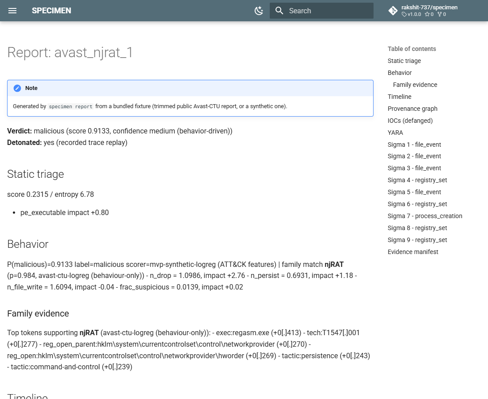
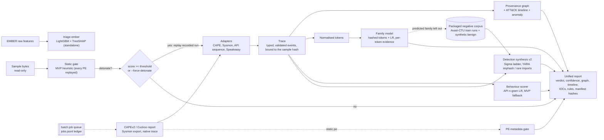

# SPECIMEN

[](https://github.com/rakshit-737/specimen-malware-analysis/actions/workflows/ci.yml)
[](https://rakshit-737.github.io/specimen-malware-analysis/)

[](LICENSE)


**Docs:** <https://rakshit-737.github.io/specimen-malware-analysis/> (architecture, evaluation with confidence intervals, API reference, [demo reports](https://rakshit-737.github.io/specimen-malware-analysis/demo/)) · **Image:** `ghcr.io/rakshit-737/specimen-malware-analysis`

**Contribution, in one sentence:** SPECIMEN measures, on a temporal split of 48,976 CAPEv2 reports and on 32,673 benign emulation reports, how often Sigma rules synthesised from *one* sandbox run and checked against a real negative corpus catch later siblings without firing on other families or on benign software, inside one explainable sample-to-report pipeline; the ablation separates what candidate generation, the generalisation ladder and the negative corpus each contribute.

[](https://rakshit-737.github.io/specimen-malware-analysis/demo/avast_njrat_1/)

**One sample (or one sandbox report) in, one defensible story out:** what the sample is, what it did on the host, how to detect it next time, and the evidence behind each conclusion.

SPECIMEN replays sandbox behaviour (CAPEv2/Cuckoo reports, Sysmon exports or its own trace format) into a process/file/registry/network provenance graph with an ATT&CK timeline, attributes the run to a family, synthesises YARA and Sigma rules that are checked for specificity before they are kept, and writes a JSON + Markdown report with a hash manifest. A static gate scores the sample first; a trained EMBER gate is available as a standalone command.

> **Lab-only, and it never executes anything.** SPECIMEN reads sample bytes and parses sandbox reports. Nothing in this repository runs, loads or unpacks a sample. All real-data work uses public sandbox reports, emulation reports and pre-extracted features: no binaries are ever downloaded. See [Safety](#safety).

---

## Headline results (real public data)

<!-- gen:headline -->
| Question | Data | SPECIMEN [95 % CI] | Baseline | Published |
|---|---|---|---|---|
| Can a static gate skip detonations safely? [^gate] | EMBER 2018, temporal (train Jan-Sep, test Nov-Dec) | skips 72 % of benign, misses 0.6 % of malware; AUC 0.989 [0.989, 0.989] | heuristic AUC 0.51; detonate all: 0 % saved | EMBER LightGBM, 600k rows: AUC 0.996 [^ember] |
| Which family is it? | Avast-CTU CAPEv2, temporal split | 95.0 % [94.6, 95.4] [^fam] | Jaccard: 87.8 % | HMIL: 94.5 % |
| Do Sigma rules from **one** run catch later siblings? | Avast-CTU, 9 families x 10 runs x 5 seeds | recall 0.293 [0.067, 0.560] at 0.006 % cross-family FPR, 0.000 % benign FPR [^rules] | MVP: 0.166 at 1.74 % | none found |
| Is the behaviour malicious? | MalbehavD-V1, 2,570 Cuckoo API traces | 93.4 [90.8, 96.0] % duplicate-free; 96.3 [95.1, 97.4] % on the paper's random splits [^beh] | MVP scorer: 50 % | MalDetConv 96.1 % (random split) |

[^gate]: Standalone `triage-ember` model on EMBER raw features; `analyze` has no PE-to-EMBER extractor and still replays every PE. Threshold for 99 % recall calibrated on October; 5 subsample seeds, 95 % t-intervals (seed variance only).
[^ember]: Upstream benchmark trains on all 600k Jan-Oct rows with EMBER's own features; SPECIMEN uses a 132k-row Jan-Sep subsample and holds October out, so the gap is not drift alone.
[^fam]: Shipped behaviour+static model, chosen on a temporal validation slice; Wilson 95 % interval.
[^rules]: Shipped configuration: packaged negative corpus minus the family the trained model predicts. Mean over 450 runs with a two-level bootstrap CI; the median family is much lower (see Evaluation). Benign FPR is on emulator (Speakeasy) reports, a lower bound.
[^beh]: Shipped API n-gram LR; Nadeau-Bengio corrected 95 % intervals. 42 % of random-split test rows have an exact duplicate in train, which inflates the paper-protocol number.

All cells come from `results/*.json`, produced by the `bench` workflow; each table on the [Evaluation](https://rakshit-737.github.io/specimen-malware-analysis/benchmarks/) page names its run id.
<!-- /gen:headline -->

## Architecture



| Stage | Module | Notes |
|---|---|---|
| Adapters | `specimen/adapters/cape.py`, `sysmon.py`, `api_seq.py`, `speakeasy.py` | Full CAPE/Cuckoo call logs, Avast-CTU reduced reports, Sysmon XML / JSON-lines exports (UTF-8/16/32), API sequences and Speakeasy emulation reports, all mapped to one `Trace`. Hostile input is coerced and capped; XML with DTDs is refused; non-finite numbers and deep nesting are rejected with one error line. |
| Evidence binding | `specimen/pipeline.py` | A trace that records a sample hash (native `sample_sha256`, CAPE `target.file.sha256`, Sysmon event 1 `Hashes`) must match the sample; one without is replayed as `unbound` with low confidence. |
| Behaviour scorer | `specimen/api_behaviour.py`, `specimen/scoring.py` | MalbehavD-V1 API uni+bigram TF-IDF + LR, exported to JSON and run in pure Python when a trace has >= 5 real API calls; otherwise the MVP ATT&CK-feature scorer. The report names the scorer used. |
| Static gate | `specimen/static_triage.py`, `specimen/ml/ember.py` | `analyze` uses the additive heuristic and still replays every PE. The EMBER LightGBM gate (TreeSHAP, 99 %-recall threshold) runs only through `triage-ember` on EMBER raw-feature JSON: there is no PE-to-EMBER feature extractor, so the integrated pipeline saves 0 % of PE detonations today. |
| Provenance | `specimen/provenance.py` | Process tree, file/registry/network/mutex/service edges; about 50 ATT&CK mapping rules |
| Tokens | `specimen/tokens.py` | Removes user names, GUIDs, SIDs, hex blobs and numbers so runs of one family share tokens |
| Family | `specimen/ml/family.py` | 2^18 hashed tokens with multinomial LR, stored as `.npz` (no pickle); every prediction is explained by its top tokens; below the open-set threshold the report says `unknown (closest: X)` |
| Detection synthesis | `specimen/detect.py` (v2, used by `analyze` and `report`), `specimen/synth.py` (MVP baseline) | See [ADR 0002](docs/adr/0002-specificity-constrained-rule-generalisation.md) |
| Report | `specimen/report.py` | JSON (strict, no NaN) + Markdown (every report string entity-encoded, IOCs defanged), Mermaid graph, manifest with sample, trace, report and content SHA-256 |
| Queue | `specimen/jobqueue.py` | Resumable append-only ledger with per-job failure isolation |

## Try it in 60 seconds

Core install is stdlib-only, so this needs nothing but Python 3.10+:

<!-- quickstart:start -->
```bash
git clone https://github.com/rakshit-737/specimen-malware-analysis && cd specimen
pip install -e .
python -m specimen demo --out out
python -m specimen report tests/fixtures/cape/avast_njrat_1.json --out out/reports
python -m specimen batch tests/fixtures/cape --out out/batch --workers 2
python -m specimen analyze tests/fixtures/sysmon/lab_sample.bin --trace tests/fixtures/sysmon/lab_run.xml --force-detonate --out out/sysmon
```
<!-- quickstart:end -->

CI runs this block exactly as written on every push. `lab_sample.bin` is an inert dummy file; the Sysmon fixture records its SHA-256 in event 1 `Hashes`, so `analyze` refuses any other sample with that trace.

Without the trained models (the default for a plain `pip install` and the Docker image) the report's `family` is `null`, nothing is left out of the negative corpus (so fewer Sigma rules survive; see Evaluation 3), and reduced reports, which have no API call log, are scored by the MVP ATT&CK-feature scorer. The API behaviour model always ships inside the package.

## Usage

```bash
pip install -e ".[dev,ml]"       # [ml] adds numpy/scikit-learn/lightgbm for the trained models
python -m pytest -q

# trained family model and EMBER gate (too large for git): release assets, SHA-256 pinned in scripts/model_assets.json
python scripts/fetch_models.py --dest models            # verifies every hash; or, without a clone:
gh release download -R rakshit-737/specimen-malware-analysis -p 'family_*' -p 'static_*' -D models   # latest release

python -m specimen analyze <your-sample> --trace <recorded-run.json|sysmon.xml> --out out/
python -m specimen batch <your-report-dir> --out out/batch --workers 4
python -m specimen triage-ember <ember-raw-features.jsonl>
```

In Docker: `docker run --rm --network none -v "$PWD/tests/fixtures:/fx:ro" ghcr.io/rakshit-737/specimen-malware-analysis:latest report /fx/cape/avast_njrat_1.json` (pin a release with `:v1.1.0`; releases after 1.1.0 are also tagged with the plain version, e.g. `:1.2.0`. The image has no family or EMBER model: mount them with `-v ./models:/opt/specimen/models:ro`).

Example: `specimen report` on the bundled njRAT report with the pinned family model in `models/` (actual output):

<!-- gen:demo-example -->
```json
{"verdict": {"confidence": "medium (behavior-driven)", "label": "malicious", "score": 0.9133},
 "static_score": 0.2315,
 "behaviour_scorer": "mvp-synthetic-logreg (ATT&CK features)",
 "family": "unknown (closest: njRAT)",
 "family_confidence": 0.821,
 "techniques": ["T1105", "T1547.001"],
 "sigma_rules": 10,
 "yara": true}
```

With the same model the trimmed Lokibot fixture comes out as `unknown (closest: Lokibot)` (p = 0.514) with 6 Sigma rules. Generated from `docs/demo/summary.json` (`scripts/build_demo.py`).
<!-- /gen:demo-example -->

The bundled fixtures are trimmed to about 8 KB, so they carry fewer behaviour tokens than the full reports the model was evaluated on. Each report contains the static contributions, the timeline with ATT&CK tags and anomaly scores, the provenance graph as Mermaid, IOCs, the family evidence tokens, ready-to-review Sigma and YARA rules, and the evidence manifest.

## Data

Nothing is committed. `scripts/download_data.py` fetches the data into `$SPECIMEN_DATA` (outside the repo) with resumable parallel range requests and records SHA-256 hashes in `SHA256SUMS` (`--verify` re-checks them against the pinned values); downloads over 1 GB (the whole EMBER archive, the Speakeasy reports) run only inside the GitHub Actions `bench` workflow.

| Dataset | What is used | Size | Licence | Citation |
|---|---|---|---|---|
| [Avast-CTU Public CAPEv2 Dataset](https://github.com/avast/avast-ctu-cape-dataset) | Reduced reports (`behavior.summary` + `static.pe`) for 48,976 samples in 10 families, labels and dates | 593 MB zip | MIT (per `Licences.txt`) | Bošanský et al. 2022 |
| [EMBER 2018 v2](https://github.com/elastic/ember) | Raw feature JSON lines; locally a 120 MB prefix (2018-01), the whole archive (pinned SHA-256 `b6052eb8...7812`) only in Actions | 1.7 GB | MIT | Anderson & Roth 2018 |
| [Quo Vadis Speakeasy](https://huggingface.co/datasets/dtrizna/quovadis-speakeasy) | The **benign** emulation reports only (`report_clean` + `report_windows_syswow64`, train and test: 32,673 reports), pinned revision, fetched only in Actions | ~1.6 GB | Apache-2.0 | Trizna 2022 |
| [Mal-API-2019](https://github.com/ocatak/malware_api_class) | 7,107 Cuckoo API-call sequences in 8 malware families (2.17 GB text, streamed from the zip) | 12 MB zip | MIT | Catak & Yazı 2019; Catak et al. 2020 |
| Oliveira API-call sequences (public re-host of the 2019 Kaggle / IEEE DataPort release) | 42,797 malware + 1,079 goodware, first 100 calls, integer-coded | 15 MB | not stated by the re-host; within-dataset evaluation only | Oliveira 2019 |
| [MalbehavD-V1](https://github.com/mpasco/MalbehavD-V1) | Cuckoo API-call sequences, 1,285 benign + 1,285 malicious | 2.3 MB | MIT | Maniriho et al. 2022 |

```bash
export SPECIMEN_DATA=/data/specimen           # anywhere outside the repo
python scripts/download_data.py --dest "$SPECIMEN_DATA"
python scripts/download_data.py --dest "$SPECIMEN_DATA" --verify
```

The test fixtures in `tests/fixtures/cape/` are four real Avast-CTU reduced reports trimmed to about 8 KB each (reports only), plus one clearly synthetic full-format CAPE report.

## Evaluation

Every number below is generated by `scripts/render_results.py` from `results/*.json`, and every result file comes from the GitHub Actions `bench` workflow (its run id and commit are in the file and under each table). Exact commands, runtimes and expected values are on the [Reproduce](https://rakshit-737.github.io/specimen-malware-analysis/reproduce/) page; protocols and caveats are on the [Evaluation](https://rakshit-737.github.io/specimen-malware-analysis/benchmarks/) page.

### 1. Static gate on EMBER (standalone `triage-ember`; `analyze` does not call it)

Train Jan-Sep 2018, calibrate the 99 %-recall threshold on October, test Nov-Dec; month-stratified subsample of the official archive, SPECIMEN's own 2,440-dimension featuriser, 5 seeds. The seed-0 model is the released `static_*` asset.

<!-- gen:static-temporal -->
| protocol | ROC AUC | TPR @ 0.1 % FPR | TPR @ 1 % FPR | detonations saved | malware missed | benign skipped |
|---|---|---|---|---|---|---|
| **temporal, SPECIMEN gate** (5 seeds) | 0.9892 [0.9889, 0.9895] | 0.488 [0.452, 0.524] | 0.873 [0.868, 0.879] | 36.4 % [35.5, 37.3] | 0.63 % [0.52, 0.73] | 72.2 % [70.4, 74.1] |
| same, seed 0, bootstrap over test rows | [0.9888, 0.9898] | [0.425, 0.561] | [0.870, 0.882] |  |  |  |
| MVP heuristic gate, same test rows | 0.510 [0.507, 0.514] | 0.001 | 0.005 | 0.0 % | 0.00 % | 0.0 % |
| detonate every PE (what `analyze` does) | - | - | - | 0 % | 0 % | 0 % |
| random split, same months and volume | 0.9965 [0.9964, 0.9966] | 0.852 [0.843, 0.862] | 0.949 [0.947, 0.951] |  |  |  |
| *upstream EMBER-2018 LightGBM (600k Jan-Oct rows, EMBER features)* | *0.99643* | *0.868* | *0.965* |  |  |  |

Intervals for the 5 seeds are 95 % t-intervals over seeds (seed variance only: the test rows are fixed); the seed-0 row bootstraps the test rows. Source: `results/static_ember_temporal.json` (bench run [37091150763](https://github.com/rakshit-737/specimen-malware-analysis/actions/runs/37091150763), commit `68dfb7c`).
<!-- /gen:static-temporal -->

On the same Nov-Dec months the upstream model (all 600k labelled Jan-Oct rows, EMBER's own features) reaches a far higher TPR at 0.1 % FPR; SPECIMEN's gate uses a fifth of the rows, its own featuriser and no October training data, so the gap mixes volume and features with drift. "Detonations saved" depends on the malware share of the submissions (benign share x benign skipped + malware share x malware missed).

<details><summary>Earlier one-month random split (optimistic about drift)</summary>

<!-- gen:static-random -->
| model | ROC AUC [bootstrap 95 %] | TPR @ 0.1 % FPR | TPR @ 1 % FPR | accuracy | F1 |
|---|---|---|---|---|---|
| MVP heuristic (ported) | 0.562 [0.553, 0.571] | 0.008 [0.005, 0.011] | 0.018 | 0.525 | 0.490 |
| logistic regression | 0.967 [0.964, 0.971] | 0.006 [0.000, 0.098] | 0.577 | 0.925 | 0.929 |
| LightGBM (SPECIMEN) | 0.994 [0.993, 0.995] | 0.846 [0.812, 0.877] | 0.928 | 0.964 | 0.966 |

Source: `results/static_ember.json` (bench run [37093305708](https://github.com/rakshit-737/specimen-malware-analysis/actions/runs/37093305708), commit `a575df4`).
<!-- /gen:static-random -->

</details>

### 2. Family attribution on Avast-CTU CAPEv2

Authors' temporal split: 37,512 training reports before 2019-08-01, 11,464 later test reports. "Novel behaviour" = test reports whose behaviour-token set never occurs in training. The shipped variant and the open-set threshold are both chosen on a validation slice (training runs from 2019-06 on), never on test.

<!-- gen:family -->
| model | test accuracy [Wilson 95 %] | novel-behaviour accuracy | macro-F1 |
|---|---|---|---|
| MVP Jaccard over ATT&CK technique sets | 0.878 [0.872, 0.884] | 0.813 [0.803, 0.822] | 0.713 |
| static.pe tokens only (validation 0.929) | 0.700 [0.692, 0.709] | 0.504 [0.492, 0.515] | 0.744 |
| behaviour tokens only (validation 0.986) | 0.959 [0.955, 0.962] | 0.934 [0.928, 0.940] | 0.926 |
| **behaviour + static tokens (shipped; best on validation, 0.987)** | 0.950 [0.946, 0.954] | 0.925 [0.918, 0.931] | 0.923 |
| *published HMIL behaviour+static (Bosansky 2022)* | *0.945* |  |  |
| *published HMIL static-only (Bosansky 2022)* | *~0.63* |  |  |

McNemar, behaviour-only vs behaviour+static on test: 159 vs 56 discordant reports, p = 1.3e-12. Source: `results/family_avast.json` (bench run [37091150763](https://github.com/rakshit-737/specimen-malware-analysis/actions/runs/37091150763), commit `68dfb7c`).
<!-- /gen:family -->

**Open set.** The abstain threshold is chosen on the validation slice and applied unchanged to test:

<!-- gen:family-openset -->
| split | abstain below | known-family coverage | accuracy on covered | unseen family accepted |
|---|---|---|---|---|
| validation (2019-06..07; chosen here) | 0.85 | 95.4 % | 99.8 % | 26.8 % |
| test (applied unchanged) | 0.85 | 92.4 % [91.9, 92.9] | 99.9 % [99.8, 99.9] | 13.3 % [12.7, 13.9] |

Leave-one-family-out on test: the median top probability of a held-out family's reports is 0.45-0.79. Below the threshold reports say `unknown (closest: X)`. Source: `results/family_avast.json` (bench run [37091150763](https://github.com/rakshit-737/specimen-malware-analysis/actions/runs/37091150763), commit `68dfb7c`).
<!-- /gen:family-openset -->

### 3. Do auto-rules from ONE run generalise? `results/rules_avast.json`

For each family and seed (5 seeds), 10 reference runs are drawn from the training split (never one of the runs inside the packaged corpus), rules are synthesised from each single run, and they are applied to the later test split and to the benign Speakeasy reports. *Sibling recall* is the share of same-family test runs on which any rule fires; *cross-family FPR* the same share over other-family test runs. Rows marked **oracle** remove the true family from the negatives, which the product cannot do; the **shipped** row removes the family the trained model predicts (out-of-fold, 5-fold cross-fitted), as `analyze` and `report` do.

<!-- gen:rules -->
| synthesizer (ablation) | sibling recall [95 % CI] | median family | novel-behaviour recall | cross-family FPR [95 % CI] | benign FPR (Speakeasy) [Wilson 95 %] | rules / run |
|---|---|---|---|---|---|---|
| Sigma MVP (technique-gated exact values, synthetic negatives) | 0.166 [0.015, 0.401] | 0.005 | 0.183 [0.018, 0.431] | 1.743 % [0.858, 2.752] | 0.000 % [0.000, 0.012] | 0.6 |
| Sigma MVP + real negatives (oracle) | 0.000 [0.000, 0.000] | 0.000 | 0.000 [0.000, 0.000] | 0.000 % [0.000, 0.000] | 0.000 % [0.000, 0.012] | 0.0 |
| every host action, exact values, synthetic negatives | 0.313 [0.092, 0.574] | 0.145 | 0.312 [0.092, 0.568] | 0.813 % [0.378, 1.454] | 0.000 % [0.000, 0.012] | 6.0 |
| every host action, exact values + real negatives (oracle) | 0.292 [0.063, 0.562] | 0.090 | 0.288 [0.061, 0.557] | 0.012 % [0.001, 0.031] | 0.000 % [0.000, 0.012] | 5.4 |
| ladder + synthetic negatives only | 0.362 [0.140, 0.612] | 0.239 | 0.384 [0.163, 0.626] | 9.317 % [3.967, 16.527] | 0.000 % [0.000, 0.012] | 6.0 |
| ladder + 1,500 other-family negatives (true family excluded, oracle) | 0.296 [0.069, 0.565] | 0.090 | 0.292 [0.065, 0.559] | 0.019 % [0.004, 0.039] | 0.000 % [0.000, 0.012] | 5.5 |
| same, at most 3 rules (oracle) | 0.237 [0.052, 0.476] | 0.069 | 0.227 [0.043, 0.460] | 0.009 % [0.001, 0.021] | 0.000 % [0.000, 0.012] | 2.6 |
| packaged corpus, true family excluded (oracle) | 0.293 [0.067, 0.560] | 0.090 | 0.289 [0.064, 0.555] | 0.004 % [0.002, 0.007] | 0.000 % [0.000, 0.012] | 5.5 |
| **packaged corpus, predicted family excluded (shipped)** | 0.293 [0.067, 0.560] | 0.090 | 0.289 [0.064, 0.555] | 0.006 % [0.003, 0.011] | 0.000 % [0.000, 0.012] | 5.5 |
| packaged corpus, no exclusion (default install, no family model) | 0.000 [0.000, 0.000] | 0.000 | 0.000 [0.000, 0.001] | 0.001 % [0.000, 0.002] | 0.000 % [0.000, 0.012] | 2.4 |
| ladder + other-family negatives, 5 runs pooled (oracle) | 0.380 [0.148, 0.635] | 0.342 | 0.364 [0.123, 0.620] | 0.042 % [0.005, 0.102] | 0.000 % [0.000, 0.012] | 5.6 |
| YARA `pe.imphash()` | 0.080 [0.000, 0.228] | 0.001 | 0.071 [0.000, 0.198] | 0.023 % [0.000, 0.058] | - | 1.0 |
| YARA v2, other-family negatives (oracle) | 0.105 [0.008, 0.290] | 0.010 | 0.097 [0.008, 0.262] | 0.079 % [0.006, 0.229] | - | 1.0 |
| YARA v2, packaged prevalence, predicted family excluded (shipped) | 0.137 [0.025, 0.309] | 0.033 | 0.126 [0.023, 0.275] | 0.182 % [0.026, 0.447] | - | 1.0 |
| YARA v2, packaged prevalence, no exclusion (default install) | 0.084 [0.004, 0.230] | 0.010 | 0.073 [0.002, 0.200] | 0.082 % [0.012, 0.199] | - | 1.0 |

Benign FPR: share of the 32,671 benign Quo Vadis Speakeasy reports on which any rule of a run fires (mean over runs); the interval is Wilson on the reports hit by *any* run of the row, an upper bound for a single run (all runs share the same benign reports, so their counts cannot be pooled). Only 5,376 of these reports contain an event a Sigma rule here can match (5,651 file writes, 55 process creations, 0 registry value writes in total): the emulator records far fewer host actions than a sandbox, so this is a weak lower bound, not a benign-FPR estimate for sandbox traces. Predicted family: 5-fold cross-fitted FamilyModel (behaviour+static) on train; it matches the true family for 98.4 % of the reference runs.

Source: `results/rules_avast.json` (bench run [37109545948](https://github.com/rakshit-737/specimen-malware-analysis/actions/runs/37109545948), commit `be11eac`).
<!-- /gen:rules -->


What the ablation shows:

<!-- gen:rules-findings -->
- **Shipped configuration:** recall 0.293 [0.067, 0.560] (median family 0.090) at 0.006 % [0.003, 0.011] cross-family FPR; the oracle true-family exclusion gives 0.293 at 0.004 %.
- **Without a family model** (pip/Docker default) nothing is excluded, so rules that also match the sample's own family in the packaged corpus are dropped: recall 0.000 [0.000, 0.000].
- **False positives come down because of the real negative corpus:** with synthetic negatives only, the ladder reaches 9.32 % FPR; real negatives change FPR by -9.30 pp (family-level Wilcoxon p = 0.0078).
- **Recall comes from candidate generation, not the ladder or the negatives:** using every host action instead of technique-gated events adds +0.148 recall [-0.046, 0.398] (p = 0.25); the generalisation ladder adds only +0.004 [-0.003, 0.012] over exact values (p = 0.11).
- **Against the MVP**, the shipped synthesizer changes recall by +0.127 [-0.065, 0.378] (not significant at family level, p = 0.57) and FPR by -1.74 pp (p = 0.0078).
- **The mean hides the spread** (shipped, per family): Swisyn 0.998, Qakbot 0.937, Lokibot 0.417, njRAT 0.141, Zeus 0.090, Ursnif 0.029, Adload 0.020, Trickbot 0.005, Emotet 0.001. Emotet, Trickbot and Ursnif randomise every artefact that reduced reports record.

Source: `results/rules_avast.json` (bench run [37109545948](https://github.com/rakshit-737/specimen-malware-analysis/actions/runs/37109545948), commit `be11eac`).
<!-- /gen:rules-findings -->

<details><summary>Family-clustered paired tests</summary>

<!-- gen:rules-tests -->
| a | b | metric | b - a [95 % CI] | Wilcoxon p (9 families) | sign-flip p |
|---|---|---|---|---|---|
| Sigma MVP (technique-gated exact values, synthetic negatives) | ladder + 1,500 other-family negatives (true family excluded, oracle) | recall | +0.130 [-0.060, +0.382] | 0.5 | 0.36 |
| Sigma MVP (technique-gated exact values, synthetic negatives) | packaged corpus, predicted family excluded (shipped) | recall | +0.127 [-0.065, +0.378] | 0.57 | 0.4 |
| Sigma MVP (technique-gated exact values, synthetic negatives) | packaged corpus, predicted family excluded (shipped) | FPR | -1.737 pp [-2.746, -0.834] | 0.0078 | 0.0078 |
| Sigma MVP (technique-gated exact values, synthetic negatives) | every host action, exact values, synthetic negatives | recall | +0.148 [-0.046, +0.398] | 0.25 | 0.3 |
| every host action, exact values, synthetic negatives | ladder + synthetic negatives only | recall | +0.049 [+0.011, +0.091] | 0.0078 | 0.0078 |
| every host action, exact values + real negatives (oracle) | ladder + 1,500 other-family negatives (true family excluded, oracle) | recall | +0.004 [-0.003, +0.012] | 0.11 | 0.094 |
| every host action, exact values + real negatives (oracle) | ladder + 1,500 other-family negatives (true family excluded, oracle) | FPR | +0.007 pp [+0.001, +0.017] | 0.031 | 0.031 |
| ladder + synthetic negatives only | ladder + 1,500 other-family negatives (true family excluded, oracle) | recall | -0.066 [-0.121, -0.016] | 0.0078 | 0.0078 |
| ladder + synthetic negatives only | ladder + 1,500 other-family negatives (true family excluded, oracle) | FPR | -9.297 pp [-16.632, -3.812] | 0.0078 | 0.0078 |
| Sigma MVP (technique-gated exact values, synthetic negatives) | Sigma MVP + real negatives (oracle) | FPR | -1.743 pp [-2.752, -0.839] | 0.0078 | 0.0078 |
| packaged corpus, true family excluded (oracle) | packaged corpus, predicted family excluded (shipped) | recall | +0.000 [+0.000, +0.000] | 1 | 1 |
| packaged corpus, true family excluded (oracle) | packaged corpus, predicted family excluded (shipped) | FPR | +0.001 pp [-0.000, +0.006] | 1 | 1 |
| packaged corpus, predicted family excluded (shipped) | packaged corpus, no exclusion (default install, no family model) | recall | -0.293 [-0.557, -0.069] | 0.0039 | 0.0039 |
| packaged corpus, predicted family excluded (shipped) | packaged corpus, no exclusion (default install, no family model) | FPR | -0.005 pp [-0.010, -0.002] | 0.016 | 0.016 |
| ladder + 1,500 other-family negatives (true family excluded, oracle) | packaged corpus, predicted family excluded (shipped) | recall | -0.003 [-0.010, +0.001] | 0.56 | 0.38 |

Tests are on the family-mean differences (the 450 units are clustered within 9 families; with 9 families the smallest attainable two-sided p is 0.0039). Source: `results/rules_avast.json` (bench run [37109545948](https://github.com/rakshit-737/specimen-malware-analysis/actions/runs/37109545948), commit `be11eac`).
<!-- /gen:rules-tests -->

</details>

### 4. Behavioural detection on MalbehavD-V1

Every sample goes through `api_sequence_to_trace`. 70/30 splits as in the dataset paper, 5x5-fold CV, and a duplicate-free split.

<!-- gen:behaviour -->
| model | seed-0 holdout [bootstrap 95 %] | 5 x 70/30 (paper protocol) | 5x5-fold CV | 5 x 70/30, duplicate-free |
|---|---|---|---|---|
| MVP scorer (synthetic-trained, ATT&CK features) | 0.503 [0.468, 0.537] | 0.502 [0.499, 0.504] | 0.501 [0.499, 0.503] |  |
| same 9 ATT&CK features, retrained | 0.754 [0.722, 0.786] | 0.723 [0.673, 0.774] | 0.715 [0.695, 0.735] | 0.723 [0.705, 0.741] |
| **API uni+bigram tokens + LR (shipped scorer)** | 0.968 [0.955, 0.979] | 0.963 [0.951, 0.974] | 0.962 [0.952, 0.972] | 0.934 [0.908, 0.960] |
| API uni+bigram tokens + LightGBM | 0.966 [0.952, 0.978] | 0.961 [0.945, 0.978] | 0.963 [0.955, 0.971] | 0.939 [0.927, 0.950] |
| *MalDetConv CNN-BiGRU (Maniriho et al. 2022)* (arXiv:2209.03547v1, Table 3 (p. 19) and Table 5 (p. 19)) | *0.961* |  |  |  |
| *MalDy TF-IDF + XGBoost (as reported there)* (arXiv:2209.03547v1, Table 7 (p. 21)) | *0.9559* |  |  |  |

- Duplicates: 1,601 distinct sequences in 2,570 rows; 42.4 [38.4, 46.4] % of test rows have an exact copy in train. The LR is 99.5 [96.2, 100.0] % accurate on those and 93.9 [91.5, 96.3] % on unseen rows.
- Simulated shipped routing (per-split LR for traces with at least 5 calls, MVP scorer otherwise; p >= 0.5 counts as not benign): accuracy 0.960 [0.947, 0.972]; at the report's 'malicious' cut-off (p >= 0.8) 88.9 [85.6, 92.3] % of malicious traces are labelled malicious. 24.3 % of traces have fewer than 20 calls.
- Intervals: Nadeau-Bengio corrected t over repeated splits/folds (logit scale near 0/1). Source: `results/behaviour_malbehavd.json` (bench run [37093305708](https://github.com/rakshit-737/specimen-malware-analysis/actions/runs/37093305708), commit `a575df4`).
<!-- /gen:behaviour -->

The MVP's synthetic-trained scorer does not transfer: API-only traces trigger almost no ATT&CK-mapped features.

### 5. Paper reproductions: paper vs reproduction vs SPECIMEN

**MalDetConv (Maniriho et al. 2022) on MalbehavD-V1** (`benchmarks/repro_maldetconv.py`). Re-implemented in PyTorch from the paper: the architecture is taken from Fig. 10 A-2 (p. 17 of arXiv:2209.03547v1; embedding 100, Conv1D 128x8 with dropout 0.2, Conv1D 64x5, max pooling, BiGRU 120, dense 150/100/60/15, sigmoid; Adam 0.001, binary cross-entropy), Keras-style pre-padding and truncation to n calls, random 70/30 split. Pool size, padding mode and batch size use Keras defaults and the epoch count (20) is a guess, because the paper does not state them. The round-3 run had wrongly treated the layer sizes as unstated; its guessed architecture stays as an ablation. The duplicate-free columns keep one row per distinct model input (the last n calls).

<!-- gen:maldetconv -->
| n calls | paper (arXiv:2209.03547v1, Table 3, p. 19) | reproduction, Fig. 10 architecture | reproduction, round-3 guess (ablation) | SPECIMEN LR | LR - reproduction (corrected paired t) | reproduction, duplicate-free inputs | SPECIMEN LR, duplicate-free inputs |
|---|---|---|---|---|---|---|---|
| 20 | 0.938 | 0.922 [0.916, 0.928] | 0.911 [0.889, 0.933] | 0.944 [0.937, 0.952] | +0.022, p = 2.1e-04 | 0.865 [0.848, 0.881] | 0.916 [0.903, 0.929] |
| 40 | 0.940 | 0.935 [0.925, 0.945] | 0.918 [0.899, 0.937] | 0.953 [0.943, 0.964] | +0.018, p = 0.014 | 0.899 [0.880, 0.918] | 0.929 [0.911, 0.946] |
| 60 | 0.952 | 0.944 [0.931, 0.958] | 0.922 [0.902, 0.942] | 0.958 [0.948, 0.969] | +0.014, p = 0.018 | 0.898 [0.869, 0.927] | 0.941 [0.927, 0.955] |
| 80 | 0.955 | 0.943 [0.933, 0.953] | 0.921 [0.904, 0.938] | 0.959 [0.948, 0.970] | +0.016, p = 0.012 | 0.923 [0.904, 0.942] | 0.940 [0.923, 0.957] |
| 100 | 0.961 | 0.950 [0.934, 0.966] | 0.923 [0.908, 0.938] | 0.957 [0.949, 0.966] | +0.008, p = 0.15 | 0.912 [0.882, 0.943] | 0.939 [0.924, 0.953] |

10 seeds x random 70/30; 20 epochs (not stated in the paper). Source: `results/repro_maldetconv.json` (bench run [37093305708](https://github.com/rakshit-737/specimen-malware-analysis/actions/runs/37093305708), commit `a575df4`).
<!-- /gen:maldetconv -->

Both are re-implementations rather than exact reproductions: the paper's training schedule and preprocessing details are not fully specified.

**Li et al. 2024 on Mal-API-2019** (`benchmarks/bench_api_cross.py`). 8-class family classification with 5-fold CV; Table I reports TF-IDF and TF-IDF + PCA models, both reproduced on their own features; SPECIMEN's LR runs on the same folds and features.

<!-- gen:li2024 -->
| model, features | paper (Table I, p. 6) | reproduction, all rows (5 seeds x 5-fold) | reproduction, duplicate-free |
|---|---|---|---|
| Random Forest, TF-IDF | 0.68 | 0.658 [0.649, 0.666] | 0.626 [0.614, 0.639] |
| XGBoost, TF-IDF | 0.68 | 0.653 [0.643, 0.662] | 0.618 [0.604, 0.632] |
| KNN, TF-IDF | 0.54 | 0.566 [0.554, 0.578] | 0.534 [0.523, 0.545] |
| NN, 4 hidden layers, TF-IDF | 0.56 | 0.613 [0.600, 0.626] | 0.586 [0.570, 0.603] |
| KNN, TF-IDF + PCA (SVD 100) | 0.54 | 0.570 [0.558, 0.582] | 0.536 [0.524, 0.548] |
| Random Forest, TF-IDF + PCA (SVD 100) | 0.62 | 0.639 [0.631, 0.648] | 0.607 [0.592, 0.622] |
| XGBoost, TF-IDF + PCA (SVD 100) | 0.62 | 0.634 [0.622, 0.646] | 0.604 [0.588, 0.620] |
| **SPECIMEN LR, TF-IDF** | - | 0.565 [0.554, 0.576] | 0.538 [0.522, 0.555] |
| **SPECIMEN LR, TF-IDF + PCA (SVD 100)** | - | 0.542 [0.530, 0.553] | 0.516 [0.501, 0.531] |
| **SPECIMEN LR, uni+bigram TF-IDF** | - | 0.667 [0.659, 0.674] | 0.638 [0.627, 0.650] |
| Random Forest, uni+bigram TF-IDF | - | 0.662 [0.649, 0.674] | 0.633 [0.619, 0.646] |

Feature-matched comparisons on identical folds (all rows; Nadeau-Bengio corrected paired t):

| a | b | b - a [95 % CI] | p |
|---|---|---|---|
| random-forest / tfidf | specimen-lr / tfidf | -0.093 [-0.105, -0.081] | 3.1e-14 |
| xgboost / tfidf | specimen-lr / tfidf | -0.088 [-0.099, -0.076] | 6.8e-14 |
| random-forest / tfidf+pca | specimen-lr / tfidf+pca | -0.098 [-0.111, -0.084] | 8.9e-14 |
| random-forest / uni+bigram | specimen-lr / uni+bigram | +0.005 [-0.008, +0.018] | 0.43 |
| specimen-lr / tfidf | specimen-lr / uni+bigram | +0.102 [+0.090, +0.113] | 2.2e-15 |

No grid search was run: the paper grid-searches (section 5.1, p. 6) but does not give the ranges, so defaults are used; part of any gap to the paper may come from that. Source: `results/api_cross.json` (bench run [37109548412](https://github.com/rakshit-737/specimen-malware-analysis/actions/runs/37109548412), commit `be11eac`).
<!-- /gen:li2024 -->

**Cross-dataset.** The shipped MalbehavD-trained scorer applied unchanged to Mal-API-2019 (all malware):

<!-- gen:cross -->
| Mal-API-2019 input | threshold | flagged [Wilson 95 %] |
|---|---|---|
| first 100 calls | 0.5 | 68.7 % [67.6, 69.7] |
| first 100 calls | 0.8 | 37.2 % [36.1, 38.4] |
| first 1,000 calls | 0.5 | 71.2 % [70.2, 72.3] |
| first 1,000 calls | 0.8 | 38.4 % [37.3, 39.5] |
| whole sequence | 0.5 | 71.6 % [70.5, 72.6] |
| whole sequence | 0.8 | 40.1 % [38.9, 41.2] |

Within Oliveira (integer-coded calls, duplicate-free, 5-fold x seeds, class-balanced LR): balanced accuracy 0.916 [0.896, 0.937], ROC AUC 0.982 [0.977, 0.987]. Source: `results/api_cross.json` (bench run [37109548412](https://github.com/rakshit-737/specimen-malware-analysis/actions/runs/37109548412), commit `be11eac`).
<!-- /gen:cross -->

Cross-dataset transfer to Oliveira is not possible because the re-host has no API-name table.

## Prior art and how SPECIMEN differs

| Existing | Scope | What SPECIMEN adds |
|---|---|---|
| Cuckoo / CAPEv2 | Mature dynamic sandboxes that produce behaviour reports | SPECIMEN *consumes* those reports. It adds a provenance graph and ATT&CK timeline, family attribution with token evidence, and rules that are checked for specificity before they are kept |
| Any.run / Joe Sandbox | Commercial, closed and cloud-based | Open, offline and extendable; every score is explainable |
| VirusTotal / Intezer | Verdicts, code reuse and relationships | Host-level reconstruction and detection synthesis from one run |
| EMBER / HMIL / MalDetConv / Li et al. 2024 | Single-stage classifiers | Published numbers used as reference points; MalDetConv and Li et al. are re-implemented on their own protocols |
| AutoYara (Raff et al., AISec 2020) | YARA rules from 10 or fewer samples of a family, measured on held-out family files and benign files | The closest peer-reviewed few-sample rule-generation benchmark. SPECIMEN targets *behavioural* Sigma from a single sandbox run, measures later-in-time siblings, other families and benign emulation reports, and positions its PE-metadata YARA rows as a baseline rather than a competitor |
| Polygraph / Autograph (Newsome et al. 2005; Kim & Karp 2004) | Automatic network signatures from sample sets | The same specificity-versus-generality trade-off, applied to host behaviour with a negative corpus check |
| yarGen and similar | String-based YARA generation | Behavioural rules, filtered against a real negative corpus, with a measured single-run-to-sibling recall |
| LLM CTI-to-Sigma generators | Rules from threat-report *text* | SPECIMEN works from sandbox runs; no published single-run sandbox-to-Sigma benchmark was found to compare against |

## Limitations

- **No live detonation.** The detonation controller (QEMU/KVM snapshot and revert, egress verification) and live eBPF capture are not built: they need an isolated lab host and must never run on this development machine. SPECIMEN replays recorded runs instead ([ADR 0001](docs/adr/0001-report-replay-instead-of-live-detonation.md)). Binary `.evtx` must be exported to XML first.
- **Reduced reports have no timing.** Events from them are ordered deterministically and flagged `synthetic_ts`.
- **Benign FPR is measured on emulation, not sandbox, reports.** Speakeasy records fewer host actions than CAPE, so the benign FPR is a lower bound; the cross-family FPR uses real sandbox reports of other malware families.
- **Without a family model nothing is left out of the negative corpus**, which costs recall (Evaluation 3); the pip package and Docker image ship without it.
- **The EMBER LightGBM gate is standalone** (`triage-ember` on EMBER raw features). `analyze` has no PE-to-EMBER feature extractor and still replays every PE.
- **Family attribution is closed-set over 10 families**; some unseen-family reports still pass the abstain threshold (Evaluation 2).
- **MalbehavD-V1 contains exact duplicate sequences**; random splits, including the published ones, partly measure memorisation. The duplicate-free number is the honest one.
- **The API behaviour scorer is trained on MalbehavD-V1** (2,570 samples). Reduced reports (no call logs) still use the MVP scorer, which is known to transfer poorly.
- **Paper reproductions are re-implementations**: unstated settings (epochs, batch size, grid-search ranges) are guessed and recorded.
- No adversarial robustness evaluation of any model.

## Roadmap

- [x] Static gate wired into reconstruction on pre-captured logs (CAPE adapters, 49k real runs)
- [x] Detection synthesizer with measured generalisation, used by both `analyze` and `report`
- [x] Unified report with evidence manifest and trace-to-sample binding; batch queue
- [x] Family attribution with an open-set threshold chosen on validation
- [x] Real-data behaviour scorer in the pipeline (API n-grams, pure-Python inference)
- [x] Emitted rules validated with pySigma and yara-python in CI
- [x] Sysmon (XML / JSON lines, UTF-8/16/32) to trace adapter
- [x] Temporal EMBER evaluation on the full 2018 set (GitHub Actions)
- [x] Seeded rule benchmark with ablation and family-clustered tests
- [x] More API-call datasets (Mal-API-2019, Oliveira) and paper reproductions (MalDetConv, Li et al. 2024)
- [x] Benign behaviour corpus for Sigma FP measurement (Quo Vadis Speakeasy adapter)
- [ ] Stage 4: detonation controller with EICAR and benign binaries only, fail-closed without verified egress isolation (needs a lab hypervisor)
- [ ] Live eBPF capture (needs a Linux lab host)
- [ ] PE-to-EMBER feature extraction so `analyze` uses the trained gate
- [ ] Benign *sandbox* (CAPE) reports for a tighter benign FPR
- [ ] Adversarial robustness checks

## Safety

- SPECIMEN only reads bytes (capped at 50 MB) and parses JSON/XML. There is no code path that executes, imports, unpacks or decompresses a sample.
- No binaries are downloaded: only sandbox reports, emulation reports, pre-extracted features and labels. `.gitignore` blocks `samples/`, `*.exe`, `*.dll`, `*.zip`, `data/` and `models/`.
- Model artefacts are stored as LightGBM text and `.npz` files with pinned SHA-256s. Loading a model never unpickles anything.
- Auto-generated rules are `status: experimental`. They record their generalisation rung and must be reviewed before deployment.
- Any future detonation work must run in a disposable VM with no egress and be reverted after each run. See [THREAT_MODEL.md](THREAT_MODEL.md) and [SECURITY.md](SECURITY.md).

## Project docs

[Docs site](https://rakshit-737.github.io/specimen-malware-analysis/) · [CHANGELOG](CHANGELOG.md) · [CONTRIBUTING](CONTRIBUTING.md) · [ADRs](docs/adr/) · [Threat model](THREAT_MODEL.md) · [Security policy](SECURITY.md) · [Citation](CITATION.cff)

## Citation of the data and papers

```
Bošanský B., Kouba D., Maňhal O., Sick T., Lisý V., Křoustek J., Somol P. Avast-CTU Public CAPE Dataset. arXiv:2209.03188, 2022.
Anderson H. S., Roth P. EMBER: An Open Dataset for Training Static PE Malware Machine Learning Models. arXiv:1804.04637, 2018.
Trizna D. Quo Vadis: Hybrid Machine Learning Meta-Model Based on Contextual and Behavioral Malware Representations. AISec 2022, doi:10.1145/3560830.3563726.
Maniriho P., Mahmood A. N., Chowdhury M. J. M. MalDetConv. arXiv:2209.03547, 2022; API-MalDetect, JNCA 218:103704, 2023, doi:10.1016/j.jnca.2023.103704 (MalbehavD-V1).
Catak F. O., Yazı A. F. A Benchmark API Call Dataset for Windows PE Malware Classification. arXiv:1905.01999, 2019; Catak F. O., Yazı A. F., Elezaj O., Ahmed J. PeerJ Computer Science 6:e285, 2020, doi:10.7717/peerj-cs.285 (Mal-API-2019).
Oliveira A. Malware Analysis Datasets: API Call Sequences. IEEE DataPort, 2019, doi:10.21227/tqqm-aq14 (fetched from a public re-host; see docs/datasets.md).
Li Z., Zhu H., Liu H., Song J., Cheng Q. Comprehensive evaluation of Mal-API-2019 dataset by machine learning in malware detection. IJCSIT 2(1), 2024, doi:10.62051/ijcsit.v2n1.01.
Raff E. et al. Automatic Yara Rule Generation Using Biclustering. AISec 2020, doi:10.1145/3411508.3421372.
```

MIT licensed. See [LICENSE](LICENSE).
