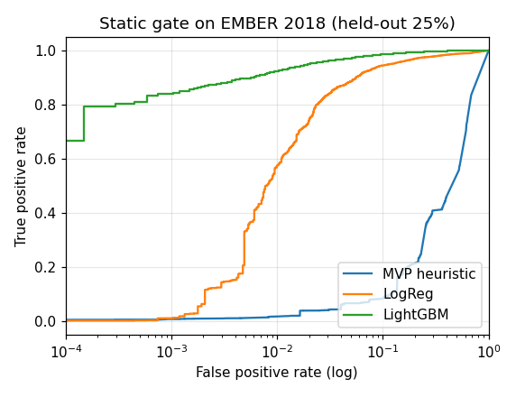
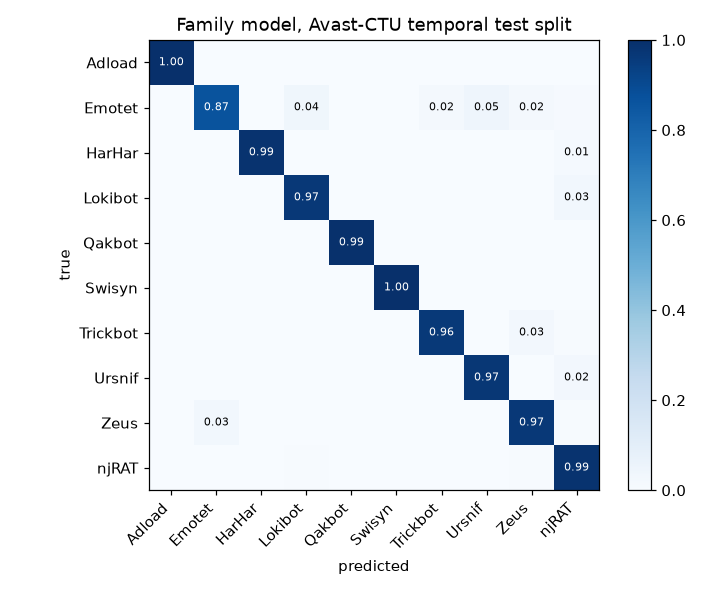
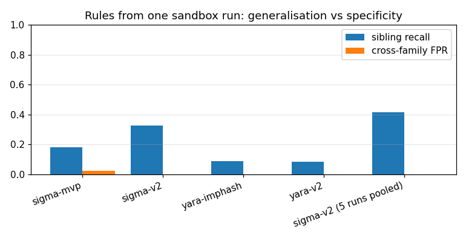

# SPECIMEN

[](https://github.com/rakshit-737/specimen/actions/workflows/ci.yml)

[](LICENSE)


**One sample (or one sandbox report) in, one defensible story out:** what the sample is, what it did on the host, how to detect it next time, and the evidence behind each conclusion.

SPECIMEN is a sample-to-story malware analysis pipeline. It runs an explainable static gate that decides whether a sample is worth detonating, then replays sandbox behaviour (CAPEv2/Cuckoo reports or its own trace format) into a process/file/registry/network provenance graph with an ATT&CK timeline. After that it attributes the run to a family, synthesizes YARA and Sigma rules that are checked for specificity before they are kept, and writes a JSON + Markdown report with a hash manifest.

> **Lab-only, and it never executes anything.** SPECIMEN reads sample bytes and parses sandbox reports. Nothing in this repository runs, loads or unpacks a sample. All real-data work uses public sandbox reports and pre-extracted features: no binaries are ever downloaded. See [Safety](#safety).

---

## Headline results (real public data)

| Question | Dataset | SPECIMEN | Baseline (MVP) | Published reference |
|---|---|---|---|---|
| Can a static gate skip detonations safely? | EMBER 2018, 56,893 PEs | **Skips 42 % of detonations (88 % of benign) and misses 1.2 % of malware** at a 99 %-recall threshold; ROC AUC **0.994** | Detonate every PE (0 % saved); heuristic AUC 0.560 | EMBER LightGBM AUC 0.9991 (2017 set, full data) |
| Which family is it? | Avast-CTU CAPEv2, 48,976 reports, temporal split | **95.9 %** accuracy (macro-F1 0.926) | Jaccard over ATT&CK sets: 87.8 % (macro-F1 0.713) | HMIL: 94.5 % |
| Do auto-Sigma rules from **one** run catch later siblings? | Avast-CTU, 10 families x 10 runs | Sibling recall **0.33** at **0.016 %** cross-family FPR (0.42 when 5 runs are pooled) | Recall 0.18 at 2.3 % FPR | - (research question from the spec) |
| Is the behaviour malicious? | MalbehavD-V1, 2,570 Cuckoo API traces | **96.8 %** accuracy, AUC 0.991 (5-fold CV 96.1 ± 0.9 %) | MVP synthetic-trained scorer: 50 % (AUC 0.23) | MalDetConv 96.1 %, MalDy 95.6 % |

All numbers come from `benchmarks/*.py` runs, and the raw outputs are committed in [`results/`](results/). The [evaluation section](#evaluation) gives the protocol, the caveats and what did *not* work.

## Architecture

```mermaid
flowchart LR
  S[Sample bytes<br/>read-only] --> G[Static gate<br/>heuristic or EMBER LightGBM + TreeSHAP]
  R[CAPEv2 / Cuckoo report<br/>full or reduced] --> A[Adapters<br/>CAPE, API-sequence, native trace]
  R -. static.pe .-> G2[PE-metadata gate]
  G -->|detonate?| D{score >= calibrated<br/>threshold}
  D -->|no| REP
  D -->|yes: replay recorded run| A
  A --> TR[Trace<br/>typed, validated events]
  TR --> PROV[Provenance graph<br/>+ ATT&CK timeline + anomaly]
  TR --> TOK[Normalised tokens]
  TOK --> FAM[Family model<br/>hashed tokens + LR, per-token evidence]
  PROV --> SC[Behaviour scorer]
  TR --> SYN[Detection synthesis v2<br/>Sigma generalisation ladder<br/>YARA pe.imphash / rare imports]
  NEG[(Negative corpus<br/>benign + other families)] --> SYN
  G2 --> REP
  FAM --> REP[Unified report<br/>verdict, confidence, graph, timeline,<br/>IOCs, rules, manifest hashes]
  SC --> REP
  SYN --> REP
  Q[[batch job queue<br/>jobs.jsonl ledger]] -.-> R
```

| Stage | Module | Notes |
|---|---|---|
| Adapters | `specimen/adapters/cape.py`, `api_seq.py` | Full CAPE/Cuckoo call logs, Avast-CTU reduced reports and API sequences, all mapped to one `Trace`. Hostile input is coerced and capped. |
| Static gate | `specimen/static_triage.py`, `specimen/ml/ember.py` | Additive heuristic on bytes or on `static.pe`; EMBER v2-style vector + LightGBM with TreeSHAP; threshold calibrated for 99 % recall |
| Provenance | `specimen/provenance.py` | Process tree, file/registry/network/mutex/service edges; about 50 ATT&CK mapping rules (34 API-level, 17 artefact-level) |
| Tokens | `specimen/tokens.py` | Removes user names, GUIDs, SIDs, hex blobs and numbers so runs of one family share tokens |
| Family | `specimen/ml/family.py` | 2^18 hashed tokens with multinomial LR. Weights are stored as `.npz` (no pickle), and every prediction is explained by its top tokens |
| Detection synthesis | `specimen/detect.py` (v2), `specimen/synth.py` (MVP) | See [ADR 0002](docs/adr/0002-specificity-constrained-rule-generalisation.md) |
| Report | `specimen/report.py` | JSON + Markdown, Mermaid graph, manifest with sample, trace, report and content SHA-256 |
| Queue | `specimen/jobqueue.py` | Resumable append-only ledger with per-job failure isolation |

## Quickstart

```bash
pip install -e ".[dev,ml]"       # core is stdlib-only; [ml] adds numpy/sklearn/lightgbm
python -m pytest -q               # 60 tests, no datasets needed
python -m specimen demo --out out # inert fixtures, all spec demo scenarios

# report-only analysis of a real (bundled) Avast-CTU CAPE report
python -m specimen report tests/fixtures/cape/avast_njrat_1.json --out out/reports

# a whole directory, resumable
python -m specimen batch path/to/cape_reports --out out/batch --workers 4

# sample bytes + a recorded run (native trace or CAPE JSON; sha256 binding enforced)
python -m specimen analyze sample.bin --trace run.json --out out/

# trained static gate on EMBER raw-feature JSON lines (after bench_static.py)
python -m specimen triage-ember features.jsonl
```

Example (`specimen report` on the bundled njRAT report, with the trained family model in `models/`; actual output):

```json
{"verdict": {"label": "malicious", "score": 0.9133, "confidence": "medium (behavior-driven)"},
 "static_score": 0.2315,
 "family": "njRAT", "family_confidence": 0.984,
 "techniques": ["T1105", "T1547.001"],
 "sigma_rules": 10, "yara": true}
```

The bundled fixtures are trimmed to about 8 KB, so they carry fewer behaviour tokens than the full reports the model was evaluated on. The trimmed Lokibot fixture (`avast_lokibot_1.json`) is misattributed as njRAT (0.86); the two Emotet fixtures and the njRAT fixture are attributed correctly.

Each report contains the static contributions, the timeline with ATT&CK tags and anomaly scores, the provenance graph as Mermaid, IOCs, the family evidence tokens, ready-to-review Sigma and YARA rules, and the evidence manifest.

## Data

Nothing is committed. `scripts/download_data.py` fetches the data into `$SPECIMEN_DATA` (outside the repo) with resumable parallel range requests and records SHA-256 hashes in `SHA256SUMS` (`--verify` re-checks them).

| Dataset | What is used | Size | Licence | Citation |
|---|---|---|---|---|
| [Avast-CTU Public CAPEv2 Dataset](https://github.com/avast/avast-ctu-cape-dataset) | Reduced reports (`behavior.summary` + `static.pe`) for 48,976 samples in 10 families, labels and dates | 593 MB zip | MIT (per `Licences.txt`) | Bošanský et al., *Avast-CTU Public CAPE Dataset*, arXiv:2209.03188 (2022) |
| [EMBER 2018 v2](https://github.com/elastic/ember) | Raw feature JSON lines; **only a 120 MB prefix** of the 1.7 GB archive, stream-decoded (56,893 labelled rows) | 120 MB | data: MIT (code upstream is AGPL-3.0; none is used) | Anderson & Roth, *EMBER*, arXiv:1804.04637 (2018) |
| [MalbehavD-V1](https://github.com/mpasco/MalbehavD-V1) | Cuckoo API-call sequences, 1,285 benign + 1,285 malicious | 2.3 MB | MIT | Maniriho et al., *MalDetConv*, arXiv:2209.03547 (2022); *API-MalDetect*, JNCA 2023 |

```bash
export SPECIMEN_DATA=/data/specimen           # anywhere outside the repo
python scripts/download_data.py --dest "$SPECIMEN_DATA"
python scripts/download_data.py --dest "$SPECIMEN_DATA" --verify
```

The test fixtures in `tests/fixtures/cape/` are four real Avast-CTU reduced reports trimmed to about 8 KB each (reports only), plus one clearly synthetic full-format CAPE report.

## Evaluation

The results can be reproduced with `make bench`. Without `make`, run `python benchmarks/bench_static.py`, `bench_family.py`, `bench_rules.py` and `bench_malbehavd.py` with `SPECIMEN_DATA` set. The Avast token cache (built once in about 20 minutes on 10 processes) is shared by the family and rule benchmarks.

### 1. Static gate on EMBER: `results/static_ember.json`

The data is a held-out, stratified 25 % of 56,893 labelled rows, with the gate threshold tuned on a separate validation slice for 99 % malware recall.

| model | ROC AUC | TPR @ 0.1 % FPR | TPR @ 1 % FPR | accuracy | F1 |
|---|---|---|---|---|---|
| MVP heuristic (ported) | 0.560 | 0.007 | 0.017 | 0.523 | 0.488 |
| logistic regression | 0.968 | 0.010 | 0.574 | 0.926 | 0.930 |
| **LightGBM (SPECIMEN)** | **0.994** | **0.839** | **0.924** | **0.965** | **0.967** |
| *EMBER paper, LightGBM, 2017 test set* | *0.9991* | *0.930* | *0.982* | | |

| gate policy | detonations saved | benign skipped | malware missed |
|---|---|---|---|
| MVP: detonate every PE | 0 % | 0 % | 0 % |
| MVP heuristic @ 99 % recall | 0 % | 0 % | 0 % |
| logistic regression @ 99 % recall | 17.4 % | 35.5 % | 1.0 % |
| **LightGBM @ 99 % recall** | **42.3 %** | **87.8 %** | **1.2 %** |



This answers the first half of the spec's research question. An explainable learned gate removes most benign detonations and wrongly skips about 1 % of malware. The hand-weighted MVP heuristic is barely better than chance on real PEs, so it cannot skip anything safely. Every gate decision carries TreeSHAP contributions over named features, for example `section.n_rx`, `datadir[2].size` or `imports:CreateToolhelp32Snapshot`.

*Caveats:* the archive prefix covers one month (2018-01), so the split is random rather than temporal and optimistic about drift. The model is trained on about 38k rows instead of 600k, which is a likely reason it trails the published AUC. CRC32 hashing makes the vectors differ from upstream EMBER vectors.

### 2. Family attribution on Avast-CTU CAPEv2: `results/family_avast.json`

The split is the dataset authors' temporal one: 37,512 training reports dated before 2019-08-01 and 11,464 later test reports.

| model | test accuracy | macro-F1 |
|---|---|---|
| MVP Jaccard over ATT&CK technique sets | 0.878 | 0.713 |
| static.pe tokens only | 0.691 | 0.737 |
| behaviour + static tokens | 0.950 | 0.923 |
| **behaviour tokens only (SPECIMEN)** | **0.959** | **0.926** |
| *HMIL on reduced reports (Bošanský et al.)* | *0.945* | |
| *HMIL static-only (Bošanský et al.)* | *~0.63* | |



A linear model on normalised, human-readable behaviour tokens matches the published hierarchical multi-instance model, and each prediction lists the tokens that drove it. The result confirms the paper's finding: static features drift badly over time (0.69), and adding them to behaviour tokens slightly *hurts* (0.950 vs 0.959). The shipped model therefore uses behaviour tokens only.

### 3. Do auto-rules from ONE run generalise? `results/rules_avast.json`

For each family, 10 reference runs are drawn from the training split and rules are synthesized from each single run. The rules are then applied to the later test split. *Sibling recall* is the share of same-family test runs on which at least one rule fires. *Cross-family FPR* is the share of other-family test runs on which at least one rule fires.

| synthesizer | mean sibling recall | mean cross-family FPR | runs with any sibling hit | rules / run |
|---|---|---|---|---|
| Sigma, MVP (exact values, technique-gated) | 0.182 | 2.27 % | 51 % | 0.7 |
| **Sigma v2 (generalisation ladder + negative check)** | **0.327** | **0.016 %** | **79 %** | 6.0 |
| Sigma v2, 5 runs pooled | 0.416 | 0.065 % | 100 % | 29.6 |
| YARA `pe.imphash()` | 0.087 | 0.021 % | 23 % | 1.0 |
| YARA v2 (imphash or rare imports) | 0.083 | 0.002 % | 17 % | 0.9 |



Rule generalisation varies a lot by family. For Swisyn and Qakbot, one run gives 99.8 % and 97.9 % sibling recall. For Lokibot it gives 49 % (61 % with 5 runs), and for njRAT 36 % (56 % with 5 runs). Emotet, Trickbot and Ursnif randomise every artefact that the reduced reports record, so rules synthesized from one run almost never transfer. HarHar reports contain no process, registry or file-write actions, so no rule can be built from them. The v2 synthesizer roughly doubles recall and cuts cross-family false positives by about 140x compared with the MVP. The negatives are other malware families, not benign software; see [Limitations](#limitations).

### 4. Behavioural detection on MalbehavD-V1: `results/behaviour_malbehavd.json`

The protocol is a 70/30 stratified split, as in the dataset paper, plus 5-fold CV. Every sample goes through `api_sequence_to_trace`.

| model | ROC AUC | accuracy | F1 | 5-fold CV accuracy |
|---|---|---|---|---|
| MVP scorer (synthetic-trained, ATT&CK features) | 0.228 | 0.503 | 0.010 | 0.501 ± 0.002 |
| same 9 ATT&CK features, retrained | 0.779 | 0.754 | 0.768 | 0.716 ± 0.019 |
| **API uni+bigram tokens + LR** | **0.991** | **0.968** | **0.967** | **0.961 ± 0.009** |
| API uni+bigram tokens + LightGBM | 0.990 | 0.966 | 0.966 | 0.963 ± 0.008 |
| *MalDetConv CNN-BiGRU (published)* | | *0.961* | *0.960* | |
| *MalDy TF-IDF + XGBoost (as reported there)* | | *0.956* | | |

This was an honest negative result for the MVP. Its synthetic-trained behaviour scorer does not transfer at all: API-only traces trigger almost no ATT&CK-mapped features, so the scorer's ranking is inverted. Nine coarse technique counts are too lossy. A plain n-gram model through the same trace path is on par with the published deep models.

## Prior art and how SPECIMEN differs

| Existing | Scope | What SPECIMEN adds |
|---|---|---|
| Cuckoo / CAPEv2 | Mature dynamic sandboxes that produce behaviour reports | SPECIMEN *consumes* those reports. It adds a static detonation gate with a measured cost/miss trade-off, a provenance graph and ATT&CK timeline, family attribution with token evidence, and rules that are checked for specificity before they are kept |
| Any.run / Joe Sandbox | Commercial, closed and cloud-based | Open, offline and extendable; every score is explainable |
| VirusTotal / Intezer | Verdicts, code reuse and relationships | Host-level reconstruction and detection synthesis from one run |
| EMBER / MalConv / HMIL / MalDetConv | Single-stage classifiers | Used here as baselines for individual stages. SPECIMEN's contribution is the integration and the rule-generalisation measurement |
| Sigma / YARA rule generators (e.g. yarGen) | String-based rule generation | Behavioural Sigma from sandbox actions, with a generalisation ladder bounded by a negative corpus |

## Limitations

- **No live detonation.** The detonation controller (QEMU/KVM snapshot and revert, egress verification) and eBPF capture are not built. SPECIMEN replays recorded runs instead ([ADR 0001](docs/adr/0001-report-replay-instead-of-live-detonation.md)).
- **Reduced reports have no timing.** Events from them are ordered deterministically and flagged `synthetic_ts`. Full CAPE reports do keep real timestamps.
- **The negatives for rule specificity are other malware families plus a small synthetic benign set**, not a large benign behaviour corpus. Real-world false-positive rates on clean enterprise telemetry are unmeasured.
- **Rule matching is a faithful re-implementation** of Sigma wildcard semantics and YARA `pe.imphash()`/`pe.imports()`. Rules have not yet been compiled with `sigma-cli`/pySigma or `yara-python` in CI.
- **EMBER is evaluated on a one-month prefix** (random split), and the behaviour models have not been adversarially evaluated.
- The shipped behaviour *scorer* in the pipeline is still the MVP one; see result 4. The real-data family model and the API n-gram model are the recommended path. Wiring a real-data maliciousness scorer into `run_report` is the top roadmap item.

## Roadmap

- [x] Stage 1: wire the static gate into reconstruction on pre-captured logs (CAPE adapters, 49k real runs)
- [x] Stage 2: detection synthesizer with measured generalisation
- [x] Stage 3: unified report with evidence manifest; batch queue
- [x] Stage 7 (partial): family clustering/attribution; job queue (file ledger)
- [ ] Real-data behaviour scorer in `run_report` (API n-grams + tokens); benign CAPE corpus for Sigma FP measurement
- [ ] Validate emitted rules with pySigma and `yara-python` in CI
- [ ] Stage 4: detonation controller with EICAR and benign binaries only, fail-closed if egress is not verified
- [ ] Stage 5: eBPF/Sysmon capture adapter (ROOTLINE), Sysmon EVTX to trace
- [ ] Temporal EMBER evaluation on the full 2018 set; adversarial robustness checks

## Safety

- SPECIMEN only reads bytes (capped at 50 MB) and parses JSON. There is no code path that executes, imports, unpacks or decompresses a sample.
- No binaries are downloaded: only sandbox reports, pre-extracted features and labels. `.gitignore` blocks `samples/`, `*.exe`, `*.dll`, `*.zip`, `data/` and `models/`.
- Model artefacts are stored as LightGBM text and `.npz` files. Loading a model never unpickles anything.
- Auto-generated rules are `status: experimental`. They record their generalisation rung and must be reviewed before deployment.
- Any future detonation work must run in a disposable VM with no egress and be reverted after each run. See [THREAT_MODEL.md](THREAT_MODEL.md) and [SECURITY.md](SECURITY.md).

## Project docs

[CHANGELOG](CHANGELOG.md) · [CONTRIBUTING](CONTRIBUTING.md) · [ADRs](docs/adr/) · [Threat model](THREAT_MODEL.md) · [Security policy](SECURITY.md) · [Spec roadmap](#roadmap)

## Citation of the data

```
Bošanský B., Kouba D., Maňhal O., Sick T., Lisý V., Křoustek J., Somol P. Avast-CTU Public CAPE Dataset. arXiv:2209.03188, 2022.
Anderson H. S., Roth P. EMBER: An Open Dataset for Training Static PE Malware Machine Learning Models. arXiv:1804.04637, 2018.
Maniriho P., Mahmood A. N., Chowdhury M. J. M. MalDetConv / API-MalDetect. arXiv:2209.03547, 2022; JNCA 218, 2023.
```

MIT licensed. See [LICENSE](LICENSE).
