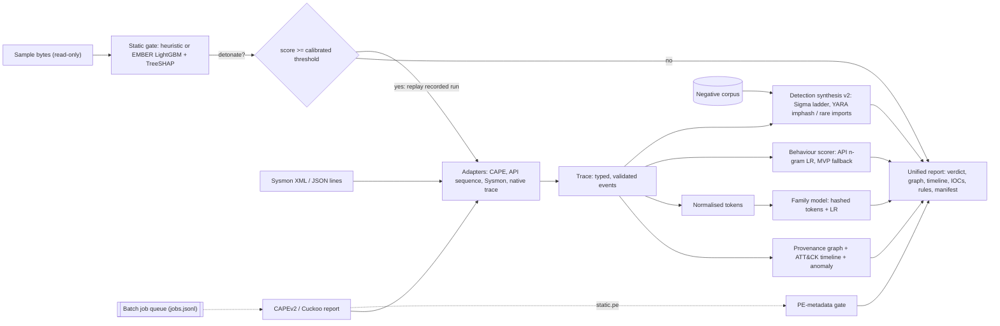

# Architecture

| Stage | Module | Notes |
|---|---|---|
| Adapters | `specimen/adapters/cape.py`, `api_seq.py`, `sysmon.py` | CAPE/Cuckoo call logs and reduced reports, API sequences, and Sysmon XML/JSON-lines exports all map to one `Trace`. Hostile input is coerced and capped; Sysmon XML with DTDs is refused. |
| Static gate | `specimen/static_triage.py`, `specimen/ml/ember.py` | Additive heuristic on bytes or `static.pe`; EMBER v2-style vector + LightGBM with TreeSHAP; threshold calibrated for 99 % recall. |
| Provenance | `specimen/provenance.py` | Process tree, file/registry/network/mutex/service edges; ~50 ATT&CK mapping rules. |
| Behaviour scorer | `specimen/api_behaviour.py`, `specimen/scoring.py` | API uni+bigram TF-IDF + LR trained on MalbehavD-V1, exported as JSON and evaluated in pure Python; used when a trace has at least 20 real API calls, otherwise the MVP ATT&CK-feature scorer. The report records which one ran. |
| Tokens / family | `specimen/tokens.py`, `specimen/ml/family.py` | Normalised behaviour tokens; 2^18 hashed features + multinomial LR stored as `.npz`; per-token evidence. |
| Detection synthesis | `specimen/detect.py` | Sigma generalisation ladder with a negative-corpus check; YARA over `pe.imphash()` and rare imports. Emitted rules are validated with pySigma and yara-python in CI. |
| Report | `specimen/report.py` | JSON + Markdown, Mermaid graph, manifest with SHA-256 hashes. |
| Queue | `specimen/jobqueue.py` | Resumable append-only ledger. |

Design decisions are recorded as ADRs (see the navigation).
