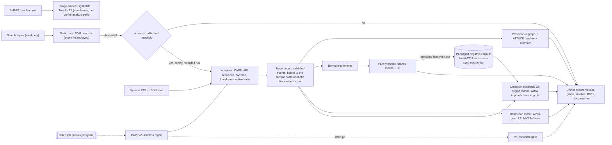

# Architecture

| Stage | Module | Notes |
|---|---|---|
| Adapters | `specimen/adapters/cape.py`, `api_seq.py`, `sysmon.py`, `speakeasy.py` | CAPE/Cuckoo call logs and reduced reports, API sequences, Sysmon XML/JSON-lines exports (UTF-8/16/32) and Speakeasy emulation reports all map to one `Trace`. Hostile input is coerced and capped; Sysmon XML with DTDs is refused; non-finite numbers and deep nesting become one-line errors. |
| Evidence binding | `specimen/pipeline.py` | `analyze` refuses a trace whose recorded sample hash (native `sample_sha256`, CAPE target hash, Sysmon event 1 `Hashes`) differs from the sample; a trace without one is `unbound` with low confidence. |
| Static gate | `specimen/static_triage.py`, `specimen/ml/ember.py` | `analyze` uses the additive heuristic on bytes (or on `static.pe` for `report`) and still replays every PE. The EMBER v2-style vector + LightGBM with TreeSHAP and a 99 %-recall threshold runs only through `triage-ember`. |
| Provenance | `specimen/provenance.py` | Process tree, file/registry/network/mutex/service edges; ~50 ATT&CK mapping rules. |
| Behaviour scorer | `specimen/api_behaviour.py`, `specimen/scoring.py` | API uni+bigram TF-IDF + LR trained on MalbehavD-V1, exported as JSON and evaluated in pure Python; used when a trace has at least 5 real API calls, otherwise the MVP ATT&CK-feature scorer. The report records which one ran. |
| Tokens / family | `specimen/tokens.py`, `specimen/ml/family.py` | Normalised behaviour tokens; 2^18 hashed features + multinomial LR stored as `.npz`; per-token evidence. |
| Detection synthesis | `specimen/detect.py` | Sigma generalisation ladder with a negative-corpus check (packaged corpus minus the predicted family), used by both `analyze` and `report`; YARA over `pe.imphash()` and rare imports, or strings from sample bytes when there is no PE metadata. Emitted rules are validated with pySigma and yara-python in CI. |
| Report | `specimen/report.py` | Strict JSON + Markdown (report strings entity-encoded, IOCs defanged), Mermaid graph, manifest with SHA-256 hashes, negative corpus and trace binding. |
| Queue | `specimen/jobqueue.py` | Resumable append-only ledger. |

Design decisions are recorded as ADRs (see the navigation).
