# Report: avast_emotet_1

!!! note
    Generated by `specimen report` from a bundled fixture (trimmed public Avast-CTU report, or a synthetic one).

**Verdict:** suspicious (score 0.5685, confidence high)  
**Detonated:** yes (recorded trace replay)

## Static triage
score 0.53 / entropy 7.86

- `high_section_entropy` impact +1.32
- `pe_executable` impact +0.80

## Behavior
P(malicious)=0.5685 label=suspicious scorer=mvp-synthetic-logreg (ATT&CK features) | family match **Emotet** (jaccard 0.999)
- `n_drop`=0.6931 impact +1.74
- `frac_suspicious`=0.0702 impact +0.11
- `n_file_write`=0.6931 impact -0.02
- `n_delete`=1.6094 impact +0.00

## Timeline
| t | event | ATT&CK | anomaly |
|---|---|---|---|
| 0.00 | sample.exe created PEM9B4 |   | 1.0 |
| 0.00 | sample.exe created PEM938 |   | 1.0 |
| 0.00 | sample.exe created Global\I5C3A8244 |   | 1.0 |
| 0.00 | sample.exe created Global\M5C3A8244 |   | 1.0 |
| 0.01 | sample.exe spawned DF4FD49DC53618D7F3A1.exe `"C:\Users\comp\AppData\Local\Temp\DF4FD49DC53618D7F3A1.exe"` |   | 1.0 |
| 0.01 | sample.exe read C:\Windows\Globalization\Sorting\sortdefault.nls |   | 0.0 |
| 0.01 | sample.exe read C:\Users\comp\AppData\Local\Temp\DF4FD49DC53618D7F3A1.exe |   | 0.0 |
| 0.01 | sample.exe read \Device\KsecDD |   | 0.0 |
| 0.01 | sample.exe read C:\Windows\SysWOW64\shell32.dll |   | 0.0 |
| 0.01 | sample.exe read C:\ |   | 0.0 |
| 0.01 | sample.exe read C:\Users\comp\AppData\Local\Microsoft\Windows\Caches\cversions.1.db |   | 0.0 |
| 0.01 | sample.exe read C:\Users\comp\AppData\Local\Microsoft\Windows\Caches\{AFBF9F1A-8EE8-4C77-AF34-C647E37CA0D9}.1.ver0x0000000000000003.db |   | 0.0 |
| 0.01 | sample.exe read C:\Users\desktop.ini |   | 0.0 |
| 0.01 | sample.exe read C:\Users |   | 0.0 |
| 0.01 | sample.exe read C:\Users\comp |   | 0.0 |
| 0.02 | sample.exe read C:\Users\comp\AppData |   | 0.0 |
| 0.02 | sample.exe read C:\Users\comp\AppData\Local |   | 0.0 |
| 0.02 | sample.exe read C:\Users\ |   | 0.0 |
| 0.02 | sample.exe read C:\Users\comp\ |   | 0.0 |
| 0.02 | sample.exe read C:\Users\comp\AppData\ |   | 0.0 |
| 0.02 | sample.exe read C:\Users\comp\AppData\Local\ |   | 0.0 |
| 0.02 | sample.exe read C:\Users\comp\AppData\Local\iproppass\ |   | 0.0 |
| 0.02 | sample.exe wrote C:\Users\comp\AppData\Local\iproppass\iproppass.exe | T1105 command-and-control | 0.537 |
| 0.02 | sample.exe deleted C:\Users\comp\AppData\Local\spcmachine\spcmachine.exe | T1070.004 defense-evasion | 1.0 |
| 0.03 | sample.exe deleted C:\Users\comp\AppData\Local\Microsoft\Windows\iproppass.exe | T1070.004 defense-evasion | 1.0 |
| 0.03 | sample.exe deleted C:\Users\comp\AppData\Local\Microsoft\Windows\spcmachine.exe | T1070.004 defense-evasion | 1.0 |
| 0.03 | sample.exe deleted C:\Users\comp\AppData\Local\Temp\DF4FD49DC53618D7F3A1.exe | T1070.004 defense-evasion | 1.0 |
| 0.03 | sample.exe read HKEY_LOCAL_MACHINE\SYSTEM\ControlSet001\Control\FileSystem\Win31FileSystem |   | 1.0 |
| 0.03 | sample.exe read DisableUserModeCallbackFilter |   | 1.0 |
| 0.03 | sample.exe read HKEY_LOCAL_MACHINE\SYSTEM\ControlSet001\Control\Nls\CustomLocale\en-US |   | 1.0 |
| 0.03 | sample.exe read HKEY_LOCAL_MACHINE\SYSTEM\ControlSet001\Control\Nls\ExtendedLocale\en-US |   | 1.0 |
| 0.03 | sample.exe read HKEY_LOCAL_MACHINE\SYSTEM\ControlSet001\Control\Nls\Sorting\Versions\00060101.00060101 |   | 1.0 |
| 0.03 | sample.exe read HKEY_LOCAL_MACHINE\SOFTWARE\Microsoft\Windows NT\CurrentVersion\GRE_Initialize\DisableMetaFiles |   | 1.0 |
| 0.03 | sample.exe read HKEY_CURRENT_USER\Software\Microsoft\Windows\CurrentVersion\Explorer\NoFileFolderConnection |   | 1.0 |
| 0.04 | sample.exe read HKEY_LOCAL_MACHINE\SOFTWARE\Microsoft\Windows\CurrentVersion\Policies\Explorer\NoPropertiesMyComputer |   | 1.0 |
| 0.04 | sample.exe read HKEY_LOCAL_MACHINE\SOFTWARE\Microsoft\Windows\CurrentVersion\Policies\Explorer\NoPropertiesRecycleBin |   | 1.0 |
| 0.04 | sample.exe read HKEY_LOCAL_MACHINE\SOFTWARE\Microsoft\Windows\CurrentVersion\Policies\Explorer\NoControlPanel |   | 1.0 |
| 0.04 | sample.exe read HKEY_LOCAL_MACHINE\SOFTWARE\Microsoft\Windows\CurrentVersion\Policies\Explorer\NoSetFolders |   | 1.0 |
| 0.04 | sample.exe read HKEY_LOCAL_MACHINE\SOFTWARE\Microsoft\Windows\CurrentVersion\Policies\Explorer\NoInternetIcon |   | 1.0 |
| 0.04 | sample.exe read HKEY_CURRENT_USER |   | 1.0 |
| 0.04 | sample.exe read HKEY_LOCAL_MACHINE\SYSTEM\CurrentControlSet\Control\FileSystem |   | 1.0 |
| 0.04 | sample.exe read HKEY_LOCAL_MACHINE\System\CurrentControlSet\Control\Nls\CustomLocale |   | 1.0 |
| 0.04 | sample.exe read HKEY_LOCAL_MACHINE\System\CurrentControlSet\Control\Nls\ExtendedLocale |   | 1.0 |
| 0.04 | sample.exe read HKEY_LOCAL_MACHINE\Software\Microsoft\Windows NT\CurrentVersion\GRE_Initialize |   | 1.0 |
| 0.04 | sample.exe read HKEY_LOCAL_MACHINE\Software\Microsoft\Windows\CurrentVersion\SideBySide |   | 1.0 |

## Provenance graph

```mermaid
flowchart LR
  n0["process: sample.exe (1000)"]
  n1["mutex: PEM9B4"]
  n2["mutex: PEM938"]
  n3["mutex: Global\I5C3A8244"]
  n4["mutex: Global\M5C3A8244"]
  n5["process: DF4FD49DC53618D7F3A1.exe (1001)"]
  n6["file: C:\Windows\Globalization\Sorting\sortdefault.nls"]
  n7["file: C:\Users\comp\AppData\Local\Temp\DF4FD49DC53618D7F3A1.exe"]
  n8["file: \Device\KsecDD"]
  n9["file: C:\Windows\SysWOW64\shell32.dll"]
  n10["file: C:\"]
  n11["file: C:\Users\comp\AppData\Local\Microsoft\Windows\Caches\cversio"]
  n12["file: C:\Users\comp\AppData\Local\Microsoft\Windows\Caches\{AFBF9F"]
  n13["file: C:\Users\desktop.ini"]
  n14["file: C:\Users"]
  n15["file: C:\Users\comp"]
  n16["file: C:\Users\comp\AppData"]
  n17["file: C:\Users\comp\AppData\Local"]
  n18["file: C:\Users\"]
  n19["file: C:\Users\comp\"]
  n20["file: C:\Users\comp\AppData\"]
  n21["file: C:\Users\comp\AppData\Local\"]
  n22["file: C:\Users\comp\AppData\Local\iproppass\"]
  n23["file: C:\Users\comp\AppData\Local\iproppass\iproppass.exe"]
  n24["file: C:\Users\comp\AppData\Local\spcmachine\spcmachine.exe"]
  n25["file: C:\Users\comp\AppData\Local\Microsoft\Windows\iproppass.exe"]
  n26["file: C:\Users\comp\AppData\Local\Microsoft\Windows\spcmachine.exe"]
  n27["registry: HKEY_LOCAL_MACHINE\SYSTEM\ControlSet001\Control\FileSystem\W"]
  n28["registry: DisableUserModeCallbackFilter"]
  n29["registry: HKEY_LOCAL_MACHINE\SYSTEM\ControlSet001\Control\Nls\CustomLo"]
  n30["registry: HKEY_LOCAL_MACHINE\SYSTEM\ControlSet001\Control\Nls\Extended"]
  n31["registry: HKEY_LOCAL_MACHINE\SYSTEM\ControlSet001\Control\Nls\Sorting\"]
  n32["registry: HKEY_LOCAL_MACHINE\SOFTWARE\Microsoft\Windows NT\CurrentVers"]
  n33["registry: HKEY_CURRENT_USER\Software\Microsoft\Windows\CurrentVersion\"]
  n34["registry: HKEY_LOCAL_MACHINE\SOFTWARE\Microsoft\Windows\CurrentVersion"]
  n35["registry: HKEY_LOCAL_MACHINE\SOFTWARE\Microsoft\Windows\CurrentVersion"]
  n36["registry: HKEY_LOCAL_MACHINE\SOFTWARE\Microsoft\Windows\CurrentVersion"]
  n37["registry: HKEY_LOCAL_MACHINE\SOFTWARE\Microsoft\Windows\CurrentVersion"]
  n38["registry: HKEY_LOCAL_MACHINE\SOFTWARE\Microsoft\Windows\CurrentVersion"]
  n39["registry: HKEY_CURRENT_USER"]
  n40["registry: HKEY_LOCAL_MACHINE\SYSTEM\CurrentControlSet\Control\FileSyst"]
  n41["registry: HKEY_LOCAL_MACHINE\System\CurrentControlSet\Control\Nls\Cust"]
  n42["registry: HKEY_LOCAL_MACHINE\System\CurrentControlSet\Control\Nls\Exte"]
  n43["registry: HKEY_LOCAL_MACHINE\Software\Microsoft\Windows NT\CurrentVers"]
  n44["registry: HKEY_LOCAL_MACHINE\Software\Microsoft\Windows\CurrentVersion"]
  n0 -->|"created"| n1
  n0 -->|"created"| n2
  n0 -->|"created"| n3
  n0 -->|"created"| n4
  n0 -->|"spawned"| n5
  n0 -->|"read"| n6
  n0 -->|"read"| n7
  n0 -->|"read"| n8
  n0 -->|"read"| n9
  n0 -->|"read"| n10
  n0 -->|"read"| n11
  n0 -->|"read"| n12
  n0 -->|"read"| n13
  n0 -->|"read"| n14
  n0 -->|"read"| n15
  n0 -->|"read"| n16
  n0 -->|"read"| n17
  n0 -->|"read"| n18
  n0 -->|"read"| n19
  n0 -->|"read"| n20
  n0 -->|"read"| n21
  n0 -->|"read"| n22
  n0 -->|"wrote"| n23
  n0 -->|"deleted"| n24
  n0 -->|"deleted"| n25
  n0 -->|"deleted"| n26
  n0 -->|"deleted"| n7
  n0 -->|"read"| n27
  n0 -->|"read"| n28
  n0 -->|"read"| n29
  n0 -->|"read"| n30
  n0 -->|"read"| n31
  n0 -->|"read"| n32
  n0 -->|"read"| n33
  n0 -->|"read"| n34
  n0 -->|"read"| n35
  n0 -->|"read"| n36
  n0 -->|"read"| n37
  n0 -->|"read"| n38
  n0 -->|"read"| n39
  n0 -->|"read"| n40
  n0 -->|"read"| n41
  n0 -->|"read"| n42
  n0 -->|"read"| n43
  n0 -->|"read"| n44
```


## IOCs
- **dropped_files**: C:\Users\comp\AppData\Local\iproppass\iproppass.exe

## YARA
```yara
import "pe"

rule SPECIMEN_70bc0ccbf006
{
    meta:
        author = "SPECIMEN (auto)"
        sample_sha256 = "70bc0ccbf0064ea50ee57f3848d3e741ab8ef89926812d7c8107e9061acacbc6"
        confidence = "auto-generated; review before deploy"
    condition:
        uint16(0) == 0x5A4D and (
        pe.imphash() == "4dea8baa82ea91fb7bfd7710f9db1c8b"
        or (
            pe.imports("advapi32.dll", "EnumServicesStatusW") +
            pe.imports("advapi32.dll", "EqualPrefixSid") +
            pe.imports("advapi32.dll", "GetWindowsAccountDomainSid") +
            pe.imports("advapi32.dll", "LookupPrivilegeNameW") +
            pe.imports("advapi32.dll", "SetSecurityAccessMask") +
            pe.imports("gdi32.dll", "GdiSetBatchLimit") +
            pe.imports("gdi32.dll", "GetBrushOrgEx") +
            pe.imports("gdi32.dll", "GetCharWidth32A")
        ) >= 6
        )
}

```

## Sigma
```yaml
title: SPECIMEN auto - file_event pattern
status: experimental
description: Auto-synthesized from one sandbox run of 70bc0ccbf0064ea5; generalisation rung 2; zero hits on the negative corpus at synthesis time. Review before deploy.
author: SPECIMEN
tags:
    - attack.t1105
logsource:
    product: windows
    category: file_event
detection:
    selection:
        TargetFilename: 'C:\Users\*\AppData\Local\*\iproppass.exe'
    condition: selection
level: medium

```

## Sigma
```yaml
title: SPECIMEN auto - process_creation pattern
status: experimental
description: Auto-synthesized from one sandbox run of 70bc0ccbf0064ea5; generalisation rung 0; zero hits on the negative corpus at synthesis time. Review before deploy.
author: SPECIMEN
logsource:
    product: windows
    category: process_creation
detection:
    selection:
        Image: 'C:\Users\*\AppData\Local\Temp\DF4FD49DC53618D7F3A1.exe'
    condition: selection
level: medium

```

Specificity: YARA FP []; dropped Sigma ['rejected_nonspecific:0']

## Evidence manifest
```json
{
  "sample_sha256": "70bc0ccbf0064ea50ee57f3848d3e741ab8ef89926812d7c8107e9061acacbc6",
  "trace_sha256": "70bc0ccbf0064ea50ee57f3848d3e741ab8ef89926812d7c8107e9061acacbc6",
  "trace_run_id": "avast_emotet_1",
  "python": "3.14.3",
  "specimen_version": "0.1.0",
  "execution": "report-only (sandbox report replay; no sample bytes handled)",
  "report_content_sha256": "77aabe53cf95d2559ee550c932266697d89935c6d53f91797fafbbad57ff1ab8",
  "report_sha256": "70bc0ccbf0064ea50ee57f3848d3e741ab8ef89926812d7c8107e9061acacbc6"
}
```
