# Report: avast_emotet_1

!!! note
    Generated by `specimen report` from a bundled fixture (trimmed public Avast-CTU report, or a synthetic one).

**Verdict:** suspicious (score 0.5685, confidence high)  
**Detonated:** yes (recorded trace replay)

## Static triage
score 0.53 / entropy 7.86

- high&#95;section&#95;entropy impact +1.32
- pe&#95;executable impact +0.80

## Behavior
P(malicious)=0.5685 label=suspicious scorer=mvp-synthetic-logreg (ATT&CK features) | family match **Emotet** (p=0.999, avast-ctu-logreg (behaviour+static))

- n&#95;drop = 0.6931, impact +1.74
- frac&#95;suspicious = 0.0702, impact +0.11
- n&#95;file&#95;write = 0.6931, impact -0.02
- n&#95;delete = 1.6094, impact +0.00

### Family evidence
Top tokens supporting **Emotet** (avast-ctu-logreg &#40;behaviour+static&#41;):

- mutex&#95;create:global&#92;i&#35;&lt;hex&gt; &#40;+0.485&#41;
- mutex&#95;create:global&#92;m&#35;&lt;hex&gt; &#40;+0.485&#41;
- file&#95;delete&#95;ext:exe &#40;+0.332&#41;
- exec:&lt;hex&gt;.exe &#40;+0.329&#41;
- tactic:defense-evasion &#40;+0.289&#41;
- dll:gdi32.dll &#40;+0.243&#41;

## Timeline
| t | event | ATT&CK | anomaly |
|---|---|---|---|
| 0.00 | sample.exe created PEM9B4 |   | 1.0 |
| 0.00 | sample.exe created PEM938 |   | 1.0 |
| 0.00 | sample.exe created Global&#92;I5C3A8244 |   | 1.0 |
| 0.00 | sample.exe created Global&#92;M5C3A8244 |   | 1.0 |
| 0.01 | sample.exe spawned DF4FD49DC53618D7F3A1.exe &#96;"C:&#92;Users&#92;comp&#92;AppData&#92;Local&#92;Temp&#92;DF4FD49DC53618D7F3A1.exe"&#96; |   | 1.0 |
| 0.01 | sample.exe read C:&#92;Windows&#92;Globalization&#92;Sorting&#92;sortdefault.nls |   | 0.0 |
| 0.01 | sample.exe read C:&#92;Users&#92;comp&#92;AppData&#92;Local&#92;Temp&#92;DF4FD49DC53618D7F3A1.exe |   | 0.0 |
| 0.01 | sample.exe read &#92;Device&#92;KsecDD |   | 0.0 |
| 0.01 | sample.exe read C:&#92;Windows&#92;SysWOW64&#92;shell32.dll |   | 0.0 |
| 0.01 | sample.exe read C:&#92; |   | 0.0 |
| 0.01 | sample.exe read C:&#92;Users&#92;comp&#92;AppData&#92;Local&#92;Microsoft&#92;Windows&#92;Caches&#92;cversions.1.db |   | 0.0 |
| 0.01 | sample.exe read C:&#92;Users&#92;comp&#92;AppData&#92;Local&#92;Microsoft&#92;Windows&#92;Caches&#92;{AFBF9F1A-8EE8-4C77-AF34-C647E37CA0D9}.1.ver0x0000000000000003.db |   | 0.0 |
| 0.01 | sample.exe read C:&#92;Users&#92;desktop.ini |   | 0.0 |
| 0.01 | sample.exe read C:&#92;Users |   | 0.0 |
| 0.01 | sample.exe read C:&#92;Users&#92;comp |   | 0.0 |
| 0.02 | sample.exe read C:&#92;Users&#92;comp&#92;AppData |   | 0.0 |
| 0.02 | sample.exe read C:&#92;Users&#92;comp&#92;AppData&#92;Local |   | 0.0 |
| 0.02 | sample.exe read C:&#92;Users&#92; |   | 0.0 |
| 0.02 | sample.exe read C:&#92;Users&#92;comp&#92; |   | 0.0 |
| 0.02 | sample.exe read C:&#92;Users&#92;comp&#92;AppData&#92; |   | 0.0 |
| 0.02 | sample.exe read C:&#92;Users&#92;comp&#92;AppData&#92;Local&#92; |   | 0.0 |
| 0.02 | sample.exe read C:&#92;Users&#92;comp&#92;AppData&#92;Local&#92;iproppass&#92; |   | 0.0 |
| 0.02 | sample.exe wrote C:&#92;Users&#92;comp&#92;AppData&#92;Local&#92;iproppass&#92;iproppass.exe | T1105 command-and-control | 0.537 |
| 0.02 | sample.exe deleted C:&#92;Users&#92;comp&#92;AppData&#92;Local&#92;spcmachine&#92;spcmachine.exe | T1070.004 defense-evasion | 1.0 |
| 0.03 | sample.exe deleted C:&#92;Users&#92;comp&#92;AppData&#92;Local&#92;Microsoft&#92;Windows&#92;iproppass.exe | T1070.004 defense-evasion | 1.0 |
| 0.03 | sample.exe deleted C:&#92;Users&#92;comp&#92;AppData&#92;Local&#92;Microsoft&#92;Windows&#92;spcmachine.exe | T1070.004 defense-evasion | 1.0 |
| 0.03 | sample.exe deleted C:&#92;Users&#92;comp&#92;AppData&#92;Local&#92;Temp&#92;DF4FD49DC53618D7F3A1.exe | T1070.004 defense-evasion | 1.0 |
| 0.03 | sample.exe read HKEY&#95;LOCAL&#95;MACHINE&#92;SYSTEM&#92;ControlSet001&#92;Control&#92;FileSystem&#92;Win31FileSystem |   | 1.0 |
| 0.03 | sample.exe read DisableUserModeCallbackFilter |   | 1.0 |
| 0.03 | sample.exe read HKEY&#95;LOCAL&#95;MACHINE&#92;SYSTEM&#92;ControlSet001&#92;Control&#92;Nls&#92;CustomLocale&#92;en-US |   | 1.0 |
| 0.03 | sample.exe read HKEY&#95;LOCAL&#95;MACHINE&#92;SYSTEM&#92;ControlSet001&#92;Control&#92;Nls&#92;ExtendedLocale&#92;en-US |   | 1.0 |
| 0.03 | sample.exe read HKEY&#95;LOCAL&#95;MACHINE&#92;SYSTEM&#92;ControlSet001&#92;Control&#92;Nls&#92;Sorting&#92;Versions&#92;00060101&#91;.&#93;00060101 |   | 1.0 |
| 0.03 | sample.exe read HKEY&#95;LOCAL&#95;MACHINE&#92;SOFTWARE&#92;Microsoft&#92;Windows NT&#92;CurrentVersion&#92;GRE&#95;Initialize&#92;DisableMetaFiles |   | 1.0 |
| 0.03 | sample.exe read HKEY&#95;CURRENT&#95;USER&#92;Software&#92;Microsoft&#92;Windows&#92;CurrentVersion&#92;Explorer&#92;NoFileFolderConnection |   | 1.0 |
| 0.04 | sample.exe read HKEY&#95;LOCAL&#95;MACHINE&#92;SOFTWARE&#92;Microsoft&#92;Windows&#92;CurrentVersion&#92;Policies&#92;Explorer&#92;NoPropertiesMyComputer |   | 1.0 |
| 0.04 | sample.exe read HKEY&#95;LOCAL&#95;MACHINE&#92;SOFTWARE&#92;Microsoft&#92;Windows&#92;CurrentVersion&#92;Policies&#92;Explorer&#92;NoPropertiesRecycleBin |   | 1.0 |
| 0.04 | sample.exe read HKEY&#95;LOCAL&#95;MACHINE&#92;SOFTWARE&#92;Microsoft&#92;Windows&#92;CurrentVersion&#92;Policies&#92;Explorer&#92;NoControlPanel |   | 1.0 |
| 0.04 | sample.exe read HKEY&#95;LOCAL&#95;MACHINE&#92;SOFTWARE&#92;Microsoft&#92;Windows&#92;CurrentVersion&#92;Policies&#92;Explorer&#92;NoSetFolders |   | 1.0 |
| 0.04 | sample.exe read HKEY&#95;LOCAL&#95;MACHINE&#92;SOFTWARE&#92;Microsoft&#92;Windows&#92;CurrentVersion&#92;Policies&#92;Explorer&#92;NoInternetIcon |   | 1.0 |
| 0.04 | sample.exe read HKEY&#95;CURRENT&#95;USER |   | 1.0 |
| 0.04 | sample.exe read HKEY&#95;LOCAL&#95;MACHINE&#92;SYSTEM&#92;CurrentControlSet&#92;Control&#92;FileSystem |   | 1.0 |
| 0.04 | sample.exe read HKEY&#95;LOCAL&#95;MACHINE&#92;System&#92;CurrentControlSet&#92;Control&#92;Nls&#92;CustomLocale |   | 1.0 |
| 0.04 | sample.exe read HKEY&#95;LOCAL&#95;MACHINE&#92;System&#92;CurrentControlSet&#92;Control&#92;Nls&#92;ExtendedLocale |   | 1.0 |
| 0.04 | sample.exe read HKEY&#95;LOCAL&#95;MACHINE&#92;Software&#92;Microsoft&#92;Windows NT&#92;CurrentVersion&#92;GRE&#95;Initialize |   | 1.0 |
| 0.04 | sample.exe read HKEY&#95;LOCAL&#95;MACHINE&#92;Software&#92;Microsoft&#92;Windows&#92;CurrentVersion&#92;SideBySide |   | 1.0 |

## Provenance graph

```mermaid
flowchart LR
  n0["process: sample.exe (1000)"]
  n1["mutex: PEM9B4"]
  n2["mutex: PEM938"]
  n3["mutex: Global\I5C3A8244"]
  n4["mutex: Global\M5C3A8244"]
  n5["process: DF4FD49DC53618D7F3A1.exe (1001)"]
  n6["file: C:\Windows\Globalization\Sorting\sortdefault.nls"]
  n7["file: C:\Users\comp\AppData\Local\Temp\DF4FD49DC53618D7F3A1.exe"]
  n8["file: \Device\KsecDD"]
  n9["file: C:\Windows\SysWOW64\shell32.dll"]
  n10["file: C:\"]
  n11["file: C:\Users\comp\AppData\Local\M~\Windows\Caches\cversions.1.db"]
  n12["file: C:\Users\comp\AppData\Local\M~D9).1.ver0x0000000000000003.db"]
  n13["file: C:\Users\desktop.ini"]
  n14["file: C:\Users"]
  n15["file: C:\Users\comp"]
  n16["file: C:\Users\comp\AppData"]
  n17["file: C:\Users\comp\AppData\Local"]
  n18["file: C:\Users\"]
  n19["file: C:\Users\comp\"]
  n20["file: C:\Users\comp\AppData\"]
  n21["file: C:\Users\comp\AppData\Local\"]
  n22["file: C:\Users\comp\AppData\Local\iproppass\"]
  n23["file: C:\Users\comp\AppData\Local\iproppass\iproppass.exe"]
  n24["file: C:\Users\comp\AppData\Local\spcmachine\spcmachine.exe"]
  n25["file: C:\Users\comp\AppData\Local\Microsoft\Windows\iproppass.exe"]
  n26["file: C:\Users\comp\AppData\Local\Microsoft\Windows\spcmachine.exe"]
  n27["registry: HKEY_LOCAL_MACHINE\SYSTEM\Con~rol\FileSystem\Win31FileSystem"]
  n28["registry: DisableUserModeCallbackFilter"]
  n29["registry: HKEY_LOCAL_MACHINE\SYSTEM\Con~Control\Nls\CustomLocale\en-US"]
  n30["registry: HKEY_LOCAL_MACHINE\SYSTEM\Con~ntrol\Nls\ExtendedLocale\en-US"]
  n31["registry: HKEY_LOCAL_MACHINE\SYSTEM\Con~ing\Versions\00060101[.]00060101"]
  n32["registry: HKEY_LOCAL_MACHINE\SOFTWARE\M~RE_Initialize\DisableMetaFiles"]
  n33["registry: HKEY_CURRENT_USER\Software\Mi~xplorer\NoFileFolderConnection"]
  n34["registry: HKEY_LOCAL_MACHINE\SOFTWARE\M~xplorer\NoPropertiesMyComputer"]
  n35["registry: HKEY_LOCAL_MACHINE\SOFTWARE\M~xplorer\NoPropertiesRecycleBin"]
  n36["registry: HKEY_LOCAL_MACHINE\SOFTWARE\M~licies\Explorer\NoControlPanel"]
  n37["registry: HKEY_LOCAL_MACHINE\SOFTWARE\M~Policies\Explorer\NoSetFolders"]
  n38["registry: HKEY_LOCAL_MACHINE\SOFTWARE\M~licies\Explorer\NoInternetIcon"]
  n39["registry: HKEY_CURRENT_USER"]
  n40["registry: HKEY_LOCAL_MACHINE\SYSTEM\Cur~tControlSet\Control\FileSystem"]
  n41["registry: HKEY_LOCAL_MACHINE\System\Cur~olSet\Control\Nls\CustomLocale"]
  n42["registry: HKEY_LOCAL_MACHINE\System\Cur~Set\Control\Nls\ExtendedLocale"]
  n43["registry: HKEY_LOCAL_MACHINE\Software\M~\CurrentVersion\GRE_Initialize"]
  n44["registry: HKEY_LOCAL_MACHINE\Software\M~dows\CurrentVersion\SideBySide"]
  n0 -->|"created"| n1
  n0 -->|"created"| n2
  n0 -->|"created"| n3
  n0 -->|"created"| n4
  n0 -->|"spawned"| n5
  n0 -->|"read"| n6
  n0 -->|"read"| n7
  n0 -->|"read"| n8
  n0 -->|"read"| n9
  n0 -->|"read"| n10
  n0 -->|"read"| n11
  n0 -->|"read"| n12
  n0 -->|"read"| n13
  n0 -->|"read"| n14
  n0 -->|"read"| n15
  n0 -->|"read"| n16
  n0 -->|"read"| n17
  n0 -->|"read"| n18
  n0 -->|"read"| n19
  n0 -->|"read"| n20
  n0 -->|"read"| n21
  n0 -->|"read"| n22
  n0 -->|"wrote"| n23
  n0 -->|"deleted"| n24
  n0 -->|"deleted"| n25
  n0 -->|"deleted"| n26
  n0 -->|"deleted"| n7
  n0 -->|"read"| n27
  n0 -->|"read"| n28
  n0 -->|"read"| n29
  n0 -->|"read"| n30
  n0 -->|"read"| n31
  n0 -->|"read"| n32
  n0 -->|"read"| n33
  n0 -->|"read"| n34
  n0 -->|"read"| n35
  n0 -->|"read"| n36
  n0 -->|"read"| n37
  n0 -->|"read"| n38
  n0 -->|"read"| n39
  n0 -->|"read"| n40
  n0 -->|"read"| n41
  n0 -->|"read"| n42
  n0 -->|"read"| n43
  n0 -->|"read"| n44
```


## IOCs (defanged)
- **dropped_files**: C:&#92;Users&#92;comp&#92;AppData&#92;Local&#92;iproppass&#92;iproppass.exe

## YARA
```yara
import "pe"

rule SPECIMEN_febb79941f66
{
    meta:
        author = "SPECIMEN (auto)"
        sample_sha256 = "febb79941f669497555e27d0547f2bdaf46bae8f2be10720fab2b851610eea60"
        confidence = "auto-generated; review before deploy"
    condition:
        uint16(0) == 0x5A4D and (
        pe.imphash() == "4dea8baa82ea91fb7bfd7710f9db1c8b"
        or (
            pe.imports("advapi32.dll", "EqualPrefixSid") +
            pe.imports("advapi32.dll", "GetWindowsAccountDomainSid") +
            pe.imports("advapi32.dll", "SetSecurityAccessMask") +
            pe.imports("gdi32.dll", "GetCharWidth32A") +
            pe.imports("ntdll.dll", "strspn") +
            pe.imports("user32.dll", "EnumWindowStationsA") +
            pe.imports("gdi32.dll", "GetCharWidthA") +
            pe.imports("gdi32.dll", "GdiSetBatchLimit")
        ) >= 6
        )
}

```

## Sigma 1 - file_event
```yaml
title: 'SPECIMEN auto - file_event pattern'
status: experimental
description: Auto-synthesized from one sandbox run of febb79941f669497; generalisation rung 2; zero hits on the negative corpus at synthesis time. Review before deploy.
author: SPECIMEN
tags:
    - attack.t1105
logsource:
    product: windows
    category: file_event
detection:
    selection:
        TargetFilename: 'C:\\Users\\*\\AppData\\Local\\*\\iproppass.exe'
    condition: selection
level: medium

```

## Sigma 2 - process_creation
```yaml
title: 'SPECIMEN auto - process_creation pattern'
status: experimental
description: Auto-synthesized from one sandbox run of febb79941f669497; generalisation rung 0; zero hits on the negative corpus at synthesis time. Review before deploy.
author: SPECIMEN
logsource:
    product: windows
    category: process_creation
detection:
    selection:
        Image: 'C:\\Users\\*\\AppData\\Local\\Temp\\DF4FD49DC53618D7F3A1.exe'
    condition: selection
level: medium

```

Specificity: 0 Sigma candidate(s) dropped because no generalisation rung was specific enough.

## Evidence manifest
```json
{
  "sample_sha256": null,
  "trace_sha256": "febb79941f669497555e27d0547f2bdaf46bae8f2be10720fab2b851610eea60",
  "trace_run_id": "avast_emotet_1",
  "python": "3.14.3",
  "specimen_version": "1.1.0",
  "execution": "report-only (sandbox report replay; no sample bytes handled)",
  "report_content_sha256": "7fcc7c73217673b3317a86c4aaa0c11e50e85bfaa4cc806068da30750556da66",
  "report_sha256": "febb79941f669497555e27d0547f2bdaf46bae8f2be10720fab2b851610eea60",
  "sample_sha256_note": "not present in the (reduced) report; rule names use the report hash",
  "negative_corpus": {
    "packaged": true,
    "excluded_family": "Emotet"
  }
}
```
