# Report: avast_lokibot_1

!!! note
    Generated by `specimen report` from a bundled fixture (trimmed public Avast-CTU report, or a synthetic one).

**Verdict:** malicious (score 0.9201, confidence medium (behavior-driven))  
**Detonated:** yes (recorded trace replay)

## Static triage
score 0.3363 / entropy 7.46

- `pe_executable` impact +0.80
- `high_section_entropy` impact +0.52

## Behavior
P(malicious)=0.9201 label=malicious scorer=mvp-synthetic-logreg (ATT&CK features) | family match **njRAT** (jaccard 0.858)
- `n_drop`=1.0986 impact +2.76
- `n_persist`=0.6931 impact +1.18
- `frac_suspicious`=0.0656 impact +0.11
- `n_file_write`=1.3863 impact -0.04
- `n_delete`=1.0986 impact +0.00

## Timeline
| t | event | ATT&CK | anomaly |
|---|---|---|---|
| 0.00 | sample.exe created 14E11E0BF783BCDB0BD10C30 |   | 1.0 |
| 0.00 | sample.exe spawned svchost.exe `"C:\Windows\SysWOW64\svchost.exe"` |   | 1.0 |
| 0.00 | sample.exe read C:\Windows\WindowsShell.Manifest |   | 0.0 |
| 0.00 | sample.exe read \Device\KsecDD |   | 0.0 |
| 0.01 | sample.exe read C:\Users\comp\AppData\Local\Temp\505B6E5E429EC62B3351.exe |   | 0.0 |
| 0.01 | sample.exe read C:\Windows\Globalization\Sorting\sortdefault.nls |   | 0.0 |
| 0.01 | sample.exe read C:\Windows\System32\UxTheme.dll.Config |   | 0.0 |
| 0.01 | sample.exe read C:\Windows\System32\uxtheme.dll |   | 0.0 |
| 0.01 | sample.exe read C:\Windows\AppPatch\sysmain.sdb |   | 0.0 |
| 0.01 | sample.exe read C:\Windows\SysWOW64\ |   | 0.0 |
| 0.01 | sample.exe read C:\Windows\SysWOW64\svchost.exe |   | 0.0 |
| 0.01 | sample.exe read C:\Users\comp\AppData\Local\Google\Chrome\User Data\Default\Login Data | T1555.003 credential-access | 0.3 |
| 0.01 | sample.exe read C:\Windows\SysWOW64\netapi32.dll |   | 0.0 |
| 0.01 | sample.exe read C:\Windows\SysWOW64\netutils.dll |   | 0.0 |
| 0.01 | sample.exe read C:\Users |   | 0.0 |
| 0.02 | sample.exe read C:\Users\comp |   | 0.0 |
| 0.02 | sample.exe read C:\Users\comp\AppData |   | 0.0 |
| 0.02 | sample.exe read C:\Users\comp\AppData\Local |   | 0.0 |
| 0.02 | sample.exe read C:\Users\comp\AppData\Local\Temp |   | 0.0 |
| 0.02 | sample.exe read C:\Users\comp\AppData\Local\Temp\505B6E5E429EC62B3351.exe.Local\ |   | 0.0 |
| 0.02 | sample.exe wrote C:\Users\comp\CertEnroll\windeploy.bat | T1105 command-and-control | 0.537 |
| 0.02 | sample.exe wrote C:\Users\comp\AppData\Roaming\BF783B\BCDB0B.lck |   | 0.237 |
| 0.02 | sample.exe wrote C:\Users\comp\AppData\Roaming\BF783B\BCDB0B.exe | T1105 command-and-control | 0.537 |
| 0.02 | sample.exe deleted C:\Users\comp\AppData\Roaming\BF783B\BCDB0B.lck | T1070.004 defense-evasion | 1.0 |
| 0.03 | sample.exe deleted C:\Windows\SysWOW64\svchost.exe | T1070.004 defense-evasion | 1.0 |
| 0.03 | sample.exe set HKEY_CURRENT_USER\Software\Microsoft\Windows\CurrentVersion\Run\0x433A5C55736572735C636F6D705C43657274456E726F6C6C | T1547.001 persistence | 1.0 |
| 0.03 | sample.exe set HKEY_CURRENT_USER\http://mbfgq.ga/Dboy/five/fre.php |   | 1.0 |
| 0.03 | sample.exe set HKEY_CURRENT_USER\http://mbfgq.ga/Dboy/five/fre.php\BF783B |   | 1.0 |
| 0.03 | sample.exe read HKEY_LOCAL_MACHINE\SOFTWARE\Wow6432Node\Microsoft\Windows\CurrentVersion\Internet Settings\DisableImprovedZoneCheck |   | 1.0 |
| 0.03 | sample.exe read HKEY_LOCAL_MACHINE\SOFTWARE\Policies\Microsoft\Windows\CurrentVersion\Internet Settings\Security_HKLM_only |   | 1.0 |
| 0.03 | sample.exe read DisableUserModeCallbackFilter |   | 1.0 |
| 0.03 | sample.exe read HKEY_CURRENT_USER\Control Panel\Mouse\SwapMouseButtons |   | 1.0 |
| 0.03 | sample.exe read HKEY_LOCAL_MACHINE\SYSTEM\ControlSet001\Control\Nls\CustomLocale\en-US |   | 1.0 |
| 0.03 | sample.exe read HKEY_LOCAL_MACHINE\SYSTEM\ControlSet001\Control\Nls\ExtendedLocale\en-US |   | 1.0 |
| 0.04 | sample.exe read HKEY_LOCAL_MACHINE\SYSTEM\ControlSet001\Control\Nls\Sorting\Versions\00060101.00060101 |   | 1.0 |
| 0.04 | sample.exe read HKEY_LOCAL_MACHINE\SYSTEM\ControlSet001\Control\Nls\Locale\00000409 |   | 1.0 |
| 0.04 | sample.exe read HKEY_LOCAL_MACHINE\SYSTEM\ControlSet001\Control\Nls\Language Groups\1 |   | 1.0 |
| 0.04 | sample.exe read HKEY_LOCAL_MACHINE\SOFTWARE\Policies\Microsoft\Windows\safer\codeidentifiers\TransparentEnabled |   | 1.0 |
| 0.04 | sample.exe read HKEY_LOCAL_MACHINE\SOFTWARE\Policies\Microsoft\Windows\safer\codeidentifiers\AuthenticodeEnabled |   | 1.0 |
| 0.04 | sample.exe read HKEY_CURRENT_USER\Software\Microsoft\Windows\CurrentVersion\Explorer\Shell Folders\Cache |   | 1.0 |
| 0.04 | sample.exe read HKEY_LOCAL_MACHINE\Software\Microsoft\Windows\CurrentVersion\SideBySide |   | 1.0 |
| 0.04 | sample.exe read HKEY_LOCAL_MACHINE\system\CurrentControlSet\control\NetworkProvider\HwOrder |   | 1.0 |
| 0.04 | sample.exe read HKEY_LOCAL_MACHINE\SOFTWARE\Microsoft\OLEAUT |   | 1.0 |
| 0.04 | sample.exe read HKEY_LOCAL_MACHINE\Software\Microsoft\Windows\CurrentVersion\Internet Settings |   | 1.0 |
| 0.04 | sample.exe read HKEY_LOCAL_MACHINE\Software\Policies\Microsoft\Windows\CurrentVersion\Internet Settings |   | 1.0 |
| 0.05 | sample.exe read HKEY_CURRENT_USER\Control Panel\Mouse |   | 1.0 |
| 0.05 | sample.exe read HKEY_CURRENT_USER\Software\AutoIt v3\AutoIt |   | 1.0 |
| 0.05 | sample.exe read HKEY_LOCAL_MACHINE\System\CurrentControlSet\Control\Nls\CustomLocale |   | 1.0 |
| 0.05 | sample.exe started VaultSvc | T1569.002 execution | 1.0 |

## Provenance graph

```mermaid
flowchart LR
  n0["process: sample.exe (1000)"]
  n1["mutex: 14E11E0BF783BCDB0BD10C30"]
  n2["process: svchost.exe (1001)"]
  n3["file: C:\Windows\WindowsShell.Manifest"]
  n4["file: \Device\KsecDD"]
  n5["file: C:\Users\comp\AppData\Local\Temp\505B6E5E429EC62B3351.exe"]
  n6["file: C:\Windows\Globalization\Sorting\sortdefault.nls"]
  n7["file: C:\Windows\System32\UxTheme.dll.Config"]
  n8["file: C:\Windows\System32\uxtheme.dll"]
  n9["file: C:\Windows\AppPatch\sysmain.sdb"]
  n10["file: C:\Windows\SysWOW64\"]
  n11["file: C:\Windows\SysWOW64\svchost.exe"]
  n12["file: C:\Users\comp\AppData\Local\Google\Chrome\User Data\Default\"]
  n13["file: C:\Windows\SysWOW64\netapi32.dll"]
  n14["file: C:\Windows\SysWOW64\netutils.dll"]
  n15["file: C:\Users"]
  n16["file: C:\Users\comp"]
  n17["file: C:\Users\comp\AppData"]
  n18["file: C:\Users\comp\AppData\Local"]
  n19["file: C:\Users\comp\AppData\Local\Temp"]
  n20["file: C:\Users\comp\AppData\Local\Temp\505B6E5E429EC62B3351.exe.Lo"]
  n21["file: C:\Users\comp\CertEnroll\windeploy.bat"]
  n22["file: C:\Users\comp\AppData\Roaming\BF783B\BCDB0B.lck"]
  n23["file: C:\Users\comp\AppData\Roaming\BF783B\BCDB0B.exe"]
  n24["registry: HKEY_CURRENT_USER\Software\Microsoft\Windows\CurrentVersion\"]
  n25["registry: HKEY_CURRENT_USER\http://mbfgq.ga/Dboy/five/fre.php"]
  n26["registry: HKEY_CURRENT_USER\http://mbfgq.ga/Dboy/five/fre.php\BF783B"]
  n27["registry: HKEY_LOCAL_MACHINE\SOFTWARE\Wow6432Node\Microsoft\Windows\Cu"]
  n28["registry: HKEY_LOCAL_MACHINE\SOFTWARE\Policies\Microsoft\Windows\Curre"]
  n29["registry: DisableUserModeCallbackFilter"]
  n30["registry: HKEY_CURRENT_USER\Control Panel\Mouse\SwapMouseButtons"]
  n31["registry: HKEY_LOCAL_MACHINE\SYSTEM\ControlSet001\Control\Nls\CustomLo"]
  n32["registry: HKEY_LOCAL_MACHINE\SYSTEM\ControlSet001\Control\Nls\Extended"]
  n33["registry: HKEY_LOCAL_MACHINE\SYSTEM\ControlSet001\Control\Nls\Sorting\"]
  n34["registry: HKEY_LOCAL_MACHINE\SYSTEM\ControlSet001\Control\Nls\Locale\0"]
  n35["registry: HKEY_LOCAL_MACHINE\SYSTEM\ControlSet001\Control\Nls\Language"]
  n36["registry: HKEY_LOCAL_MACHINE\SOFTWARE\Policies\Microsoft\Windows\safer"]
  n37["registry: HKEY_LOCAL_MACHINE\SOFTWARE\Policies\Microsoft\Windows\safer"]
  n38["registry: HKEY_CURRENT_USER\Software\Microsoft\Windows\CurrentVersion\"]
  n39["registry: HKEY_LOCAL_MACHINE\Software\Microsoft\Windows\CurrentVersion"]
  n40["registry: HKEY_LOCAL_MACHINE\system\CurrentControlSet\control\NetworkP"]
  n41["registry: HKEY_LOCAL_MACHINE\SOFTWARE\Microsoft\OLEAUT"]
  n42["registry: HKEY_LOCAL_MACHINE\Software\Microsoft\Windows\CurrentVersion"]
  n43["registry: HKEY_LOCAL_MACHINE\Software\Policies\Microsoft\Windows\Curre"]
  n44["registry: HKEY_CURRENT_USER\Control Panel\Mouse"]
  n45["registry: HKEY_CURRENT_USER\Software\AutoIt v3\AutoIt"]
  n46["registry: HKEY_LOCAL_MACHINE\System\CurrentControlSet\Control\Nls\Cust"]
  n47["service: VaultSvc"]
  n0 -->|"created"| n1
  n0 -->|"spawned"| n2
  n0 -->|"read"| n3
  n0 -->|"read"| n4
  n0 -->|"read"| n5
  n0 -->|"read"| n6
  n0 -->|"read"| n7
  n0 -->|"read"| n8
  n0 -->|"read"| n9
  n0 -->|"read"| n10
  n0 -->|"read"| n11
  n0 -->|"read"| n12
  n0 -->|"read"| n13
  n0 -->|"read"| n14
  n0 -->|"read"| n15
  n0 -->|"read"| n16
  n0 -->|"read"| n17
  n0 -->|"read"| n18
  n0 -->|"read"| n19
  n0 -->|"read"| n20
  n0 -->|"wrote"| n21
  n0 -->|"wrote"| n22
  n0 -->|"wrote"| n23
  n0 -->|"deleted"| n22
  n0 -->|"deleted"| n11
  n0 -->|"set"| n24
  n0 -->|"set"| n25
  n0 -->|"set"| n26
  n0 -->|"read"| n27
  n0 -->|"read"| n28
  n0 -->|"read"| n29
  n0 -->|"read"| n30
  n0 -->|"read"| n31
  n0 -->|"read"| n32
  n0 -->|"read"| n33
  n0 -->|"read"| n34
  n0 -->|"read"| n35
  n0 -->|"read"| n36
  n0 -->|"read"| n37
  n0 -->|"read"| n38
  n0 -->|"read"| n39
  n0 -->|"read"| n40
  n0 -->|"read"| n41
  n0 -->|"read"| n42
  n0 -->|"read"| n43
  n0 -->|"read"| n44
  n0 -->|"read"| n45
  n0 -->|"read"| n46
  n0 -->|"started"| n47
```


## IOCs
- **dropped_files**: C:\Users\comp\AppData\Roaming\BF783B\BCDB0B.exe
- **registry**: HKEY_CURRENT_USER\Software\Microsoft\Windows\CurrentVersion\Run\0x433A5C55736572735C636F6D705C43657274456E726F6C6C, HKEY_CURRENT_USER\http://mbfgq.ga/Dboy/five/fre.php, HKEY_CURRENT_USER\http://mbfgq.ga/Dboy/five/fre.php\BF783B

## YARA
```yara
import "pe"

rule SPECIMEN_0ebe59582c24
{
    meta:
        author = "SPECIMEN (auto)"
        sample_sha256 = "0ebe59582c24d26a38162cb7a5eadfc0dff66ae51d122739efd3515e3633af88"
        confidence = "auto-generated; review before deploy"
    condition:
        uint16(0) == 0x5A4D and (
        pe.imphash() == "afcdf79be1557326c854b6e20cb900a7"
        or (
            pe.imports("comctl32.dll", "ImageList_BeginDrag") +
            pe.imports("comctl32.dll", "ImageList_Destroy") +
            pe.imports("comctl32.dll", "ImageList_DragEnter") +
            pe.imports("comctl32.dll", "ImageList_DragLeave") +
            pe.imports("comctl32.dll", "ImageList_EndDrag") +
            pe.imports("comctl32.dll", "ImageList_Remove") +
            pe.imports("comctl32.dll", "ImageList_ReplaceIcon") +
            pe.imports("comctl32.dll", "ImageList_SetDragCursorImage")
        ) >= 6
        )
}

```

## Sigma
```yaml
title: SPECIMEN auto - process_creation pattern
status: experimental
description: Auto-synthesized from one sandbox run of 0ebe59582c24d26a; generalisation rung 3; zero hits on the negative corpus at synthesis time. Review before deploy.
author: SPECIMEN
logsource:
    product: windows
    category: process_creation
detection:
    selection:
        Image: 'C:\Windows\*\svchost.exe'
    condition: selection
level: medium

```

## Sigma
```yaml
title: SPECIMEN auto - file_event pattern
status: experimental
description: Auto-synthesized from one sandbox run of 0ebe59582c24d26a; generalisation rung 2; zero hits on the negative corpus at synthesis time. Review before deploy.
author: SPECIMEN
tags:
    - attack.t1105
logsource:
    product: windows
    category: file_event
detection:
    selection:
        TargetFilename: 'C:\Users\*\*\windeploy.bat'
    condition: selection
level: medium

```

## Sigma
```yaml
title: SPECIMEN auto - registry_set pattern
status: experimental
description: Auto-synthesized from one sandbox run of 0ebe59582c24d26a; generalisation rung 1; zero hits on the negative corpus at synthesis time. Review before deploy.
author: SPECIMEN
logsource:
    product: windows
    category: registry_set
detection:
    selection:
        TargetObject: 'HKEY_CURRENT_USER\http://mbfgq.ga/Dboy/five\*'
    condition: selection
level: medium

```

## Sigma
```yaml
title: SPECIMEN auto - registry_set pattern
status: experimental
description: Auto-synthesized from one sandbox run of 0ebe59582c24d26a; generalisation rung 1; zero hits on the negative corpus at synthesis time. Review before deploy.
author: SPECIMEN
logsource:
    product: windows
    category: registry_set
detection:
    selection:
        TargetObject: 'HKEY_CURRENT_USER\http://mbfgq.ga/Dboy/five/fre.php\*'
    condition: selection
level: medium

```

## Sigma
```yaml
title: SPECIMEN auto - file_event pattern
status: experimental
description: Auto-synthesized from one sandbox run of 0ebe59582c24d26a; generalisation rung 0; zero hits on the negative corpus at synthesis time. Review before deploy.
author: SPECIMEN
tags:
    - attack.t1070.004
logsource:
    product: windows
    category: file_event
detection:
    selection:
        TargetFilename: 'C:\Users\*\AppData\Roaming\BF783B\BCDB0B.lck'
    condition: selection
level: medium

```

## Sigma
```yaml
title: SPECIMEN auto - file_event pattern
status: experimental
description: Auto-synthesized from one sandbox run of 0ebe59582c24d26a; generalisation rung 0; zero hits on the negative corpus at synthesis time. Review before deploy.
author: SPECIMEN
tags:
    - attack.t1105
logsource:
    product: windows
    category: file_event
detection:
    selection:
        TargetFilename: 'C:\Users\*\AppData\Roaming\BF783B\BCDB0B.exe'
    condition: selection
level: medium

```

## Sigma
```yaml
title: SPECIMEN auto - registry_set pattern
status: experimental
description: Auto-synthesized from one sandbox run of 0ebe59582c24d26a; generalisation rung 0; zero hits on the negative corpus at synthesis time. Review before deploy.
author: SPECIMEN
tags:
    - attack.t1547.001
logsource:
    product: windows
    category: registry_set
detection:
    selection:
        TargetObject: 'HKEY_CURRENT_USER\Software\Microsoft\Windows\CurrentVersion\Run\0x433A5C55736572735C636F6D705C43657274456E726F6C6C'
    condition: selection
level: medium

```

Specificity: YARA FP []; dropped Sigma ['rejected_nonspecific:0']

## Evidence manifest
```json
{
  "sample_sha256": "0ebe59582c24d26a38162cb7a5eadfc0dff66ae51d122739efd3515e3633af88",
  "trace_sha256": "0ebe59582c24d26a38162cb7a5eadfc0dff66ae51d122739efd3515e3633af88",
  "trace_run_id": "avast_lokibot_1",
  "python": "3.14.3",
  "specimen_version": "1.0.0",
  "execution": "report-only (sandbox report replay; no sample bytes handled)",
  "report_content_sha256": "6dc9dc2163f5389120464fb6380436fdbf2fb1a840a8407ecf8c51b989dac94e",
  "report_sha256": "0ebe59582c24d26a38162cb7a5eadfc0dff66ae51d122739efd3515e3633af88"
}
```
