# Report: avast_njrat_1

!!! note
    Generated by `specimen report` from a bundled fixture (trimmed public Avast-CTU report, or a synthetic one).

**Verdict:** malicious (score 0.9133, confidence medium (behavior-driven))  
**Detonated:** yes (recorded trace replay)

## Static triage
score 0.2315 / entropy 6.78

- pe&#95;executable impact +0.80

## Behavior
P(malicious)=0.9133 label=malicious scorer=mvp-synthetic-logreg (ATT&CK features) | family match **unknown &#40;closest: njRAT&#41;** (p=0.821, avast-ctu-logreg (behaviour+static))

- n&#95;drop = 1.0986, impact +2.76
- n&#95;persist = 0.6931, impact +1.18
- n&#95;file&#95;write = 1.6094, impact -0.04
- frac&#95;suspicious = 0.0139, impact +0.02

### Family evidence
Top tokens supporting **unknown &#40;closest: njRAT&#41;** (avast-ctu-logreg &#40;behaviour+static&#41;):

- tech:T1105 &#40;+0.230&#41;
- tactic:command-and-control &#40;+0.225&#41;
- tech:T1547.001 &#40;+0.214&#41;
- tactic:persistence &#40;+0.200&#41;
- exec:regasm.exe &#40;+0.147&#41;
- file&#95;read:&#92;device&#92;ksecdd &#40;+0.136&#41;

## Timeline
| t | event | ATT&CK | anomaly |
|---|---|---|---|
| 0.00 | sample.exe created bitsperf |   | 1.0 |
| 0.00 | sample.exe created Global&#92;CLR&#95;CASOFF&#95;MUTEX |   | 1.0 |
| 0.00 | sample.exe created 10e93180d6481ad63a77c2b255d40864 |   | 1.0 |
| 0.00 | sample.exe created Global&#92;.net clr networking |   | 1.0 |
| 0.01 | sample.exe spawned RegAsm.exe &#96;"C:&#92;Windows&#92;Microsoft.NET&#92;Framework&#92;v2.0.50727&#92;RegAsm.exe"&#96; |   | 1.0 |
| 0.01 | sample.exe spawned netsh &#96;netsh firewall add allowedprogram "C:&#92;Windows&#92;Microsoft.NET&#92;Framework&#92;v2.0.50727&#92;RegAsm.exe" "RegAsm.exe" ENABLE&#96; |   | 1.0 |
| 0.01 | sample.exe read C:&#92;Windows&#92;WindowsShell.Manifest |   | 0.0 |
| 0.01 | sample.exe read &#92;Device&#92;KsecDD |   | 0.0 |
| 0.01 | sample.exe read C:&#92;Users&#92;comp&#92;AppData&#92;Local&#92;Temp&#92;83DFFD621EFA44CF1A60.exe |   | 0.0 |
| 0.01 | sample.exe read C:&#92;Windows&#92;Globalization&#92;Sorting&#92;sortdefault.nls |   | 0.0 |
| 0.01 | sample.exe read C:&#92;Windows&#92;System32&#92;UxTheme.dll&#91;.&#93;Config |   | 0.0 |
| 0.01 | sample.exe read C:&#92;Windows&#92;System32&#92;uxtheme.dll |   | 0.0 |
| 0.01 | sample.exe read C:&#92;Users&#92;comp&#92;service&#92;svchost.exe |   | 0.0 |
| 0.01 | sample.exe read C:&#92;Users&#92;comp&#92;AppData&#92;Roaming&#92;Microsoft&#92;Windows&#92;Start Menu&#92;Programs&#92;Startup&#92;Host Process for Windows Services.url |   | 0.0 |
| 0.01 | sample.exe read C:&#92;Users&#92;comp&#92;service&#92;Host Process for Windows Services.vbs |   | 0.0 |
| 0.02 | sample.exe read C:&#92;Windows&#92;Microsoft.NET&#92;Framework&#92;v2.0.50727&#92;RegAsm.exe&#91;.&#93;config |   | 0.0 |
| 0.02 | sample.exe read C:&#92;Windows&#92;Microsoft.NET&#92;Framework&#92;v2.0.50727&#92;mscorwks.dll |   | 0.0 |
| 0.02 | sample.exe read C:&#92;Windows&#92;winsxs&#92;x86&#95;microsoft.vc80.crt&#95;1fc8b3b9a1e18e3b&#95;8.0.50727.4940&#95;none&#95;d08cc06a442b34fc&#92;msvcr80.dll |   | 0.0 |
| 0.02 | sample.exe read C:&#92;Users |   | 0.0 |
| 0.02 | sample.exe read C:&#92;Users&#92;comp |   | 0.0 |
| 0.02 | sample.exe read C:&#92;Users&#92;comp&#92;AppData |   | 0.0 |
| 0.02 | sample.exe read C:&#92;Users&#92;comp&#92;AppData&#92;Local |   | 0.0 |
| 0.02 | sample.exe read C:&#92;Users&#92;comp&#92;AppData&#92;Local&#92;Temp |   | 0.0 |
| 0.02 | sample.exe read C:&#92;Users&#92;comp&#92;AppData&#92;Local&#92;Temp&#92;83DFFD621EFA44CF1A60.exe.Local&#92; |   | 0.0 |
| 0.03 | sample.exe wrote C:&#92;Users&#92;comp&#92;service&#92;svchost.exe | T1105 command-and-control | 0.537 |
| 0.03 | sample.exe wrote C:&#92;Users&#92;comp&#92;AppData&#92;Roaming&#92;Microsoft&#92;Windows&#92;Start Menu&#92;Programs&#92;Startup&#92;Host Process for Windows Services.url | T1547.001 persistence | 0.537 |
| 0.03 | sample.exe wrote C:&#92;Users&#92;comp&#92;service&#92;Host Process for Windows Services.vbs | T1105 command-and-control | 0.537 |
| 0.03 | sample.exe wrote &#92;Device&#92;Http&#92;Communication |   | 0.237 |
| 0.03 | sample.exe set HKEY&#95;CURRENT&#95;USER&#92;di |   | 1.0 |
| 0.03 | sample.exe set HKEY&#95;CURRENT&#95;USER&#92;Environment&#92;SEE&#95;MASK&#95;NOZONECHECKS |   | 1.0 |
| 0.03 | sample.exe set HKEY&#95;CURRENT&#95;USER&#92;Software&#92;10e93180d6481ad63a77c2b255d40864 |   | 1.0 |
| 0.03 | sample.exe set HKEY&#95;CURRENT&#95;USER&#92;Software&#92;10e93180d6481ad63a77c2b255d40864&#92;&#91;kl&#93; |   | 1.0 |
| 0.03 | sample.exe set HKEY&#95;CURRENT&#95;USER&#92;Software&#92;Classes&#92;Local Settings&#92;MuiCache&#92;6&#92;52C64B7E&#92;LanguageList |   | 1.0 |
| 0.03 | sample.exe set HKEY&#95;CURRENT&#95;USER&#92;Software&#92;Classes&#92;Local Settings&#92;MuiCache&#92;6&#92;52C64B7E&#92;@%SystemRoot%&#92;system32&#92;dhcpqec.dll,-100 |   | 1.0 |
| 0.04 | sample.exe set HKEY&#95;CURRENT&#95;USER&#92;Software&#92;Classes&#92;Local Settings&#92;MuiCache&#92;6&#92;52C64B7E&#92;@%SystemRoot%&#92;system32&#92;dhcpqec.dll,-101 |   | 1.0 |
| 0.04 | sample.exe set HKEY&#95;CURRENT&#95;USER&#92;Software&#92;Classes&#92;Local Settings&#92;MuiCache&#92;6&#92;52C64B7E&#92;@%SystemRoot%&#92;system32&#92;dhcpqec.dll,-103 |   | 1.0 |
| 0.04 | sample.exe set HKEY&#95;CURRENT&#95;USER&#92;Software&#92;Classes&#92;Local Settings&#92;MuiCache&#92;6&#92;52C64B7E&#92;@%SystemRoot%&#92;system32&#92;dhcpqec.dll,-102 |   | 1.0 |
| 0.04 | sample.exe set HKEY&#95;CURRENT&#95;USER&#92;Software&#92;Classes&#92;Local Settings&#92;MuiCache&#92;6&#92;52C64B7E&#92;@%SystemRoot%&#92;system32&#92;napipsec.dll,-1 |   | 1.0 |
| 0.04 | sample.exe set HKEY&#95;CURRENT&#95;USER&#92;Software&#92;Classes&#92;Local Settings&#92;MuiCache&#92;6&#92;52C64B7E&#92;@%SystemRoot%&#92;system32&#92;napipsec.dll,-2 |   | 1.0 |
| 0.04 | sample.exe set HKEY&#95;CURRENT&#95;USER&#92;Software&#92;Classes&#92;Local Settings&#92;MuiCache&#92;6&#92;52C64B7E&#92;@%SystemRoot%&#92;system32&#92;napipsec.dll,-4 |   | 1.0 |
| 0.04 | sample.exe read HKEY&#95;LOCAL&#95;MACHINE&#92;SOFTWARE&#92;Wow6432Node&#92;Microsoft&#92;Windows&#92;CurrentVersion&#92;Internet Settings&#92;DisableImprovedZoneCheck |   | 1.0 |
| 0.04 | sample.exe read HKEY&#95;LOCAL&#95;MACHINE&#92;SOFTWARE&#92;Policies&#92;Microsoft&#92;Windows&#92;CurrentVersion&#92;Internet Settings&#92;Security&#95;HKLM&#95;only |   | 1.0 |
| 0.04 | sample.exe read DisableUserModeCallbackFilter |   | 1.0 |
| 0.04 | sample.exe read HKEY&#95;CURRENT&#95;USER&#92;Control Panel&#92;Mouse&#92;SwapMouseButtons |   | 1.0 |
| 0.04 | sample.exe read HKEY&#95;LOCAL&#95;MACHINE&#92;SYSTEM&#92;ControlSet001&#92;Control&#92;Nls&#92;CustomLocale&#92;en-US |   | 1.0 |
| 0.05 | sample.exe read HKEY&#95;LOCAL&#95;MACHINE&#92;SYSTEM&#92;ControlSet001&#92;Control&#92;Nls&#92;ExtendedLocale&#92;en-US |   | 1.0 |
| 0.05 | sample.exe read HKEY&#95;LOCAL&#95;MACHINE&#92;SYSTEM&#92;ControlSet001&#92;Control&#92;Nls&#92;Sorting&#92;Versions&#92;00060101&#91;.&#93;00060101 |   | 1.0 |
| 0.05 | sample.exe read HKEY&#95;LOCAL&#95;MACHINE&#92;SYSTEM&#92;ControlSet001&#92;Control&#92;Nls&#92;Locale&#92;00000409 |   | 1.0 |
| 0.05 | sample.exe read HKEY&#95;LOCAL&#95;MACHINE&#92;SYSTEM&#92;ControlSet001&#92;Control&#92;Nls&#92;Language Groups&#92;1 |   | 1.0 |
| 0.05 | sample.exe read HKEY&#95;LOCAL&#95;MACHINE&#92;SYSTEM&#92;ControlSet001&#92;Control&#92;Lsa&#92;AccessProviders&#92;MartaExtension |   | 1.0 |
| 0.05 | sample.exe read HKEY&#95;LOCAL&#95;MACHINE&#92;SOFTWARE&#92;Microsoft&#92;Windows NT&#92;CurrentVersion&#92;GRE&#95;Initialize&#92;DisableMetaFiles |   | 1.0 |
| 0.05 | sample.exe read HKEY&#95;LOCAL&#95;MACHINE&#92;SOFTWARE&#92;Wow6432Node&#92;Microsoft&#92;.NETFramework&#92;InstallRoot |   | 1.0 |
| 0.05 | sample.exe read HKEY&#95;LOCAL&#95;MACHINE&#92;Software&#92;Microsoft&#92;Windows&#92;CurrentVersion&#92;SideBySide |   | 1.0 |
| 0.05 | sample.exe read HKEY&#95;LOCAL&#95;MACHINE&#92;system&#92;CurrentControlSet&#92;control&#92;NetworkProvider&#92;HwOrder |   | 1.0 |
| 0.06 | sample.exe read HKEY&#95;LOCAL&#95;MACHINE&#92;SOFTWARE&#92;Microsoft&#92;OLEAUT |   | 1.0 |
| 0.06 | sample.exe read HKEY&#95;LOCAL&#95;MACHINE&#92;Software&#92;Microsoft&#92;Windows&#92;CurrentVersion&#92;Internet Settings |   | 1.0 |
| 0.06 | sample.exe read HKEY&#95;LOCAL&#95;MACHINE&#92;Software&#92;Policies&#92;Microsoft&#92;Windows&#92;CurrentVersion&#92;Internet Settings |   | 1.0 |
| 0.06 | sample.exe read HKEY&#95;CURRENT&#95;USER&#92;Control Panel&#92;Mouse |   | 1.0 |
| 0.06 | sample.exe read HKEY&#95;CURRENT&#95;USER&#92;Software&#92;AutoIt v3&#92;AutoIt |   | 1.0 |
| 0.06 | sample.exe read HKEY&#95;LOCAL&#95;MACHINE&#92;System&#92;CurrentControlSet&#92;Control&#92;Nls&#92;CustomLocale |   | 1.0 |

## Provenance graph

```mermaid
flowchart LR
  n0["process: sample.exe (1000)"]
  n1["mutex: bitsperf"]
  n2["mutex: Global\CLR_CASOFF_MUTEX"]
  n3["mutex: 10e93180d6481ad63a77c2b255d40864"]
  n4["mutex: Global\.net clr networking"]
  n5["process: RegAsm.exe (1001)"]
  n6["process: netsh (1002)"]
  n7["file: C:\Windows\WindowsShell.Manifest"]
  n8["file: \Device\KsecDD"]
  n9["file: C:\Users\comp\AppData\Local\Temp\83DFFD621EFA44CF1A60.exe"]
  n10["file: C:\Windows\Globalization\Sorting\sortdefault.nls"]
  n11["file: C:\Windows\System32\UxTheme.dll[.]Config"]
  n12["file: C:\Windows\System32\uxtheme.dll"]
  n13["file: C:\Users\comp\service\svchost.exe"]
  n14["file: C:\Users\comp\AppData\Roaming~ocess for Windows Services.url"]
  n15["file: C:\Users\comp\service\Host Process for Windows Services.vbs"]
  n16["file: C:\Windows\Microsoft.NET\Fram~k\v2.0.50727\RegAsm.exe[.]config"]
  n17["file: C:\Windows\Microsoft.NET\Framework\v2.0.50727\mscorwks.dll"]
  n18["file: C:\Windows\winsxs\x86_microso~e_d08cc06a442b34fc\msvcr80.dll"]
  n19["file: C:\Users"]
  n20["file: C:\Users\comp"]
  n21["file: C:\Users\comp\AppData"]
  n22["file: C:\Users\comp\AppData\Local"]
  n23["file: C:\Users\comp\AppData\Local\Temp"]
  n24["file: C:\Users\comp\AppData\Local\T~3DFFD621EFA44CF1A60.exe.Local\"]
  n25["file: \Device\Http\Communication"]
  n26["registry: HKEY_CURRENT_USER\di"]
  n27["registry: HKEY_CURRENT_USER\Environment\SEE_MASK_NOZONECHECKS"]
  n28["registry: HKEY_CURRENT_USER\Software\10e93180d6481ad63a77c2b255d40864"]
  n29["registry: HKEY_CURRENT_USER\Software\10~0d6481ad63a77c2b255d40864\(kl)"]
  n30["registry: HKEY_CURRENT_USER\Software\Cl~iCache\6\52C64B7E\LanguageList"]
  n31["registry: HKEY_CURRENT_USER\Software\Cl~oot%\system32\dhcpqec.dll,-100"]
  n32["registry: HKEY_CURRENT_USER\Software\Cl~oot%\system32\dhcpqec.dll,-101"]
  n33["registry: HKEY_CURRENT_USER\Software\Cl~oot%\system32\dhcpqec.dll,-103"]
  n34["registry: HKEY_CURRENT_USER\Software\Cl~oot%\system32\dhcpqec.dll,-102"]
  n35["registry: HKEY_CURRENT_USER\Software\Cl~Root%\system32\napipsec.dll,-1"]
  n36["registry: HKEY_CURRENT_USER\Software\Cl~Root%\system32\napipsec.dll,-2"]
  n37["registry: HKEY_CURRENT_USER\Software\Cl~Root%\system32\napipsec.dll,-4"]
  n38["registry: HKEY_LOCAL_MACHINE\SOFTWARE\W~tings\DisableImprovedZoneCheck"]
  n39["registry: HKEY_LOCAL_MACHINE\SOFTWARE\P~et Settings\Security_HKLM_only"]
  n40["registry: DisableUserModeCallbackFilter"]
  n41["registry: HKEY_CURRENT_USER\Control Panel\Mouse\SwapMouseButtons"]
  n42["registry: HKEY_LOCAL_MACHINE\SYSTEM\Con~Control\Nls\CustomLocale\en-US"]
  n43["registry: HKEY_LOCAL_MACHINE\SYSTEM\Con~ntrol\Nls\ExtendedLocale\en-US"]
  n44["registry: HKEY_LOCAL_MACHINE\SYSTEM\Con~ing\Versions\00060101[.]00060101"]
  n45["registry: HKEY_LOCAL_MACHINE\SYSTEM\Con~01\Control\Nls\Locale\00000409"]
  n46["registry: HKEY_LOCAL_MACHINE\SYSTEM\Con~\Control\Nls\Language Groups\1"]
  n47["registry: HKEY_LOCAL_MACHINE\SYSTEM\Con~AccessProviders\MartaExtension"]
  n48["registry: HKEY_LOCAL_MACHINE\SOFTWARE\M~RE_Initialize\DisableMetaFiles"]
  n49["registry: HKEY_LOCAL_MACHINE\SOFTWARE\W~soft\.NETFramework\InstallRoot"]
  n50["registry: HKEY_LOCAL_MACHINE\Software\M~dows\CurrentVersion\SideBySide"]
  n51["registry: HKEY_LOCAL_MACHINE\system\Cur~ontrol\NetworkProvider\HwOrder"]
  n52["registry: HKEY_LOCAL_MACHINE\SOFTWARE\Microsoft\OLEAUT"]
  n53["registry: HKEY_LOCAL_MACHINE\Software\M~rrentVersion\Internet Settings"]
  n54["registry: HKEY_LOCAL_MACHINE\Software\P~rrentVersion\Internet Settings"]
  n55["registry: HKEY_CURRENT_USER\Control Panel\Mouse"]
  n56["registry: HKEY_CURRENT_USER\Software\AutoIt v3\AutoIt"]
  n57["registry: HKEY_LOCAL_MACHINE\System\Cur~olSet\Control\Nls\CustomLocale"]
  n0 -->|"created"| n1
  n0 -->|"created"| n2
  n0 -->|"created"| n3
  n0 -->|"created"| n4
  n0 -->|"spawned"| n5
  n0 -->|"spawned"| n6
  n0 -->|"read"| n7
  n0 -->|"read"| n8
  n0 -->|"read"| n9
  n0 -->|"read"| n10
  n0 -->|"read"| n11
  n0 -->|"read"| n12
  n0 -->|"read"| n13
  n0 -->|"read"| n14
  n0 -->|"read"| n15
  n0 -->|"read"| n16
  n0 -->|"read"| n17
  n0 -->|"read"| n18
  n0 -->|"read"| n19
  n0 -->|"read"| n20
  n0 -->|"read"| n21
  n0 -->|"read"| n22
  n0 -->|"read"| n23
  n0 -->|"read"| n24
  n0 -->|"wrote"| n13
  n0 -->|"wrote"| n14
  n0 -->|"wrote"| n15
  n0 -->|"wrote"| n25
  n0 -->|"set"| n26
  n0 -->|"set"| n27
  n0 -->|"set"| n28
  n0 -->|"set"| n29
  n0 -->|"set"| n30
  n0 -->|"set"| n31
  n0 -->|"set"| n32
  n0 -->|"set"| n33
  n0 -->|"set"| n34
  n0 -->|"set"| n35
  n0 -->|"set"| n36
  n0 -->|"set"| n37
  n0 -->|"read"| n38
  n0 -->|"read"| n39
  n0 -->|"read"| n40
  n0 -->|"read"| n41
  n0 -->|"read"| n42
  n0 -->|"read"| n43
  n0 -->|"read"| n44
  n0 -->|"read"| n45
  n0 -->|"read"| n46
  n0 -->|"read"| n47
  n0 -->|"read"| n48
  n0 -->|"read"| n49
  n0 -->|"read"| n50
  n0 -->|"read"| n51
  n0 -->|"read"| n52
  n0 -->|"read"| n53
  n0 -->|"read"| n54
  n0 -->|"read"| n55
  n0 -->|"read"| n56
  n0 -->|"read"| n57
```


## IOCs (defanged)
- **dropped_files**: C:&#92;Users&#92;comp&#92;service&#92;svchost.exe
- **registry**: HKEY&#95;CURRENT&#95;USER&#92;Environment&#92;SEE&#95;MASK&#95;NOZONECHECKS, HKEY&#95;CURRENT&#95;USER&#92;Software&#92;10e93180d6481ad63a77c2b255d40864, HKEY&#95;CURRENT&#95;USER&#92;Software&#92;10e93180d6481ad63a77c2b255d40864&#92;&#91;kl&#93;, HKEY&#95;CURRENT&#95;USER&#92;Software&#92;Classes&#92;Local Settings&#92;MuiCache&#92;6&#92;52C64B7E&#92;@%SystemRoot%&#92;system32&#92;dhcpqec.dll,-100, HKEY&#95;CURRENT&#95;USER&#92;Software&#92;Classes&#92;Local Settings&#92;MuiCache&#92;6&#92;52C64B7E&#92;@%SystemRoot%&#92;system32&#92;dhcpqec.dll,-101, HKEY&#95;CURRENT&#95;USER&#92;Software&#92;Classes&#92;Local Settings&#92;MuiCache&#92;6&#92;52C64B7E&#92;@%SystemRoot%&#92;system32&#92;dhcpqec.dll,-102, HKEY&#95;CURRENT&#95;USER&#92;Software&#92;Classes&#92;Local Settings&#92;MuiCache&#92;6&#92;52C64B7E&#92;@%SystemRoot%&#92;system32&#92;dhcpqec.dll,-103, HKEY&#95;CURRENT&#95;USER&#92;Software&#92;Classes&#92;Local Settings&#92;MuiCache&#92;6&#92;52C64B7E&#92;@%SystemRoot%&#92;system32&#92;napipsec.dll,-1, HKEY&#95;CURRENT&#95;USER&#92;Software&#92;Classes&#92;Local Settings&#92;MuiCache&#92;6&#92;52C64B7E&#92;@%SystemRoot%&#92;system32&#92;napipsec.dll,-2, HKEY&#95;CURRENT&#95;USER&#92;Software&#92;Classes&#92;Local Settings&#92;MuiCache&#92;6&#92;52C64B7E&#92;@%SystemRoot%&#92;system32&#92;napipsec.dll,-4, HKEY&#95;CURRENT&#95;USER&#92;Software&#92;Classes&#92;Local Settings&#92;MuiCache&#92;6&#92;52C64B7E&#92;LanguageList, HKEY&#95;CURRENT&#95;USER&#92;di

## YARA
```yara
import "pe"

rule SPECIMEN_2434c0af980a
{
    meta:
        author = "SPECIMEN (auto)"
        sample_sha256 = "2434c0af980a3a712b4ead907d2bdcd79682c37ce7c6c6a973f87c50d0698391"
        confidence = "auto-generated; review before deploy"
    condition:
        uint16(0) == 0x5A4D and (
        pe.imphash() == "afcdf79be1557326c854b6e20cb900a7"
        or (
            pe.imports("wsock32.dll", "inet_ntoa") +
            pe.imports("mpr.dll", "WNetAddConnection2W") +
            pe.imports("mpr.dll", "WNetCancelConnection2W") +
            pe.imports("wsock32.dll", "htons") +
            pe.imports("wsock32.dll", "ioctlsocket") +
            pe.imports("wsock32.dll", "ntohs") +
            pe.imports("wsock32.dll", "recvfrom") +
            pe.imports("wsock32.dll", "setsockopt")
        ) >= 6
        )
}

```

## Sigma 1 - file_event
```yaml
title: 'SPECIMEN auto - file_event pattern'
status: experimental
description: Auto-synthesized from one sandbox run of 2434c0af980a3a71; generalisation rung 2; zero hits on the negative corpus at synthesis time. Review before deploy.
author: SPECIMEN
tags:
    - attack.t1547.001
logsource:
    product: windows
    category: file_event
detection:
    selection:
        TargetFilename: 'C:\\Users\\*\\AppData\\Roaming\\Microsoft\\Windows\\Start Menu\\Programs\\*\\Host Process for Windows Services.url'
    condition: selection
level: medium

```

## Sigma 2 - file_event
```yaml
title: 'SPECIMEN auto - file_event pattern'
status: experimental
description: Auto-synthesized from one sandbox run of 2434c0af980a3a71; generalisation rung 2; zero hits on the negative corpus at synthesis time. Review before deploy.
author: SPECIMEN
tags:
    - attack.t1105
logsource:
    product: windows
    category: file_event
detection:
    selection:
        TargetFilename: 'C:\\Users\\*\\*\\Host Process for Windows Services.vbs'
    condition: selection
level: medium

```

## Sigma 3 - file_event
```yaml
title: 'SPECIMEN auto - file_event pattern'
status: experimental
description: Auto-synthesized from one sandbox run of 2434c0af980a3a71; generalisation rung 2; zero hits on the negative corpus at synthesis time. Review before deploy.
author: SPECIMEN
logsource:
    product: windows
    category: file_event
detection:
    selection:
        TargetFilename: '\\Device\\*\\Communication'
    condition: selection
level: medium

```

## Sigma 4 - file_event
```yaml
title: 'SPECIMEN auto - file_event pattern'
status: experimental
description: Auto-synthesized from one sandbox run of 2434c0af980a3a71; generalisation rung 1; zero hits on the negative corpus at synthesis time. Review before deploy.
author: SPECIMEN
tags:
    - attack.t1105
logsource:
    product: windows
    category: file_event
detection:
    selection:
        TargetFilename: 'C:\\Users\\*\\service\\*.exe'
    condition: selection
level: medium

```

## Sigma 5 - registry_set
```yaml
title: 'SPECIMEN auto - registry_set pattern'
status: experimental
description: Auto-synthesized from one sandbox run of 2434c0af980a3a71; generalisation rung 1; zero hits on the negative corpus at synthesis time. Review before deploy.
author: SPECIMEN
logsource:
    product: windows
    category: registry_set
detection:
    selection:
        TargetObject: 'HKEY_CURRENT_USER\\Software\\Classes\\Local Settings\\MuiCache\\*\\*\\@%SystemRoot%\\system*\\dhcpqec.dll,-*'
    condition: selection
level: medium

```

## Sigma 6 - registry_set
```yaml
title: 'SPECIMEN auto - registry_set pattern'
status: experimental
description: Auto-synthesized from one sandbox run of 2434c0af980a3a71; generalisation rung 1; zero hits on the negative corpus at synthesis time. Review before deploy.
author: SPECIMEN
logsource:
    product: windows
    category: registry_set
detection:
    selection:
        TargetObject: 'HKEY_CURRENT_USER\\Software\\Classes\\Local Settings\\MuiCache\\*\\*\\@%SystemRoot%\\system*\\napipsec.dll,-*'
    condition: selection
level: medium

```

## Sigma 7 - process_creation
```yaml
title: 'SPECIMEN auto - process_creation pattern'
status: experimental
description: Auto-synthesized from one sandbox run of 2434c0af980a3a71; generalisation rung 0; zero hits on the negative corpus at synthesis time. Review before deploy.
author: SPECIMEN
logsource:
    product: windows
    category: process_creation
detection:
    selection:
        Image: 'netsh'
        CommandLine: '*firewall add allowedprogram "C:\\Windows\\Microsoft.NET\\Framework\\v*.*.*\\RegAsm.exe" "RegAsm.exe" ENABLE*'
    condition: selection
level: medium

```

## Sigma 8 - registry_set
```yaml
title: 'SPECIMEN auto - registry_set pattern'
status: experimental
description: Auto-synthesized from one sandbox run of 2434c0af980a3a71; generalisation rung 0; zero hits on the negative corpus at synthesis time. Review before deploy.
author: SPECIMEN
logsource:
    product: windows
    category: registry_set
detection:
    selection:
        TargetObject: 'HKEY_CURRENT_USER\\Environment\\SEE_MASK_NOZONECHECKS'
    condition: selection
level: medium

```

## Sigma 9 - registry_set
```yaml
title: 'SPECIMEN auto - registry_set pattern'
status: experimental
description: Auto-synthesized from one sandbox run of 2434c0af980a3a71; generalisation rung 0; zero hits on the negative corpus at synthesis time. Review before deploy.
author: SPECIMEN
logsource:
    product: windows
    category: registry_set
detection:
    selection:
        TargetObject: 'HKEY_CURRENT_USER\\Software\\10e93180d6481ad63a77c2b255d40864'
    condition: selection
level: medium

```

## Sigma 10 - registry_set
```yaml
title: 'SPECIMEN auto - registry_set pattern'
status: experimental
description: Auto-synthesized from one sandbox run of 2434c0af980a3a71; generalisation rung 0; zero hits on the negative corpus at synthesis time. Review before deploy.
author: SPECIMEN
logsource:
    product: windows
    category: registry_set
detection:
    selection:
        TargetObject: 'HKEY_CURRENT_USER\\Software\\10e93180d6481ad63a77c2b255d40864\\[kl]'
    condition: selection
level: medium

```

Specificity: 3 Sigma candidate(s) dropped because no generalisation rung was specific enough.

## Evidence manifest
```json
{
  "sample_sha256": null,
  "trace_sha256": "2434c0af980a3a712b4ead907d2bdcd79682c37ce7c6c6a973f87c50d0698391",
  "trace_run_id": "avast_njrat_1",
  "python": "3.14.3",
  "specimen_version": "1.1.3",
  "execution": "report-only (sandbox report replay; no sample bytes handled)",
  "report_content_sha256": "9624ade2a448257a448b702bd9978ebaab7a59ae5af2201f195136c6f769547e",
  "report_sha256": "2434c0af980a3a712b4ead907d2bdcd79682c37ce7c6c6a973f87c50d0698391",
  "sample_sha256_note": "not present in the (reduced) report; rule names use the report hash",
  "negative_corpus": {
    "packaged": true,
    "excluded_family": "njRAT"
  }
}
```
