# Report: avast_njrat_1

!!! note
    Generated by `specimen report` from a bundled fixture (trimmed public Avast-CTU report, or a synthetic one).

**Verdict:** malicious (score 0.9133, confidence medium (behavior-driven))  
**Detonated:** yes (recorded trace replay)

## Static triage
score 0.2315 / entropy 6.78

- `pe_executable` impact +0.80

## Behavior
P(malicious)=0.9133 label=malicious scorer=mvp-synthetic-logreg (ATT&CK features) | family match **njRAT** (jaccard 0.984)
- `n_drop`=1.0986 impact +2.76
- `n_persist`=0.6931 impact +1.18
- `n_file_write`=1.6094 impact -0.04
- `frac_suspicious`=0.0139 impact +0.02

## Timeline
| t | event | ATT&CK | anomaly |
|---|---|---|---|
| 0.00 | sample.exe created bitsperf |   | 1.0 |
| 0.00 | sample.exe created Global\CLR_CASOFF_MUTEX |   | 1.0 |
| 0.00 | sample.exe created 10e93180d6481ad63a77c2b255d40864 |   | 1.0 |
| 0.00 | sample.exe created Global\.net clr networking |   | 1.0 |
| 0.01 | sample.exe spawned RegAsm.exe `"C:\Windows\Microsoft.NET\Framework\v2.0.50727\RegAsm.exe"` |   | 1.0 |
| 0.01 | sample.exe spawned netsh `netsh firewall add allowedprogram "C:\Windows\Microsoft.NET\Framework\v2.0.50727\RegAsm.exe" "RegAsm.exe" ENABLE` |   | 1.0 |
| 0.01 | sample.exe read C:\Windows\WindowsShell.Manifest |   | 0.0 |
| 0.01 | sample.exe read \Device\KsecDD |   | 0.0 |
| 0.01 | sample.exe read C:\Users\comp\AppData\Local\Temp\83DFFD621EFA44CF1A60.exe |   | 0.0 |
| 0.01 | sample.exe read C:\Windows\Globalization\Sorting\sortdefault.nls |   | 0.0 |
| 0.01 | sample.exe read C:\Windows\System32\UxTheme.dll.Config |   | 0.0 |
| 0.01 | sample.exe read C:\Windows\System32\uxtheme.dll |   | 0.0 |
| 0.01 | sample.exe read C:\Users\comp\service\svchost.exe |   | 0.0 |
| 0.01 | sample.exe read C:\Users\comp\AppData\Roaming\Microsoft\Windows\Start Menu\Programs\Startup\Host Process for Windows Services.url |   | 0.0 |
| 0.01 | sample.exe read C:\Users\comp\service\Host Process for Windows Services.vbs |   | 0.0 |
| 0.02 | sample.exe read C:\Windows\Microsoft.NET\Framework\v2.0.50727\RegAsm.exe.config |   | 0.0 |
| 0.02 | sample.exe read C:\Windows\Microsoft.NET\Framework\v2.0.50727\mscorwks.dll |   | 0.0 |
| 0.02 | sample.exe read C:\Windows\winsxs\x86_microsoft.vc80.crt_1fc8b3b9a1e18e3b_8.0.50727.4940_none_d08cc06a442b34fc\msvcr80.dll |   | 0.0 |
| 0.02 | sample.exe read C:\Users |   | 0.0 |
| 0.02 | sample.exe read C:\Users\comp |   | 0.0 |
| 0.02 | sample.exe read C:\Users\comp\AppData |   | 0.0 |
| 0.02 | sample.exe read C:\Users\comp\AppData\Local |   | 0.0 |
| 0.02 | sample.exe read C:\Users\comp\AppData\Local\Temp |   | 0.0 |
| 0.02 | sample.exe read C:\Users\comp\AppData\Local\Temp\83DFFD621EFA44CF1A60.exe.Local\ |   | 0.0 |
| 0.03 | sample.exe wrote C:\Users\comp\service\svchost.exe | T1105 command-and-control | 0.537 |
| 0.03 | sample.exe wrote C:\Users\comp\AppData\Roaming\Microsoft\Windows\Start Menu\Programs\Startup\Host Process for Windows Services.url | T1547.001 persistence | 0.537 |
| 0.03 | sample.exe wrote C:\Users\comp\service\Host Process for Windows Services.vbs | T1105 command-and-control | 0.537 |
| 0.03 | sample.exe wrote \Device\Http\Communication |   | 0.237 |
| 0.03 | sample.exe set HKEY_CURRENT_USER\di |   | 1.0 |
| 0.03 | sample.exe set HKEY_CURRENT_USER\Environment\SEE_MASK_NOZONECHECKS |   | 1.0 |
| 0.03 | sample.exe set HKEY_CURRENT_USER\Software\10e93180d6481ad63a77c2b255d40864 |   | 1.0 |
| 0.03 | sample.exe set HKEY_CURRENT_USER\Software\10e93180d6481ad63a77c2b255d40864\[kl] |   | 1.0 |
| 0.03 | sample.exe set HKEY_CURRENT_USER\Software\Classes\Local Settings\MuiCache\6\52C64B7E\LanguageList |   | 1.0 |
| 0.03 | sample.exe set HKEY_CURRENT_USER\Software\Classes\Local Settings\MuiCache\6\52C64B7E\@%SystemRoot%\system32\dhcpqec.dll,-100 |   | 1.0 |
| 0.04 | sample.exe set HKEY_CURRENT_USER\Software\Classes\Local Settings\MuiCache\6\52C64B7E\@%SystemRoot%\system32\dhcpqec.dll,-101 |   | 1.0 |
| 0.04 | sample.exe set HKEY_CURRENT_USER\Software\Classes\Local Settings\MuiCache\6\52C64B7E\@%SystemRoot%\system32\dhcpqec.dll,-103 |   | 1.0 |
| 0.04 | sample.exe set HKEY_CURRENT_USER\Software\Classes\Local Settings\MuiCache\6\52C64B7E\@%SystemRoot%\system32\dhcpqec.dll,-102 |   | 1.0 |
| 0.04 | sample.exe set HKEY_CURRENT_USER\Software\Classes\Local Settings\MuiCache\6\52C64B7E\@%SystemRoot%\system32\napipsec.dll,-1 |   | 1.0 |
| 0.04 | sample.exe set HKEY_CURRENT_USER\Software\Classes\Local Settings\MuiCache\6\52C64B7E\@%SystemRoot%\system32\napipsec.dll,-2 |   | 1.0 |
| 0.04 | sample.exe set HKEY_CURRENT_USER\Software\Classes\Local Settings\MuiCache\6\52C64B7E\@%SystemRoot%\system32\napipsec.dll,-4 |   | 1.0 |
| 0.04 | sample.exe read HKEY_LOCAL_MACHINE\SOFTWARE\Wow6432Node\Microsoft\Windows\CurrentVersion\Internet Settings\DisableImprovedZoneCheck |   | 1.0 |
| 0.04 | sample.exe read HKEY_LOCAL_MACHINE\SOFTWARE\Policies\Microsoft\Windows\CurrentVersion\Internet Settings\Security_HKLM_only |   | 1.0 |
| 0.04 | sample.exe read DisableUserModeCallbackFilter |   | 1.0 |
| 0.04 | sample.exe read HKEY_CURRENT_USER\Control Panel\Mouse\SwapMouseButtons |   | 1.0 |
| 0.04 | sample.exe read HKEY_LOCAL_MACHINE\SYSTEM\ControlSet001\Control\Nls\CustomLocale\en-US |   | 1.0 |
| 0.05 | sample.exe read HKEY_LOCAL_MACHINE\SYSTEM\ControlSet001\Control\Nls\ExtendedLocale\en-US |   | 1.0 |
| 0.05 | sample.exe read HKEY_LOCAL_MACHINE\SYSTEM\ControlSet001\Control\Nls\Sorting\Versions\00060101.00060101 |   | 1.0 |
| 0.05 | sample.exe read HKEY_LOCAL_MACHINE\SYSTEM\ControlSet001\Control\Nls\Locale\00000409 |   | 1.0 |
| 0.05 | sample.exe read HKEY_LOCAL_MACHINE\SYSTEM\ControlSet001\Control\Nls\Language Groups\1 |   | 1.0 |
| 0.05 | sample.exe read HKEY_LOCAL_MACHINE\SYSTEM\ControlSet001\Control\Lsa\AccessProviders\MartaExtension |   | 1.0 |
| 0.05 | sample.exe read HKEY_LOCAL_MACHINE\SOFTWARE\Microsoft\Windows NT\CurrentVersion\GRE_Initialize\DisableMetaFiles |   | 1.0 |
| 0.05 | sample.exe read HKEY_LOCAL_MACHINE\SOFTWARE\Wow6432Node\Microsoft\.NETFramework\InstallRoot |   | 1.0 |
| 0.05 | sample.exe read HKEY_LOCAL_MACHINE\Software\Microsoft\Windows\CurrentVersion\SideBySide |   | 1.0 |
| 0.05 | sample.exe read HKEY_LOCAL_MACHINE\system\CurrentControlSet\control\NetworkProvider\HwOrder |   | 1.0 |
| 0.06 | sample.exe read HKEY_LOCAL_MACHINE\SOFTWARE\Microsoft\OLEAUT |   | 1.0 |
| 0.06 | sample.exe read HKEY_LOCAL_MACHINE\Software\Microsoft\Windows\CurrentVersion\Internet Settings |   | 1.0 |
| 0.06 | sample.exe read HKEY_LOCAL_MACHINE\Software\Policies\Microsoft\Windows\CurrentVersion\Internet Settings |   | 1.0 |
| 0.06 | sample.exe read HKEY_CURRENT_USER\Control Panel\Mouse |   | 1.0 |
| 0.06 | sample.exe read HKEY_CURRENT_USER\Software\AutoIt v3\AutoIt |   | 1.0 |
| 0.06 | sample.exe read HKEY_LOCAL_MACHINE\System\CurrentControlSet\Control\Nls\CustomLocale |   | 1.0 |

## Provenance graph

```mermaid
flowchart LR
  n0["process: sample.exe (1000)"]
  n1["mutex: bitsperf"]
  n2["mutex: Global\CLR_CASOFF_MUTEX"]
  n3["mutex: 10e93180d6481ad63a77c2b255d40864"]
  n4["mutex: Global\.net clr networking"]
  n5["process: RegAsm.exe (1001)"]
  n6["process: netsh (1002)"]
  n7["file: C:\Windows\WindowsShell.Manifest"]
  n8["file: \Device\KsecDD"]
  n9["file: C:\Users\comp\AppData\Local\Temp\83DFFD621EFA44CF1A60.exe"]
  n10["file: C:\Windows\Globalization\Sorting\sortdefault.nls"]
  n11["file: C:\Windows\System32\UxTheme.dll.Config"]
  n12["file: C:\Windows\System32\uxtheme.dll"]
  n13["file: C:\Users\comp\service\svchost.exe"]
  n14["file: C:\Users\comp\AppData\Roaming\Microsoft\Windows\Start Menu\P"]
  n15["file: C:\Users\comp\service\Host Process for Windows Services.vbs"]
  n16["file: C:\Windows\Microsoft.NET\Framework\v2.0.50727\RegAsm.exe.con"]
  n17["file: C:\Windows\Microsoft.NET\Framework\v2.0.50727\mscorwks.dll"]
  n18["file: C:\Windows\winsxs\x86_microsoft.vc80.crt_1fc8b3b9a1e18e3b_8."]
  n19["file: C:\Users"]
  n20["file: C:\Users\comp"]
  n21["file: C:\Users\comp\AppData"]
  n22["file: C:\Users\comp\AppData\Local"]
  n23["file: C:\Users\comp\AppData\Local\Temp"]
  n24["file: C:\Users\comp\AppData\Local\Temp\83DFFD621EFA44CF1A60.exe.Lo"]
  n25["file: \Device\Http\Communication"]
  n26["registry: HKEY_CURRENT_USER\di"]
  n27["registry: HKEY_CURRENT_USER\Environment\SEE_MASK_NOZONECHECKS"]
  n28["registry: HKEY_CURRENT_USER\Software\10e93180d6481ad63a77c2b255d40864"]
  n29["registry: HKEY_CURRENT_USER\Software\10e93180d6481ad63a77c2b255d40864\"]
  n30["registry: HKEY_CURRENT_USER\Software\Classes\Local Settings\MuiCache\6"]
  n31["registry: HKEY_CURRENT_USER\Software\Classes\Local Settings\MuiCache\6"]
  n32["registry: HKEY_CURRENT_USER\Software\Classes\Local Settings\MuiCache\6"]
  n33["registry: HKEY_CURRENT_USER\Software\Classes\Local Settings\MuiCache\6"]
  n34["registry: HKEY_CURRENT_USER\Software\Classes\Local Settings\MuiCache\6"]
  n35["registry: HKEY_CURRENT_USER\Software\Classes\Local Settings\MuiCache\6"]
  n36["registry: HKEY_CURRENT_USER\Software\Classes\Local Settings\MuiCache\6"]
  n37["registry: HKEY_CURRENT_USER\Software\Classes\Local Settings\MuiCache\6"]
  n38["registry: HKEY_LOCAL_MACHINE\SOFTWARE\Wow6432Node\Microsoft\Windows\Cu"]
  n39["registry: HKEY_LOCAL_MACHINE\SOFTWARE\Policies\Microsoft\Windows\Curre"]
  n40["registry: DisableUserModeCallbackFilter"]
  n41["registry: HKEY_CURRENT_USER\Control Panel\Mouse\SwapMouseButtons"]
  n42["registry: HKEY_LOCAL_MACHINE\SYSTEM\ControlSet001\Control\Nls\CustomLo"]
  n43["registry: HKEY_LOCAL_MACHINE\SYSTEM\ControlSet001\Control\Nls\Extended"]
  n44["registry: HKEY_LOCAL_MACHINE\SYSTEM\ControlSet001\Control\Nls\Sorting\"]
  n45["registry: HKEY_LOCAL_MACHINE\SYSTEM\ControlSet001\Control\Nls\Locale\0"]
  n46["registry: HKEY_LOCAL_MACHINE\SYSTEM\ControlSet001\Control\Nls\Language"]
  n47["registry: HKEY_LOCAL_MACHINE\SYSTEM\ControlSet001\Control\Lsa\AccessPr"]
  n48["registry: HKEY_LOCAL_MACHINE\SOFTWARE\Microsoft\Windows NT\CurrentVers"]
  n49["registry: HKEY_LOCAL_MACHINE\SOFTWARE\Wow6432Node\Microsoft\.NETFramew"]
  n50["registry: HKEY_LOCAL_MACHINE\Software\Microsoft\Windows\CurrentVersion"]
  n51["registry: HKEY_LOCAL_MACHINE\system\CurrentControlSet\control\NetworkP"]
  n52["registry: HKEY_LOCAL_MACHINE\SOFTWARE\Microsoft\OLEAUT"]
  n53["registry: HKEY_LOCAL_MACHINE\Software\Microsoft\Windows\CurrentVersion"]
  n54["registry: HKEY_LOCAL_MACHINE\Software\Policies\Microsoft\Windows\Curre"]
  n55["registry: HKEY_CURRENT_USER\Control Panel\Mouse"]
  n56["registry: HKEY_CURRENT_USER\Software\AutoIt v3\AutoIt"]
  n57["registry: HKEY_LOCAL_MACHINE\System\CurrentControlSet\Control\Nls\Cust"]
  n0 -->|"created"| n1
  n0 -->|"created"| n2
  n0 -->|"created"| n3
  n0 -->|"created"| n4
  n0 -->|"spawned"| n5
  n0 -->|"spawned"| n6
  n0 -->|"read"| n7
  n0 -->|"read"| n8
  n0 -->|"read"| n9
  n0 -->|"read"| n10
  n0 -->|"read"| n11
  n0 -->|"read"| n12
  n0 -->|"read"| n13
  n0 -->|"read"| n14
  n0 -->|"read"| n15
  n0 -->|"read"| n16
  n0 -->|"read"| n17
  n0 -->|"read"| n18
  n0 -->|"read"| n19
  n0 -->|"read"| n20
  n0 -->|"read"| n21
  n0 -->|"read"| n22
  n0 -->|"read"| n23
  n0 -->|"read"| n24
  n0 -->|"wrote"| n13
  n0 -->|"wrote"| n14
  n0 -->|"wrote"| n15
  n0 -->|"wrote"| n25
  n0 -->|"set"| n26
  n0 -->|"set"| n27
  n0 -->|"set"| n28
  n0 -->|"set"| n29
  n0 -->|"set"| n30
  n0 -->|"set"| n31
  n0 -->|"set"| n32
  n0 -->|"set"| n33
  n0 -->|"set"| n34
  n0 -->|"set"| n35
  n0 -->|"set"| n36
  n0 -->|"set"| n37
  n0 -->|"read"| n38
  n0 -->|"read"| n39
  n0 -->|"read"| n40
  n0 -->|"read"| n41
  n0 -->|"read"| n42
  n0 -->|"read"| n43
  n0 -->|"read"| n44
  n0 -->|"read"| n45
  n0 -->|"read"| n46
  n0 -->|"read"| n47
  n0 -->|"read"| n48
  n0 -->|"read"| n49
  n0 -->|"read"| n50
  n0 -->|"read"| n51
  n0 -->|"read"| n52
  n0 -->|"read"| n53
  n0 -->|"read"| n54
  n0 -->|"read"| n55
  n0 -->|"read"| n56
  n0 -->|"read"| n57
```


## IOCs
- **dropped_files**: C:\Users\comp\service\svchost.exe
- **registry**: HKEY_CURRENT_USER\Environment\SEE_MASK_NOZONECHECKS, HKEY_CURRENT_USER\Software\10e93180d6481ad63a77c2b255d40864, HKEY_CURRENT_USER\Software\10e93180d6481ad63a77c2b255d40864\[kl], HKEY_CURRENT_USER\Software\Classes\Local Settings\MuiCache\6\52C64B7E\@%SystemRoot%\system32\dhcpqec.dll,-100, HKEY_CURRENT_USER\Software\Classes\Local Settings\MuiCache\6\52C64B7E\@%SystemRoot%\system32\dhcpqec.dll,-101, HKEY_CURRENT_USER\Software\Classes\Local Settings\MuiCache\6\52C64B7E\@%SystemRoot%\system32\dhcpqec.dll,-102, HKEY_CURRENT_USER\Software\Classes\Local Settings\MuiCache\6\52C64B7E\@%SystemRoot%\system32\dhcpqec.dll,-103, HKEY_CURRENT_USER\Software\Classes\Local Settings\MuiCache\6\52C64B7E\@%SystemRoot%\system32\napipsec.dll,-1, HKEY_CURRENT_USER\Software\Classes\Local Settings\MuiCache\6\52C64B7E\@%SystemRoot%\system32\napipsec.dll,-2, HKEY_CURRENT_USER\Software\Classes\Local Settings\MuiCache\6\52C64B7E\@%SystemRoot%\system32\napipsec.dll,-4, HKEY_CURRENT_USER\Software\Classes\Local Settings\MuiCache\6\52C64B7E\LanguageList, HKEY_CURRENT_USER\di

## YARA
```yara
import "pe"

rule SPECIMEN_e706854024ae
{
    meta:
        author = "SPECIMEN (auto)"
        sample_sha256 = "e706854024aef57f26d2e9bf55f0fe68faef5c47fd23ef095087607b43fda736"
        confidence = "auto-generated; review before deploy"
    condition:
        uint16(0) == 0x5A4D and (
        pe.imphash() == "afcdf79be1557326c854b6e20cb900a7"
        or (
            pe.imports("comctl32.dll", "ImageList_BeginDrag") +
            pe.imports("comctl32.dll", "ImageList_Destroy") +
            pe.imports("comctl32.dll", "ImageList_DragEnter") +
            pe.imports("comctl32.dll", "ImageList_DragLeave") +
            pe.imports("comctl32.dll", "ImageList_EndDrag") +
            pe.imports("comctl32.dll", "ImageList_Remove") +
            pe.imports("comctl32.dll", "ImageList_ReplaceIcon") +
            pe.imports("comctl32.dll", "ImageList_SetDragCursorImage")
        ) >= 6
        )
}

```

## Sigma
```yaml
title: SPECIMEN auto - process_creation pattern
status: experimental
description: Auto-synthesized from one sandbox run of e706854024aef57f; generalisation rung 4; zero hits on the negative corpus at synthesis time. Review before deploy.
author: SPECIMEN
logsource:
    product: windows
    category: process_creation
detection:
    selection:
        Image: 'C:\Windows\Microsoft.NET\Framework\*\*.exe'
    condition: selection
level: medium

```

## Sigma
```yaml
title: SPECIMEN auto - file_event pattern
status: experimental
description: Auto-synthesized from one sandbox run of e706854024aef57f; generalisation rung 3; zero hits on the negative corpus at synthesis time. Review before deploy.
author: SPECIMEN
tags:
    - attack.t1547.001
logsource:
    product: windows
    category: file_event
detection:
    selection:
        TargetFilename: 'C:\Users\*\AppData\Roaming\Microsoft\Windows\Start Menu\Programs\*\*.url'
    condition: selection
level: medium

```

## Sigma
```yaml
title: SPECIMEN auto - file_event pattern
status: experimental
description: Auto-synthesized from one sandbox run of e706854024aef57f; generalisation rung 2; zero hits on the negative corpus at synthesis time. Review before deploy.
author: SPECIMEN
tags:
    - attack.t1105
logsource:
    product: windows
    category: file_event
detection:
    selection:
        TargetFilename: 'C:\Users\*\*\svchost.exe'
    condition: selection
level: medium

```

## Sigma
```yaml
title: SPECIMEN auto - file_event pattern
status: experimental
description: Auto-synthesized from one sandbox run of e706854024aef57f; generalisation rung 2; zero hits on the negative corpus at synthesis time. Review before deploy.
author: SPECIMEN
tags:
    - attack.t1105
logsource:
    product: windows
    category: file_event
detection:
    selection:
        TargetFilename: 'C:\Users\*\*\Host Process for Windows Services.vbs'
    condition: selection
level: medium

```

## Sigma
```yaml
title: SPECIMEN auto - file_event pattern
status: experimental
description: Auto-synthesized from one sandbox run of e706854024aef57f; generalisation rung 2; zero hits on the negative corpus at synthesis time. Review before deploy.
author: SPECIMEN
logsource:
    product: windows
    category: file_event
detection:
    selection:
        TargetFilename: '\Device\*\Communication'
    condition: selection
level: medium

```

## Sigma
```yaml
title: SPECIMEN auto - registry_set pattern
status: experimental
description: Auto-synthesized from one sandbox run of e706854024aef57f; generalisation rung 2; zero hits on the negative corpus at synthesis time. Review before deploy.
author: SPECIMEN
logsource:
    product: windows
    category: registry_set
detection:
    selection:
        TargetObject: 'HKEY_CURRENT_USER\Software\Classes\Local Settings\MuiCache\*\*\*'
    condition: selection
level: medium

```

## Sigma
```yaml
title: SPECIMEN auto - registry_set pattern
status: experimental
description: Auto-synthesized from one sandbox run of e706854024aef57f; generalisation rung 2; zero hits on the negative corpus at synthesis time. Review before deploy.
author: SPECIMEN
logsource:
    product: windows
    category: registry_set
detection:
    selection:
        TargetObject: 'HKEY_CURRENT_USER\Software\Classes\Local Settings\MuiCache\*\*\@%SystemRoot%\system*\*'
    condition: selection
level: medium

```

## Sigma
```yaml
title: SPECIMEN auto - registry_set pattern
status: experimental
description: Auto-synthesized from one sandbox run of e706854024aef57f; generalisation rung 1; zero hits on the negative corpus at synthesis time. Review before deploy.
author: SPECIMEN
logsource:
    product: windows
    category: registry_set
detection:
    selection:
        TargetObject: 'HKEY_CURRENT_USER\*'
    condition: selection
level: medium

```

## Sigma
```yaml
title: SPECIMEN auto - registry_set pattern
status: experimental
description: Auto-synthesized from one sandbox run of e706854024aef57f; generalisation rung 1; zero hits on the negative corpus at synthesis time. Review before deploy.
author: SPECIMEN
logsource:
    product: windows
    category: registry_set
detection:
    selection:
        TargetObject: 'HKEY_CURRENT_USER\Environment\*'
    condition: selection
level: medium

```

## Sigma
```yaml
title: SPECIMEN auto - process_creation pattern
status: experimental
description: Auto-synthesized from one sandbox run of e706854024aef57f; generalisation rung 0; zero hits on the negative corpus at synthesis time. Review before deploy.
author: SPECIMEN
logsource:
    product: windows
    category: process_creation
detection:
    selection:
        Image: 'netsh'
        CommandLine: '*firewall add allowedprogram "C:\Windows\Microsoft.NET\Framework\v*.*.*\RegAsm.exe" "RegAsm.exe" ENABLE*'
    condition: selection
level: medium

```

Specificity: YARA FP []; dropped Sigma ['rejected_nonspecific:0']

## Evidence manifest
```json
{
  "sample_sha256": "e706854024aef57f26d2e9bf55f0fe68faef5c47fd23ef095087607b43fda736",
  "trace_sha256": "e706854024aef57f26d2e9bf55f0fe68faef5c47fd23ef095087607b43fda736",
  "trace_run_id": "avast_njrat_1",
  "python": "3.14.3",
  "specimen_version": "1.0.0",
  "execution": "report-only (sandbox report replay; no sample bytes handled)",
  "report_content_sha256": "6dd904bcfbc1f75808116795690988c363018bf75598eedc7aa10f838e9fb2a2",
  "report_sha256": "e706854024aef57f26d2e9bf55f0fe68faef5c47fd23ef095087607b43fda736"
}
```
