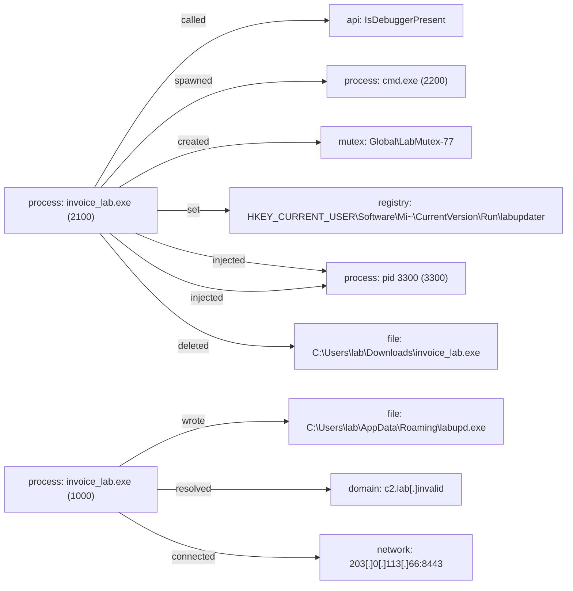

# Report: full_cape_synthetic

!!! note
    Generated by `specimen report` from a bundled fixture (trimmed public Avast-CTU report, or a synthetic one).

**Verdict:** suspicious (score 0.7396, confidence low-static/behavior-disagree)  
**Detonated:** yes (recorded trace replay)

## Static triage
score 0.3543 / entropy 0.0

- pe&#95;executable impact +0.80
- few&#95;imports impact +0.60

## Behavior
P(malicious)=0.7396 label=suspicious scorer=api-ngram-lr (MalbehavD-V1) | family match **unknown (closest: Zeus)** (p=0.363, avast-ctu-logreg (behaviour+static))

- writeprocessmemory = 0.3416, impact +0.82
- createremotethread = 0.4172, impact +0.52
- isdebuggerpresent = 0.1694, impact -0.42
- regsetvalueexw = 0.1956, impact +0.36
- deletefilew = 0.207, impact +0.33
- deletefilew&gt;ntopenfile = 0.5225, impact +0.14

### Family evidence
Top tokens supporting **unknown (closest: Zeus)** (avast-ctu-logreg (behaviour+static)):

- tech:T1055 (+0.433)
- tech:T1622 (+0.384)
- tactic:defense-evasion (+0.188)
- file&#95;delete&#95;ext:exe (+0.185)
- exec:cmd.exe (+0.145)
- tech:T1070.004 (+0.115)

## Timeline
| t | event | ATT&CK | anomaly |
|---|---|---|---|
| 0.00 | invoice&#95;lab.exe called IsDebuggerPresent | T1622 defense-evasion | 1.0 |
| 0.00 | invoice&#95;lab.exe spawned cmd.exe &#96;cmd.exe /c vssadmin delete shadows /all /quiet&#96; | T1490 impact | 1.0 |
| 0.10 | invoice&#95;lab.exe created Global\LabMutex-77 |   | 1.0 |
| 0.20 | invoice&#95;lab.exe set HKEY&#95;CURRENT&#95;USER\Software\Microsoft\Windows\CurrentVersion\Run\labupdater | T1547.001 persistence | 1.0 |
| 0.30 | invoice&#95;lab.exe injected into pid 3300 | T1055 defense-evasion | 1.0 |
| 0.40 | invoice&#95;lab.exe injected into pid 3300 | T1055 defense-evasion | 1.0 |
| 0.50 | invoice&#95;lab.exe deleted C:\Users\lab\Downloads\invoice&#95;lab.exe | T1070.004 defense-evasion | 1.0 |
| 0.90 | invoice&#95;lab.exe wrote C:\Users\lab\AppData\Roaming\labupd.exe | T1105 command-and-control | 0.537 |
| 0.90 | invoice&#95;lab.exe resolved c2.lab[.]invalid | T1071.004 command-and-control | 0.451 |
| 0.91 | invoice&#95;lab.exe connected 203[.]0[.]113[.]66:8443 | T1071 command-and-control | 0.58 |

## Provenance graph


## IOCs (defanged)
- **network**: 203[.]0[.]113[.]66:8443
- **domains**: c2.lab[.]invalid
- **dropped_files**: C:\Users\lab\AppData\Roaming\labupd.exe
- **registry**: HKEY&#95;CURRENT&#95;USER\Software\Microsoft\Windows\CurrentVersion\Run\labupdater

## Sigma 1 - file_event
```yaml
title: 'SPECIMEN auto - file_event pattern'
status: experimental
description: Auto-synthesized from one sandbox run of 5d1f0a0c3a2f7e6b; generalisation rung 2; zero hits on the negative corpus at synthesis time. Review before deploy.
author: SPECIMEN
tags:
    - attack.t1105
logsource:
    product: windows
    category: file_event
detection:
    selection:
        TargetFilename: 'C:\\Users\\*\\AppData\\*\\labupd.exe'
    condition: selection
level: medium

```

## Sigma 2 - process_creation
```yaml
title: 'SPECIMEN auto - process_creation pattern'
status: experimental
description: Auto-synthesized from one sandbox run of 5d1f0a0c3a2f7e6b; generalisation rung 0; zero hits on the negative corpus at synthesis time. Review before deploy.
author: SPECIMEN
logsource:
    product: windows
    category: process_creation
detection:
    selection:
        Image: 'cmd.exe'
        CommandLine: '*/c vssadmin delete shadows /all /quiet*'
    condition: selection
level: medium

```

## Sigma 3 - registry_set
```yaml
title: 'SPECIMEN auto - registry_set pattern'
status: experimental
description: Auto-synthesized from one sandbox run of 5d1f0a0c3a2f7e6b; generalisation rung 0; zero hits on the negative corpus at synthesis time. Review before deploy.
author: SPECIMEN
tags:
    - attack.t1547.001
logsource:
    product: windows
    category: registry_set
detection:
    selection:
        TargetObject: 'HKEY_CURRENT_USER\\Software\\Microsoft\\Windows\\CurrentVersion\\Run\\labupdater'
    condition: selection
level: medium

```

Specificity: 0 Sigma candidate(s) dropped because no generalisation rung was specific enough.

## Evidence manifest
```json
{
  "sample_sha256": "5d1f0a0c3a2f7e6b9c8d7e6f5a4b3c2d1e0f9a8b7c6d5e4f3a2b1c0d9e8f7a6b",
  "trace_sha256": "1c6780cf6a678c2cc7b0d0f74d9677973ae5e1129642ec16cbf156ade159800d",
  "trace_run_id": "full_cape_synthetic",
  "python": "3.14.3",
  "specimen_version": "1.0.0",
  "execution": "report-only (sandbox report replay; no sample bytes handled)",
  "report_content_sha256": "869dd3aec9814f5692e888169a5b6497b94947029587b619eabf627255ac001f",
  "report_sha256": "1c6780cf6a678c2cc7b0d0f74d9677973ae5e1129642ec16cbf156ade159800d",
  "negative_corpus": {
    "packaged": true,
    "excluded_family": "Zeus"
  },
  "behaviour_model": {
    "path": "D:\\cyber-portfolio\\repos\\specimen\\specimen\\data\\api_behaviour.json",
    "sha256": "b9476f2c3813c4ed0df070f5e5a11956b96c7a82dffad80399cacd2b04491470"
  }
}
```
