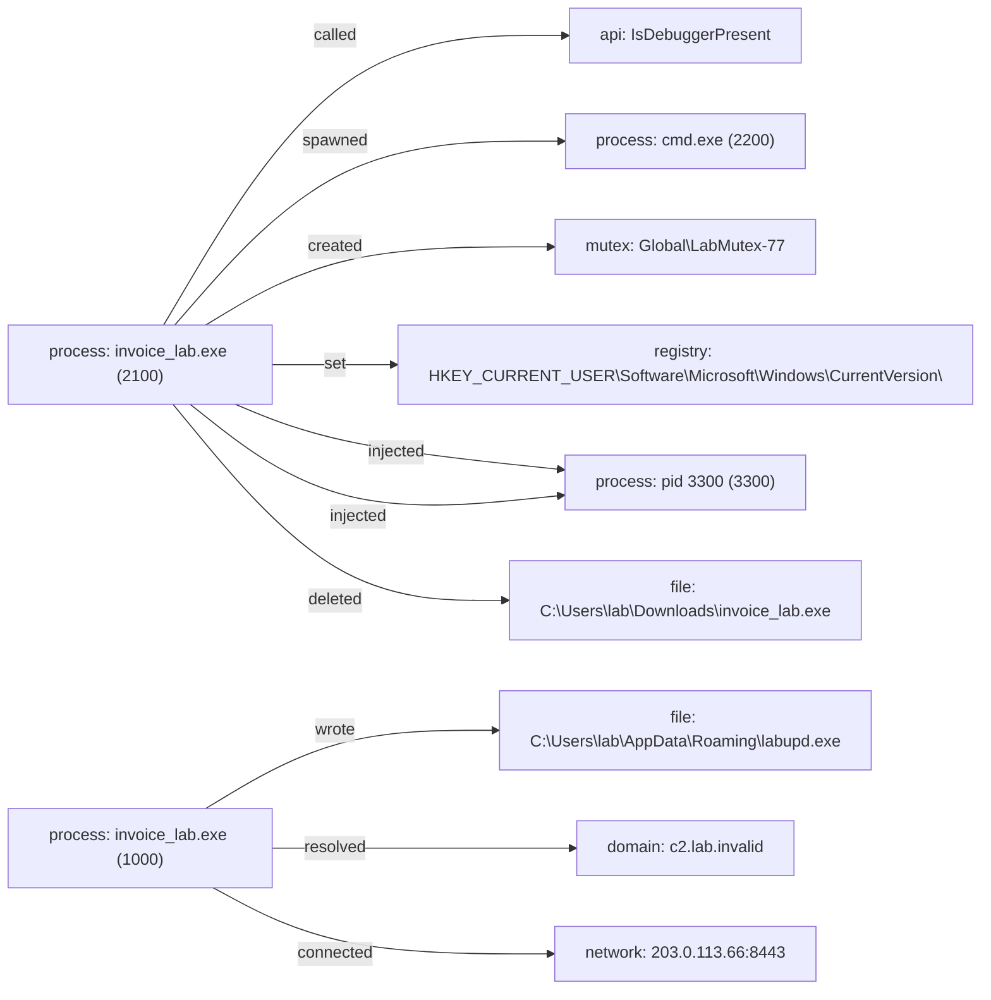

# Report: full_cape_synthetic

!!! note
    Generated by `specimen report` from a bundled fixture (trimmed public Avast-CTU report, or a synthetic one).

**Verdict:** malicious (score 0.9948, confidence medium (behavior-driven))  
**Detonated:** yes (recorded trace replay)

## Static triage
score 0.3543 / entropy 0.0

- `pe_executable` impact +0.80
- `few_imports` impact +0.60

## Behavior
P(malicious)=0.9948 label=malicious scorer=mvp-synthetic-logreg (ATT&CK features) | family match **Zeus** (jaccard 0.497)
- `n_inject`=1.0986 impact +2.12
- `n_drop`=0.6931 impact +1.74
- `n_persist`=0.6931 impact +1.18
- `n_impact`=0.6931 impact +1.01
- `frac_suspicious`=0.5455 impact +0.88
- `n_c2`=1.0986 impact -0.10

## Timeline
| t | event | ATT&CK | anomaly |
|---|---|---|---|
| 0.00 | invoice_lab.exe called IsDebuggerPresent | T1622 defense-evasion | 1.0 |
| 0.00 | invoice_lab.exe spawned cmd.exe `cmd.exe /c vssadmin delete shadows /all /quiet` | T1490 impact | 1.0 |
| 0.10 | invoice_lab.exe created Global\LabMutex-77 |   | 1.0 |
| 0.20 | invoice_lab.exe set HKEY_CURRENT_USER\Software\Microsoft\Windows\CurrentVersion\Run\labupdater | T1547.001 persistence | 1.0 |
| 0.30 | invoice_lab.exe injected into pid 3300 | T1055 defense-evasion | 1.0 |
| 0.40 | invoice_lab.exe injected into pid 3300 | T1055 defense-evasion | 1.0 |
| 0.50 | invoice_lab.exe deleted C:\Users\lab\Downloads\invoice_lab.exe | T1070.004 defense-evasion | 1.0 |
| 0.90 | invoice_lab.exe wrote C:\Users\lab\AppData\Roaming\labupd.exe | T1105 command-and-control | 0.537 |
| 0.90 | invoice_lab.exe resolved c2.lab.invalid | T1071.004 command-and-control | 0.451 |
| 0.91 | invoice_lab.exe connected 203.0.113.66:8443 | T1071 command-and-control | 0.58 |

## Provenance graph


## IOCs
- **network**: 203.0.113.66:8443
- **domains**: c2.lab.invalid
- **dropped_files**: C:\Users\lab\AppData\Roaming\labupd.exe
- **registry**: HKEY_CURRENT_USER\Software\Microsoft\Windows\CurrentVersion\Run\labupdater

## Sigma
```yaml
title: SPECIMEN auto - file_event pattern
status: experimental
description: Auto-synthesized from one sandbox run of 5d1f0a0c3a2f7e6b; generalisation rung 3; zero hits on the negative corpus at synthesis time. Review before deploy.
author: SPECIMEN
tags:
    - attack.t1105
logsource:
    product: windows
    category: file_event
detection:
    selection:
        TargetFilename: 'C:\Users\*\AppData\*\*.exe'
    condition: selection
level: medium

```

## Sigma
```yaml
title: SPECIMEN auto - process_creation pattern
status: experimental
description: Auto-synthesized from one sandbox run of 5d1f0a0c3a2f7e6b; generalisation rung 0; zero hits on the negative corpus at synthesis time. Review before deploy.
author: SPECIMEN
logsource:
    product: windows
    category: process_creation
detection:
    selection:
        Image: 'cmd.exe'
        CommandLine: '*/c vssadmin delete shadows /all /quiet*'
    condition: selection
level: medium

```

## Sigma
```yaml
title: SPECIMEN auto - registry_set pattern
status: experimental
description: Auto-synthesized from one sandbox run of 5d1f0a0c3a2f7e6b; generalisation rung 0; zero hits on the negative corpus at synthesis time. Review before deploy.
author: SPECIMEN
tags:
    - attack.t1547.001
logsource:
    product: windows
    category: registry_set
detection:
    selection:
        TargetObject: 'HKEY_CURRENT_USER\Software\Microsoft\Windows\CurrentVersion\Run\labupdater'
    condition: selection
level: medium

```

Specificity: YARA FP []; dropped Sigma ['rejected_nonspecific:0']

## Evidence manifest
```json
{
  "sample_sha256": "5d1f0a0c3a2f7e6b9c8d7e6f5a4b3c2d1e0f9a8b7c6d5e4f3a2b1c0d9e8f7a6b",
  "trace_sha256": "1c6780cf6a678c2cc7b0d0f74d9677973ae5e1129642ec16cbf156ade159800d",
  "trace_run_id": "full_cape_synthetic",
  "python": "3.14.3",
  "specimen_version": "1.0.0",
  "execution": "report-only (sandbox report replay; no sample bytes handled)",
  "report_content_sha256": "ba06cfebbfa3895014f195cbe7582f51177e5dd073e24d0584a9e15a50ac61a9",
  "report_sha256": "1c6780cf6a678c2cc7b0d0f74d9677973ae5e1129642ec16cbf156ade159800d"
}
```
