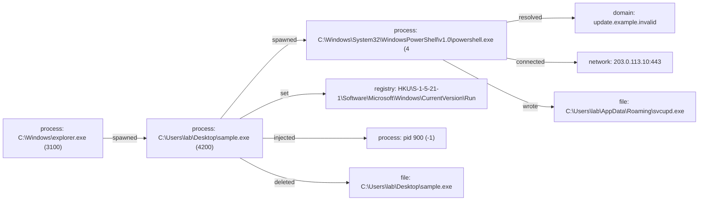

# Report: Sysmon lab run

!!! note
    Generated by `specimen analyze --force-detonate` from inert bytes and a synthetic Sysmon XML export.

**Verdict:** malicious (score 0.98, confidence high)  
**Detonated:** yes (recorded trace replay)

## Static triage
score 0.525 / entropy 3.1224

- `token:powershell -enc` impact +1.00
- `pe_executable` impact +0.80
- `embedded_urls` impact +0.30

## Behavior
P(malicious)=0.98 label=malicious scorer=mvp-synthetic-logreg (ATT&CK features) | family match **sim-persist-loader** (jaccard 0.714)
- `n_drop`=0.6931 impact +1.74
- `n_inject`=0.6931 impact +1.34
- `n_persist`=0.6931 impact +1.18
- `frac_suspicious`=0.5 impact +0.80
- `n_exec_script`=0.6931 impact +0.51
- `n_c2`=1.0986 impact -0.10

## Timeline
| t | event | ATT&CK | anomaly |
|---|---|---|---|
| 0.00 | C:\Windows\explorer.exe spawned C:\Users\lab\Desktop\sample.exe `"C:\Users\lab\Desktop\sample.exe"` |   | 1.0 |
| 1.15 | C:\Users\lab\Desktop\sample.exe spawned C:\Windows\System32\WindowsPowerShell\v1.0\powershell.exe `powershell.exe -nop -w hidden -enc SQBFAFgA` | T1059.001 execution | 1.0 |
| 1.90 | C:\Windows\System32\WindowsPowerShell\v1.0\powershell.exe resolved update.example.invalid | T1071.004 command-and-control | 0.451 |
| 2.30 | C:\Windows\System32\WindowsPowerShell\v1.0\powershell.exe connected 203.0.113.10:443 | T1071 command-and-control | 0.58 |
| 2.90 | C:\Windows\System32\WindowsPowerShell\v1.0\powershell.exe wrote C:\Users\lab\AppData\Roaming\svcupd.exe | T1105 command-and-control | 0.537 |
| 3.50 | C:\Users\lab\Desktop\sample.exe set HKU\S-1-5-21-1\Software\Microsoft\Windows\CurrentVersion\Run\svcupd | T1547.001 persistence | 1.0 |
| 3.90 | C:\Users\lab\Desktop\sample.exe injected into pid 900 | T1055 defense-evasion | 1.0 |
| 4.90 | C:\Users\lab\Desktop\sample.exe deleted C:\Users\lab\Desktop\sample.exe | T1070.004 defense-evasion | 1.0 |

## Provenance graph


## IOCs
- **urls**: http://203.0.113.10/a
- **ips**: 203.0.113.10
- **network**: 203.0.113.10:443
- **domains**: update.example.invalid
- **dropped_files**: C:\Users\lab\AppData\Roaming\svcupd.exe
- **registry**: HKU\S-1-5-21-1\Software\Microsoft\Windows\CurrentVersion\Run\svcupd

## YARA
```yara
rule SPECIMEN_61fcc54b4c13
{
    meta:
        author = "SPECIMEN (auto)"
        sample_sha256 = "61fcc54b4c1356acea74d8d85806d25dd5bd9589f47d3565e3659d812c65a2e6"
        confidence = "auto-generated; review before deploy"
    strings:
        $s0 = "inert demo bytes powershell -enc http://203.0.113.10/a" ascii wide
    condition:
        1 of ($s*)
}

```

## Sigma
```yaml
title: SPECIMEN auto - T1059.001 via C:\Users\lab\Desktop\sample.exe
status: experimental
description: Auto-synthesized from run of 61fcc54b4c1356ac; review before deploy
tags:
    - attack.t1059.001
logsource:
    product: windows
    category: process_creation
detection:
    selection:
        Image|endswith: '\C:\Windows\System32\WindowsPowerShell\v1.0\powershell.exe'
        CommandLine|contains: '-nop'
    condition: selection
level: medium

```

## Sigma
```yaml
title: SPECIMEN auto - T1547.001 via C:\Users\lab\Desktop\sample.exe
status: experimental
description: Auto-synthesized from run of 61fcc54b4c1356ac; review before deploy
tags:
    - attack.t1547.001
logsource:
    product: windows
    category: registry_set
detection:
    selection:
        TargetObject|contains: '\CurrentVersion\Run\'
    condition: selection
level: medium

```

## Sigma
```yaml
title: SPECIMEN auto - T1055 via C:\Users\lab\Desktop\sample.exe
status: experimental
description: Auto-synthesized from run of 61fcc54b4c1356ac; review before deploy
tags:
    - attack.t1055
logsource:
    product: windows
    category: create_remote_thread
detection:
    selection:
        TargetImage|endswith: '\pid 900'
    condition: selection
level: medium

```

## Evidence manifest
```json
{
  "sample_sha256": "61fcc54b4c1356acea74d8d85806d25dd5bd9589f47d3565e3659d812c65a2e6",
  "trace_sha256": "c6f3b134300078d908aae4e6d65e13bd938066832405d8a702a3b8781c779330",
  "trace_run_id": "lab_run",
  "python": "3.14.3",
  "specimen_version": "1.0.0",
  "execution": "trace-replay (no live detonation)",
  "report_content_sha256": "37a263c2371ad5519ca901a76b4817f7822ba82c34e307b519dd1b1d9c9e7419"
}
```
