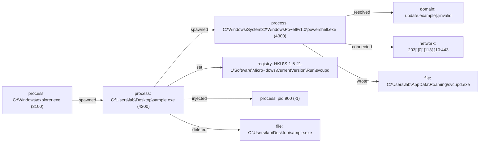

# Report: Sysmon lab run

!!! note
    Generated by `specimen analyze --force-detonate` from the inert lab_sample.bin and the synthetic Sysmon XML export bound to it.

**Verdict:** malicious (score 0.98, confidence medium (behavior-driven))  
**Detonated:** yes (recorded trace replay)

## Static triage
score 0.1192 / entropy 4.5124

- no suspicious static features

## Behavior
P(malicious)=0.98 label=malicious scorer=mvp-synthetic-logreg (ATT&CK features) | family match **sim-persist-loader** (jaccard 0.714)

- n&#95;drop = 0.6931, impact +1.74
- n&#95;inject = 0.6931, impact +1.34
- n&#95;persist = 0.6931, impact +1.18
- frac&#95;suspicious = 0.5, impact +0.80
- n&#95;exec&#95;script = 0.6931, impact +0.51
- n&#95;c2 = 1.0986, impact -0.10

## Timeline
| t | event | ATT&CK | anomaly |
|---|---|---|---|
| 0.00 | C:&#92;Windows&#92;explorer.exe spawned C:&#92;Users&#92;lab&#92;Desktop&#92;sample.exe &#96;"C:&#92;Users&#92;lab&#92;Desktop&#92;sample.exe"&#96; |   | 1.0 |
| 1.15 | C:&#92;Users&#92;lab&#92;Desktop&#92;sample.exe spawned C:&#92;Windows&#92;System32&#92;WindowsPowerShell&#92;v1.0&#92;powershell.exe &#96;powershell.exe -nop -w hidden -enc SQBFAFgA&#96; | T1059.001 execution | 1.0 |
| 1.90 | C:&#92;Windows&#92;System32&#92;WindowsPowerShell&#92;v1.0&#92;powershell.exe resolved update.example&#91;.&#93;invalid | T1071.004 command-and-control | 0.451 |
| 2.30 | C:&#92;Windows&#92;System32&#92;WindowsPowerShell&#92;v1.0&#92;powershell.exe connected 203&#91;.&#93;0&#91;.&#93;113&#91;.&#93;10:443 | T1071 command-and-control | 0.58 |
| 2.90 | C:&#92;Windows&#92;System32&#92;WindowsPowerShell&#92;v1.0&#92;powershell.exe wrote C:&#92;Users&#92;lab&#92;AppData&#92;Roaming&#92;svcupd.exe | T1105 command-and-control | 0.537 |
| 3.50 | C:&#92;Users&#92;lab&#92;Desktop&#92;sample.exe set HKU&#92;S-1-5-21-1&#92;Software&#92;Microsoft&#92;Windows&#92;CurrentVersion&#92;Run&#92;svcupd | T1547.001 persistence | 1.0 |
| 3.90 | C:&#92;Users&#92;lab&#92;Desktop&#92;sample.exe injected into pid 900 | T1055 defense-evasion | 1.0 |
| 4.90 | C:&#92;Users&#92;lab&#92;Desktop&#92;sample.exe deleted C:&#92;Users&#92;lab&#92;Desktop&#92;sample.exe | T1070.004 defense-evasion | 1.0 |

## Provenance graph


## IOCs (defanged)
- **network**: 203&#91;.&#93;0&#91;.&#93;113&#91;.&#93;10:443
- **domains**: update.example&#91;.&#93;invalid
- **dropped_files**: C:&#92;Users&#92;lab&#92;AppData&#92;Roaming&#92;svcupd.exe
- **registry**: HKU&#92;S-1-5-21-1&#92;Software&#92;Microsoft&#92;Windows&#92;CurrentVersion&#92;Run&#92;svcupd

## Sigma 1 - file_event
```yaml
title: 'SPECIMEN auto - file_event pattern'
status: experimental
description: Auto-synthesized from one sandbox run of b81a2a0872b6f42e; generalisation rung 2; zero hits on the negative corpus at synthesis time. Review before deploy.
author: SPECIMEN
tags:
    - attack.t1105
logsource:
    product: windows
    category: file_event
detection:
    selection:
        TargetFilename: 'C:\\Users\\*\\AppData\\*\\svcupd.exe'
    condition: selection
level: medium

```

## Sigma 2 - registry_set
```yaml
title: 'SPECIMEN auto - registry_set pattern'
status: experimental
description: Auto-synthesized from one sandbox run of b81a2a0872b6f42e; generalisation rung 1; zero hits on the negative corpus at synthesis time. Review before deploy.
author: SPECIMEN
tags:
    - attack.t1547.001
logsource:
    product: windows
    category: registry_set
detection:
    selection:
        TargetObject: 'HKU\\*\\Software\\Microsoft\\Windows\\CurrentVersion\\Run\\*'
    condition: selection
level: medium

```

## Sigma 3 - process_creation
```yaml
title: 'SPECIMEN auto - process_creation pattern'
status: experimental
description: Auto-synthesized from one sandbox run of b81a2a0872b6f42e; generalisation rung 0; zero hits on the negative corpus at synthesis time. Review before deploy.
author: SPECIMEN
logsource:
    product: windows
    category: process_creation
detection:
    selection:
        Image: 'C:\\Users\\*\\Desktop\\sample.exe'
    condition: selection
level: medium

```

## Sigma 4 - process_creation
```yaml
title: 'SPECIMEN auto - process_creation pattern'
status: experimental
description: Auto-synthesized from one sandbox run of b81a2a0872b6f42e; generalisation rung 0; zero hits on the negative corpus at synthesis time. Review before deploy.
author: SPECIMEN
logsource:
    product: windows
    category: process_creation
detection:
    selection:
        Image: 'powershell.exe'
    condition: selection
level: medium

```

Specificity: 0 Sigma candidate(s) dropped because no generalisation rung was specific enough.

## Evidence manifest
```json
{
  "sample_sha256": "b81a2a0872b6f42e1237dd33a08f48f687d7e1a4747be20c8805117148039bba",
  "trace_sha256": "55e2dfc4fbb59aeaed456c996efad13c541aec2eb786325b87ba9e92cfc7ac96",
  "trace_run_id": "lab_run",
  "python": "3.14.3",
  "specimen_version": "1.1.0",
  "execution": "trace-replay (no live detonation)",
  "trace_binding": "bound: the trace records this sample's SHA-256",
  "report_content_sha256": "7a0e65e12c4d8e4b3297d3c85b8e555763d8d63ad4df2aa31ac9d81da39fc5c6",
  "negative_corpus": {
    "packaged": true,
    "excluded_family": null
  }
}
```
