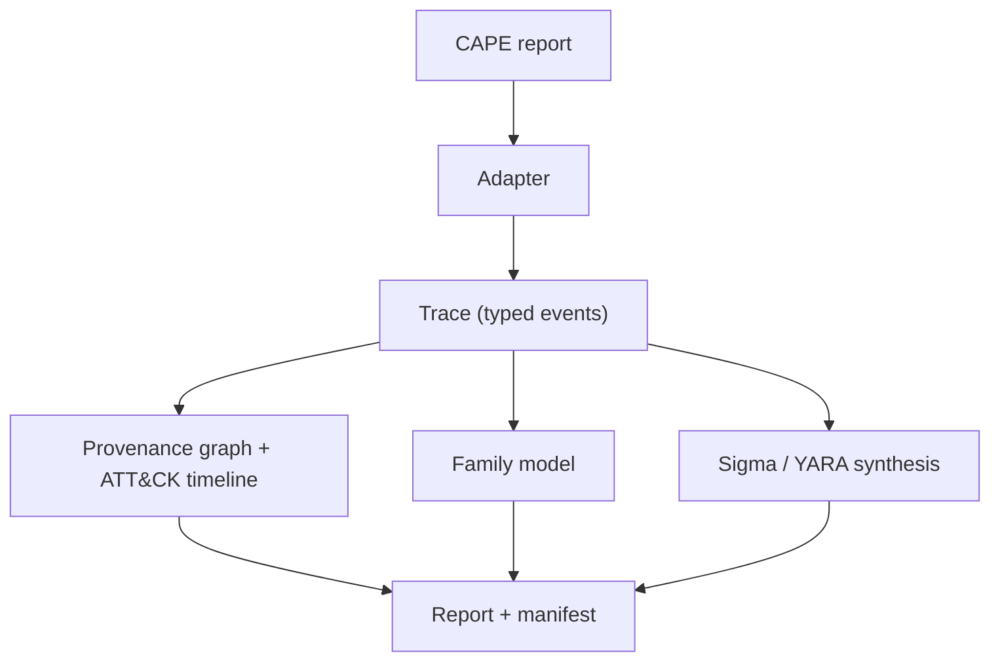

# How it works

This page follows one bundled input, `tests/fixtures/cape/avast_njrat_1.json` (a trimmed public Avast-CTU CAPEv2 report of an njRAT sample), through every stage. The full output is the [njRAT demo report](demo/avast_njrat_1.md); run it yourself with `python -m specimen report tests/fixtures/cape/avast_njrat_1.json`.



## 1. Static gate

A reduced report carries `static.pe` (imports, sections, imphash), not the sample bytes. The additive heuristic scores it (`score 0.2315`, top reason `pe_executable +0.80`). For a real PE, `analyze` still detonates (replays) every PE; the trained EMBER LightGBM gate is a separate `triage-ember` command because SPECIMEN has no PE-to-EMBER feature extractor ([Evaluation](benchmarks.md)).

## 2. Adapter to trace

`specimen/adapters/cape.py` maps `behavior.summary` (files, keys, mutexes, executed commands, resolved APIs) and full call logs onto one `Trace` of typed events: `process_create`, `file_write`, `registry_set`, `dns`, `net`, `mutex`. Unknown shapes are ignored; values are coerced to strings and capped. Reduced reports have no timing, so events are ordered deterministically and flagged `synthetic_ts`.

## 3. Provenance graph and timeline

`specimen/provenance.py` builds the process tree plus file, registry, network, mutex and service edges, and tags each event with ATT&CK rules (about 50). For the njRAT run: `sample.exe` spawns `RegAsm.exe` (a .NET living-off-the-land host), adds a firewall exception with `netsh`, and writes a Startup-folder `.url` file (T1547.001). Every IOC on the page is defanged.

## 4. Behaviour score

Traces with at least 5 real API calls are scored by the packaged MalbehavD-V1 n-gram LR; reduced reports have no call log, so they get the MVP ATT&CK-feature scorer (here 0.913 driven by `n_drop` and `n_persist`). The report always names the scorer used.

## 5. Family attribution

Events become normalised tokens (user names, GUIDs, SIDs, hex blobs and numbers removed) and a hashed-token LR trained on the Avast-CTU temporal training split predicts the family: **njRAT, p = 0.984**. The page lists the tokens that drove it, for example `exec:regasm.exe (+0.413)` and `tech:T1547.001 (+0.277)`. Below the abstain threshold the report says `unknown (closest: X)` instead.

## 6. Sigma and YARA synthesis

For each candidate event the synthesiser climbs a generalisation ladder ([ADR 0002](adr/0002-specificity-constrained-rule-generalisation.md)): rung 0 is the exact value, higher rungs replace user names, version directories and file stems with wildcards. A rung is kept only if it still has enough literal text and hits nothing in the packaged negative corpus (event lines from Avast-CTU training runs of *other* families plus synthetic benign traces). Example from this run, rung 2:

```yaml
detection:
    selection:
        TargetFilename: 'C:\Users\*\AppData\Roaming\Microsoft\Windows\Start Menu\Programs\*\Host Process for Windows Services.url'
```

Literal segments are escaped for Sigma (`\`), wildcards are left unescaped, and every value is emitted through a YAML-safe quoter. YARA rules use `pe.imphash()` or the rarest imports by family prevalence.

## 7. Report and evidence manifest

The JSON and Markdown reports carry the verdict with a confidence grade, the static reasons, the timeline, the Mermaid graph, IOCs, rules and a manifest of SHA-256s (sample, trace, report and report content). In report-only mode no sample bytes are handled: `sample_sha256` is taken from the report when present and is otherwise `null` with a note, and the report file's hash is recorded as `report_sha256` / `trace_sha256`.
