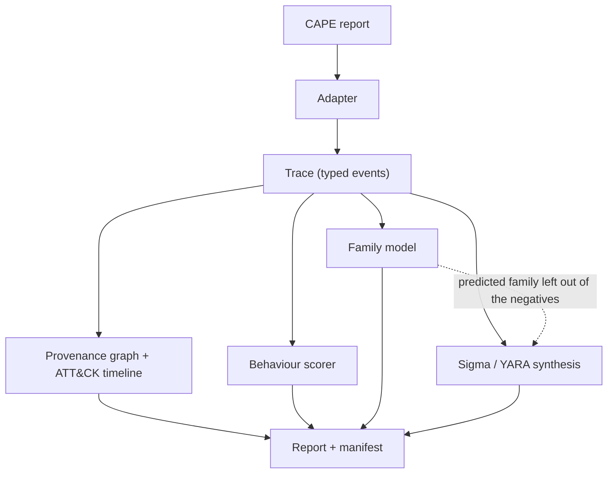

# How it works

This page follows one bundled input, `tests/fixtures/cape/avast_njrat_1.json` (a trimmed public Avast-CTU CAPEv2 report of an njRAT sample), through every stage. The full output is the [njRAT demo report](demo/avast_njrat_1.md); run it yourself with `python -m specimen report tests/fixtures/cape/avast_njrat_1.json` after `python scripts/fetch_models.py --only family_`. The numbers on this page are generated from `docs/demo/summary.json`, which `scripts/build_demo.py` writes with the pinned family model.

## 1. Static gate

A reduced report carries `static.pe` (imports, sections, imphash), not the sample bytes. <!-- gen:walk-static -->
<!-- /gen:walk-static -->
For a real PE, `analyze` still replays every PE; the trained EMBER LightGBM gate is a separate `triage-ember` command because SPECIMEN has no PE-to-EMBER feature extractor ([Evaluation](benchmarks.md#1-static-gate-on-ember)).

## 2. Adapter to trace

`specimen/adapters/cape.py` maps `behavior.summary` (files, keys, mutexes, executed commands, resolved APIs) and full call logs onto one `Trace` of typed events: `process_create`, `file_write`, `registry_set`, `dns_query`, `net_connect`, `mutex_create` and more. Unknown shapes are ignored; values are coerced to strings and capped; non-finite numbers are refused. Reduced reports have no timing, so events are ordered deterministically and flagged `synthetic_ts`. Sysmon exports and Speakeasy emulation reports go through their own adapters into the same event model.

## 3. Provenance graph and timeline

`specimen/provenance.py` builds the process tree plus file, registry, network, mutex and service edges, and tags events with about 50 ATT&CK rules. The graph of this run, as the report renders it:

<!-- gen:walk-graph -->
<!-- /gen:walk-graph -->

The timeline rows that carry an ATT&CK technique (every report string is entity-encoded and IOCs are defanged in the Markdown report):

<!-- gen:walk-timeline -->
<!-- /gen:walk-timeline -->

## 4. Behaviour score

Traces with at least 5 real API calls are scored by the packaged MalbehavD-V1 n-gram LR; reduced reports have no call log, so they get the MVP ATT&CK-feature scorer. <!-- gen:walk-behaviour -->
<!-- /gen:walk-behaviour -->
The report always names the scorer used.

## 5. Family attribution

Events become normalised tokens (user names, GUIDs, SIDs, hex blobs and numbers removed) and a hashed-token LR trained on the Avast-CTU temporal training split predicts the family. <!-- gen:walk-family -->
<!-- /gen:walk-family -->
Below the abstain threshold (chosen on a validation slice) the report says `unknown (closest: X)` instead.

## 6. Sigma and YARA synthesis

For each host action of the run the synthesiser climbs a generalisation ladder ([ADR 0002](adr/0002-specificity-constrained-rule-generalisation.md)): rung 0 is the exact value, higher rungs replace user names, numbers, file stems and parent directories with wildcards. A rung is kept only if it still has at least 10 literal characters beyond generic prefixes (hive roots, `\Environment`, user profile folders) and hits nothing in the negative corpus: the synthetic benign traces plus the packaged Avast-CTU corpus *minus the family the model predicted* (without a family model nothing is left out). `analyze` and `report` use the same synthesizer.

<!-- gen:walk-sigma -->
<!-- /gen:walk-sigma -->

Literal segments are escaped for Sigma (`\`), wildcards are left unescaped, and every value is emitted through a YAML-safe quoter; CI compiles every emitted rule with pySigma and runs it in SQLite on its own run. YARA rules use `pe.imphash()` or the rarest imports by family prevalence. How far such rules generalise, and what they cost in false positives:

## 7. Report and evidence manifest

The JSON and Markdown reports carry the verdict with a confidence grade, the static reasons, the timeline, the Mermaid graph, IOCs, rules and a manifest of SHA-256s (sample, trace, report and report content), the negative corpus used (and the family left out) and, for `analyze`, whether the trace is bound to the sample's hash. In report-only mode no sample bytes are handled: `sample_sha256` is taken from the report when present and is otherwise `null` with a note, and the report file's hash is recorded as `report_sha256` / `trace_sha256`.
